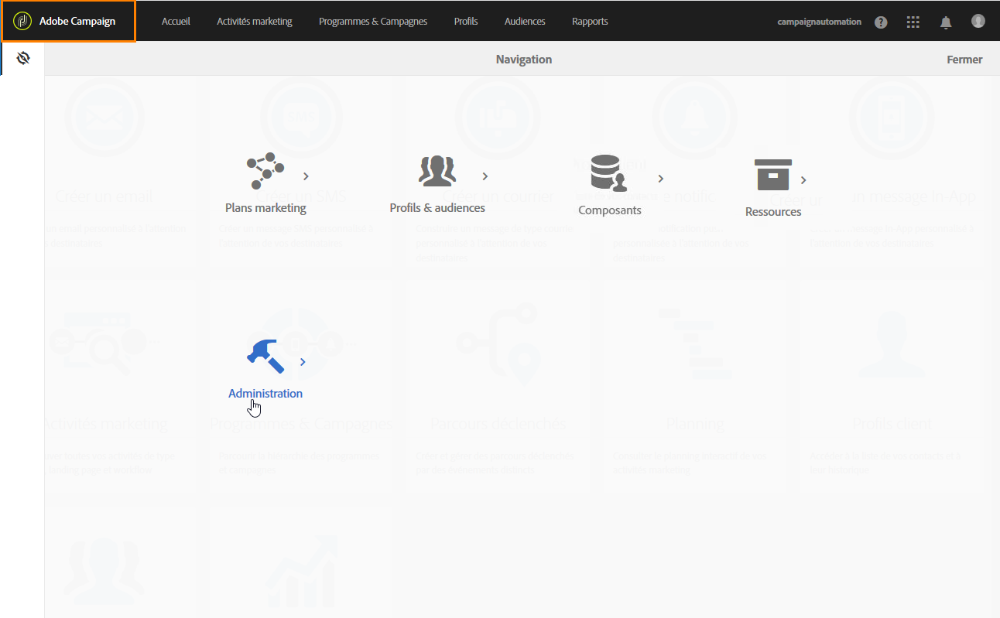

# Accès au panneau de contrôle {#accessing-control-panel}

Le Panneau de configuration est directement accessible à partir d’Experience Cloud ou du produit lui-même.

Il est accessible uniquement aux utilisateurs **** administrateurs. Pour plus d'informations sur l'affectation des utilisateurs au groupe Administrateurs, reportez-vous à [cette section](../../discover/using/managing-permissions.md).

## Accès à partir d'Experience Cloud Platform {#access-experience-cloud-platform}

Pour accéder au Panneau de configuration à partir d’Experience Cloud Platform, accédez à la [page d’accueil Experience Cloud Platform](https://amc.experiencecloud.adobe.com/), puis cliquez sur le lien dédié dans la section **Accès rapide**.

Le panneau de contrôle est également accessible à partir du **sélecteur de solution** Experience Cloud Platform :

1. Naviguez jusqu'à [Adobe Experience Cloud](https://amc.experiencecloud.adobe.com/), puis sélectionnez **Campaign** dans le sélecteur de solution.

   

1. La liste des instances Campaign s'affiche. Click the **Control Panel** card to launch it.

   

## Accès depuis le produit {#access-product}

>[!NOTE]
>
>Pour les instances de **Campaign Classic** , l’accès depuis le produit est disponible à partir de la version 19.1 de Campaign Classic.

1. Ouvrez votre produit Campaign Standard, puis sélectionnez le menu **[!UICONTROL Administration]** dans le volet **Navigation[!UICONTROL .]**

   

1. Cliquez sur l’icône **[!UICONTROL Panneau]** de configuration.

   
