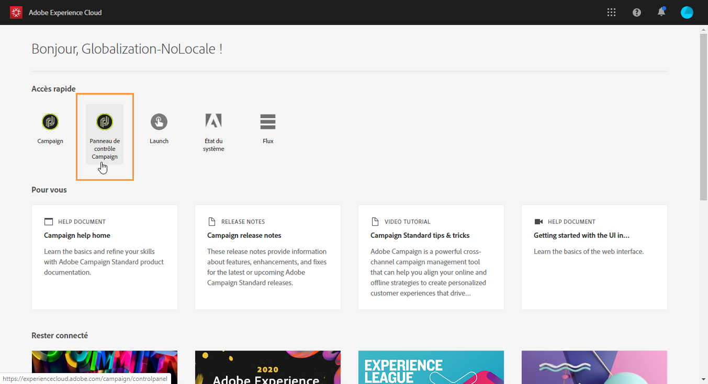
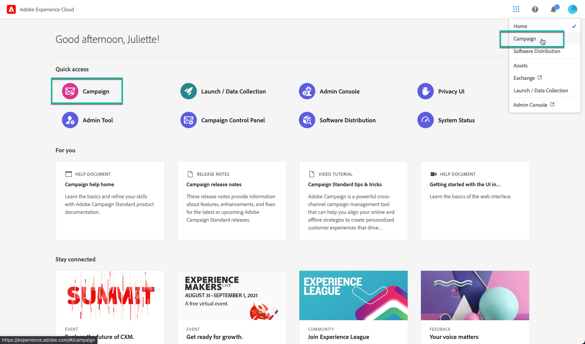
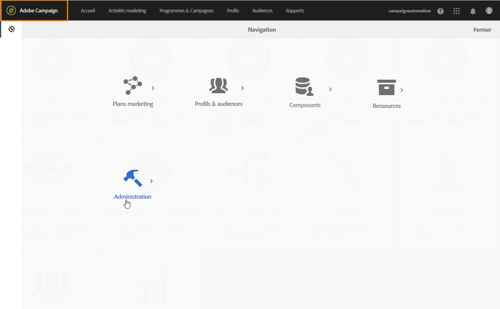
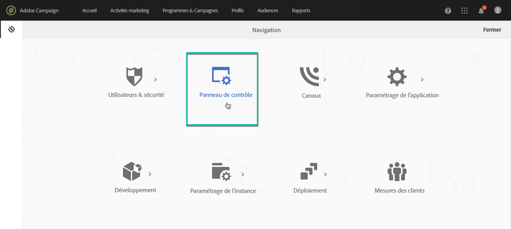

# Accès au Panneau de contrôle {#accessing-control-panel}

Le Panneau de contrôle est disponible directement depuis Experience Cloud ou depuis le produit lui-même.

## Conditions préalables requises {#prerequisites}

Pour Campaign v7/v8, notez que votre instance doit être hébergée sur Amazon Web Services (AWS) et mise à niveau vers le dernier [build stable de Campaign](https://experienceleague.adobe.com/docs/campaign-classic/using/release-notes/rn-overview.html?lang=fr#rn-statuses) ou vers le build 9032 ou supérieur. Découvrez comment vérifier votre version dans [cette section](https://experienceleague.adobe.com/docs/campaign-classic/using/getting-started/starting-with-adobe-campaign/launching-adobe-campaign.html?lang=fr#getting-your-campaign-version). Pour vérifier si votre instance est hébergée sur AWS, suivez les étapes présentées sur [cette page](../../faq.md#hosted-aws).

Les instances Campaign v8 hébergées sur Microsoft Azure ont également accès à un sous-ensemble de fonctionnalités de Panneau de Contrôle : [liste autorisée d’adresses IP pour l’accès aux instances](../../instances-settings/using/ip-allow-listing-instance-access.md), [liste autorisée d’adresses IP pour les serveurs SFTP](../../sftp/using/ip-range-allow-listing.md) et [gestion des certificats SSL gérés par le client](../../subdomains-certificates/using/renewing-subdomain-certificate.md).

>[!IMPORTANT]
>
>Par défaut, le panneau de contrôle est accessible aux administrateurs et administratrices appartenant au profil de produit « Administration ». Selon la configuration de votre organisation, le profil de produit peut être appelé différemment (« admin », « admins », « admin d’approbation », etc.). **Tout profil de produit contenant le mot « admin » dans son nom accordera automatiquement l’accès à Panneau de Contrôle**. Examinez attentivement la dénomination de votre profil de produit pour vous assurer que seules les personnes autorisées ont accès au panneau de contrôle. [Découvrez comment gérer les autorisations de Panneau de Contrôle ](../../discover/using/managing-permissions.md).

## Accès à partir de la plateforme Experience Cloud {#access-experience-cloud-platform}

Pour accéder au Panneau de contrôle à partir de la plateforme Adobe Experience Cloud, suivez la procédure ci-dessous.

1. Accédez à la [page d’accueil Experience Cloud](https://experiencecloud.adobe.com/){target="_blank"}.

1. Cliquez sur le lien dédié dans la section **Accès rapide**.

   

Le Panneau de contrôle est également accessible à partir du **sélecteur de solution** de la plateforme Experience Cloud :

1. Sur la [page d’accueil Adobe Experience Cloud](https://experiencecloud.adobe.com/){target="_blank"}, sélectionnez **Campaign** dans la section **Accès rapide** ou dans le menu supérieur droit.

   

1. La liste des instances Campaign s’affiche. Cliquez sur la carte **Panneau de contrôle** pour le lancer.

   

## Accès depuis le produit {#access-product}

>[!NOTE]
>
>L’accès depuis le produit est disponible uniquement pour [Campaign Standard](https://experienceleague.adobe.com/docs/campaign-standard/using/campaign-standard-home.html?lang=fr){target="_blank"}.

1. Ouvrez votre produit Campaign Standard.

1. Sélectionnez le menu **[!UICONTROL Administration]** dans le volet **Navigation**.

   

1. Cliquez sur l’icône **[!UICONTROL Panneau de contrôle]**.

   
