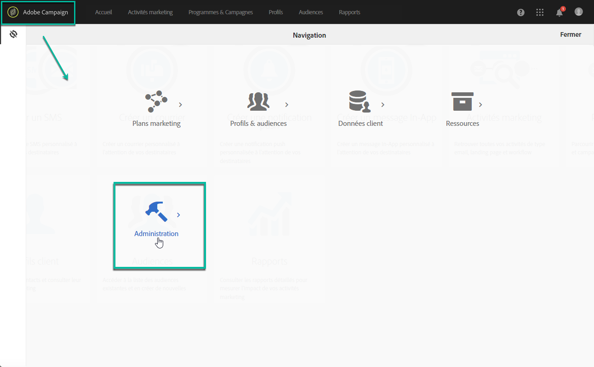

# Accès au panneau de contrôle {#accessing-control-panel}

Le panneau de contrôle est disponible directement depuis Experience Cloud ou depuis le produit lui-même.

Il est accessible uniquement aux **utilisateurs administrateurs**. Pour plus d’informations sur l’affectation des utilisateurs au groupe Administrateurs, reportez-vous à [cette section](../../discover/using/managing-permissions.md).

## Accès à partir de la plateforme Experience Cloud {#access-experience-cloud-platform}

Pour accéder au panneau de contrôle à partir de la plateforme Adobe Experience Cloud, suivez la procédure ci-dessous.

1. Naviguez vers la [page d’accueil d’Experience Cloud](https://experiencecloud.adobe.com/){target=&quot;_blank&quot;}.

1. Cliquez sur le lien dédié dans la section **Accès rapide**.

   

Le panneau de contrôle est également accessible à partir du **sélecteur de solution** de la plateforme Experience Cloud :

1. Sur la [page d’accueil d’Adobe Experience Cloud](https://experiencecloud.adobe.com/){target=&quot;_blank&quot;}, sélectionnez **Campaign** dans la section **Accès rapide** ou dans le menu supérieur droit.

   

1. La liste des instances Campaign s’affiche. Cliquez sur la carte **Panneau de contrôle** pour le lancer.

   

## Accès depuis le produit {#access-product}

>[!NOTE]
>
>L’accès depuis le produit est disponible uniquement pour [Campaign Standard](https://experienceleague.adobe.com/docs/campaign-standard/using/campaign-standard-home.html?lang=fr){target=&quot;_blank&quot;}.

1. Ouvrez votre produit Campaign Standard.

1. Sélectionnez le menu **[!UICONTROL Administration]** dans le volet **Navigation**.

   

1. Cliquez sur l’icône **[!UICONTROL Panneau de contrôle]**.

   
