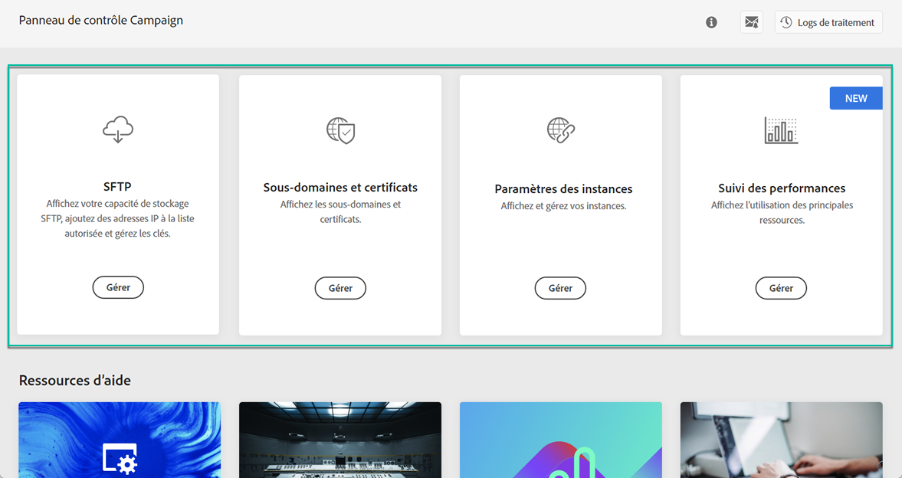

# Découverte de l'interface du Panneau de configuration {#discovering-interface}

La page d'accueil du panneau de contrôle vous donne accès à toutes les actions qui peuvent être effectuées sur vos instances Campaign.

They are represented by cards that are organized into topics, for example **Storage &amp; Database Management**.

D'autres rubriques et vignettes seront disponibles avec les prochaines versions de Campaign.

## Logs de traitement {#job-logs}

Le bouton **[!UICONTROL Logs de traitement]** situé dans le coin supérieur droit vous permet de contrôler toutes les modifications apportées par les utilisateurs de votre entreprise.

Pour obtenir des détails supplémentaires, cliquez sur un élément de la liste.

Le bouton **[!UICONTROL Ouvrir]** vous permet d’accéder directement à l’onglet Panneau de configuration où la modification a été effectuée.

## Ressources d'aide {#help-resources}

The **[!UICONTROL Help Resources]** section provides useful documentation to help you in your use of the Control Panel and Campaign products. N'hésitez pas à l'explorer.

