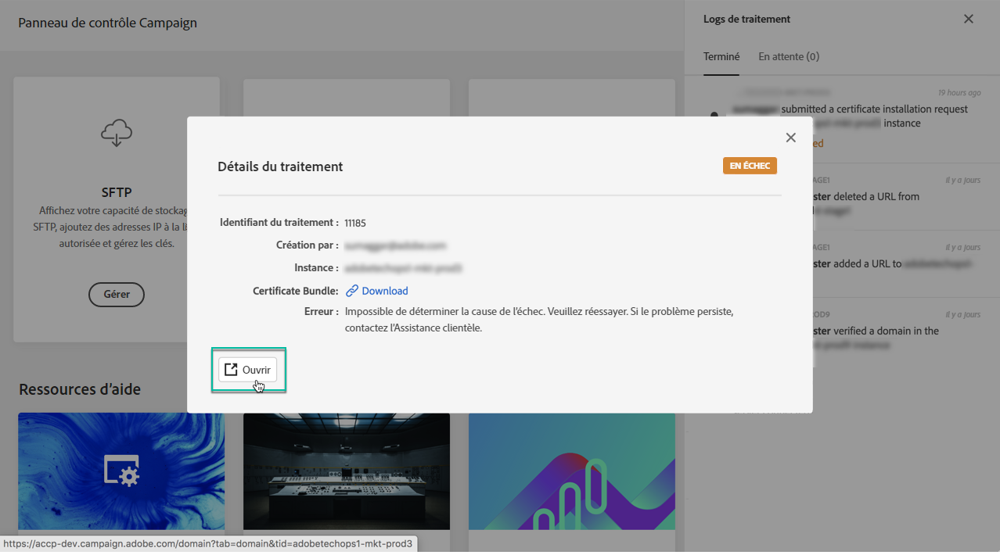

# Découverte de l’interface du Panneau de contrôle {#discovering-interface}

La page d’accueil du Panneau de contrôle vous donne accès à toutes les actions qui peuvent être effectuées sur vos instances Campaign.

Elles sont représentées par des cartes organisées en rubriques, par exemple **Suivi des performances**.

<!--With upcoming Campaign releases, more topics and cards will be made available.-->

## Logs de traitement {#job-logs}

Le bouton **[!UICONTROL Logs de traitement]** situé dans le coin supérieur droit vous permet de contrôler toutes les modifications apportées par les utilisateurs de votre entreprise.

Pour obtenir des détails supplémentaires, cliquez sur un élément de la liste.

Le bouton **[!UICONTROL Ouvrir]** vous permet d’accéder directement à l’onglet Panneau de contrôle où la modification a été effectuée.

## Ressources d’aide {#help-resources}

La section **[!UICONTROL Ressources d’aide]** propose de la documentation pour vous aider à utiliser le Panneau de contrôle et les produits Campaign. N’hésitez pas à l’explorer.

