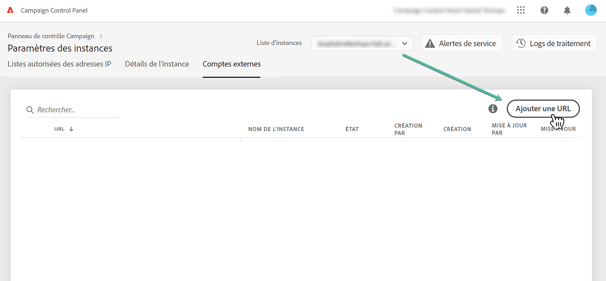

# Connexion des instances MID/RT

>[!CONTEXTUALHELP]
>id="cp_externalaccounts_url"
>title="Détails du sous-domaine"
>abstract="Dans cet écran, les clients disposant d’un modèle d’hébergement hybride peuvent fournir leurs instances MID/RT présentes dans leur instance marketing afin d’effectuer des actions spécifiques dans Panneau de Contrôle."

Panneau de Contrôle permet aux clients disposant d’un modèle d’hébergement hybride d’effectuer une action spécifique dans Panneau de Contrôle en fournissant leurs instances MID/RT présentes dans leur instance marketing. Pour plus d’informations sur les modèles d’hébergement, reportez-vous à la section [Documentation du Campaign Classic](https://experienceleague.adobe.com/docs/campaign-classic/using/installing-campaign-classic/architecture-and-hosting-models/hosting-models-lp/hosting-models.html).

## Connexion d’une instance MID/RT {#connect}

>[!CONTEXTUALHELP]
>id="cp_externalaccounts_operator"
>title="Détails du sous-domaine"
>abstract="Identifiant de l&#39;opérateur utilisé dans la console cliente pour ajouter l&#39;instance MID/RT dans l&#39;instance marketing."

>[!CONTEXTUALHELP]
>id="cp_externalaccounts_password"
>title="Détails du sous-domaine"
>abstract="Mot de passe de l&#39;opérateur utilisé dans la console cliente pour ajouter l&#39;instance MID/RT dans l&#39;instance marketing."

Pour fournir une instance MID/RT dans le Panneau de Contrôle, procédez comme suit :

1. Dans le **[!UICONTROL Paramètres des instances]** , sélectionnez **[!UICONTROL Comptes externes]** .

1. Sélectionnez l&#39;instance marketing dans la liste déroulante, puis cliquez sur **[!UICONTROL Ajouter une URL]**.

   

1. Fournissez des informations sur l’instance MID/RT à connecter :
   * **[!UICONTROL URL]**: URL de l&#39;instance,
   * **[!UICONTROL Opérateur]** / **[!UICONTROL Mot de passe]**: Identifiants de l’opérateur utilisé dans la console cliente pour ajouter l’instance MID/RT dans l’instance marketing.

   

1. Cliquez sur **[!UICONTROL Enregistrer]** pour valider.

Votre instance est maintenant connectée au Panneau de Contrôle. Vous pouvez supprimer ou désactiver une connexion à tout moment en la sélectionnant dans la liste.

## Fonctionnalités disponibles pour les instances MID/RT {#capabilities}

Une fois qu’une instance MID/RT est connectée au Panneau de Contrôle, vous pouvez exploiter les fonctionnalités répertoriées ci-dessous pour la surveiller :

* [Affichage des détails de votre instance](../../instances-settings/using/instance-details.md),
* [Ajoutez des adresses IP à la liste autorisée pour accéder à vos instances](../../instances-settings/using/ip-allow-listing-instance-access.md),
* [Affichage des informations sur les sous-domaines délégués](../../subdomains-certificates/using/setting-up-new-subdomain.md),
* [Affichage des informations sur les certificats SSL](../../subdomains-certificates/using/monitoring-ssl-certificates.md).
