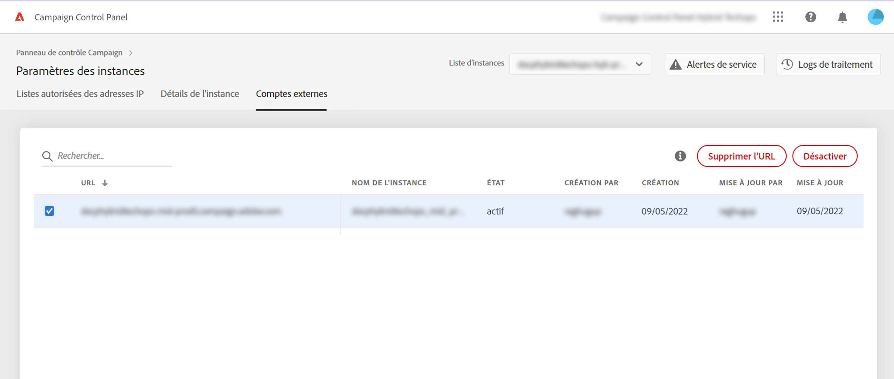

# Ajouter des instances MID/RT (modèle hybride){#add-mid-rt-instances-hybrid-model}

>[!CONTEXTUALHELP]
>id="cp_externalaccounts"
>title="Comptes externes"
>abstract="Dans cette fenêtre, les clients disposant d’un modèle d’hébergement hybride peuvent fournir l’URL de leur instance MID/RT configurée dans l’instance marketing dans le panneau de contrôle, afin de tirer parti des fonctionnalités du panneau de contrôle."

Le panneau de contrôle permet aux clients disposant d’un modèle d’hébergement hybride de tirer parti des fonctionnalités spécifiques du panneau de contrôle. Pour ce faire, vous devez :

* [Founir l’URL de l’instance MID/RT](#add) configurée dans votre instance marketing dans le panneau de contrôle,
* [Ajouter l’adresse IP de l’instance MID/RT à la liste autorisée](#ip) pour permettre à l’instance marketing de s’y connecter.

Pour plus d’informations sur les modèles d’hébergement, reportez-vous à la [documentation de Campaign Classic](https://experienceleague.adobe.com/docs/campaign-classic/using/installing-campaign-classic/architecture-and-hosting-models/hosting-models-lp/hosting-models.html?lang=fr).

## Ajouter une instance MID/RT {#add}

>[!CONTEXTUALHELP]
>id="cp_externalaccounts_url"
>title="URL"
>abstract="URL de l’instance, qui peut être trouvée dans la console client de Campaign dans le menu Administration > Plateforme > Comptes externes."

>[!CONTEXTUALHELP]
>id="cp_externalaccounts_operator"
>title="Opérateur"
>abstract="Identifiant de l’opérateur fourni après l’approvisionnement initial par Adobe Admin."

>[!CONTEXTUALHELP]
>id="cp_externalaccounts_password"
>title="Mot de passe"
>abstract="Mot de passe de l’opérateur fourni après l’approvisionnement initial par Adobe Admin."

Les clients hybrides doivent se connecter au panneau de contrôle via Experience Cloud. Lorsque vous accédez au panneau de contrôle pour la première fois, seules deux vignettes s’affichent sur la page d’accueil.

>[!NOTE]
>
>Si vous rencontrez des problèmes pour accéder au panneau de contrôle d’accès, il est fort probable que votre instance marketing ne soit pas encore mappée à votre [identifiant d’organisation](https://experienceleague.adobe.com/docs/core-services/interface/administration/organizations.html?lang=fr). Contactez l’assistance clientèle afin de compléter cette configuration pour continuer. Une fois la connexion établie, la page d’accueil du panneau de contrôle s’affiche.

Pour pouvoir accéder aux fonctionnalités du panneau de contrôle, vous devez fournir les informations de votre instance MID/RT dans la vignette des **[!UICONTROL Paramètres des instances]**. Pour ce faire, suivez les étapes ci-après.

1. Dans la vignette **[!UICONTROL Paramètres des instances]**, sélectionnez l’onglet **[!UICONTROL Comptes externes]**.

1. Sélectionnez l’instance marketing désirée dans la liste déroulante, puis cliquez sur **[!UICONTROL Ajouter une nouvelle URL]**.

   

1. Fournissez des informations sur l’instance MID/RT à ajouter.

   

   * **[!UICONTROL URL]** : URL de l’instance, qui peut être trouvée dans la console client de Campaign dans le menu **[!UICONTROL Administration]** > **[!UICONTROL Plateforme]** > **[!UICONTROL Comptes externes]**.

     

   * **[!UICONTROL Opérateur]**/**[!UICONTROL Mot de passe]** : les informations d’identification de l’opérateur fournies après l’approvisionnement initial par Adobe Admin.

     >[!NOTE]
     >
     >Si ces informations ne sont pas disponibles, contactez l’assistance clientèle.

1. Cliquez sur **[!UICONTROL Enregistrer]** pour confirmer.

Lors de l’ajout d’une URL MID/RT, un processus asynchrone est déclenché pour valider l’exactitude des URL. Ce processus peut prendre quelques minutes. Tant que l’URL de l’instance MID/RT ne sera pas validée, le traitement restera en attente. Une fois la validation terminée, vous pouvez accéder aux principales fonctionnalités du panneau de contrôle.

Vous pouvez supprimer ou désactiver l’URL d&#39;une instance MID/RT à tout moment en la sélectionnant dans la liste.

Notez que vous pouvez surveiller toute action effectuée dans l’onglet **[!UICONTROL Comptes externes]** sur une URL d’instance MID/RT à partir des **[!UICONTROL Logs de traitement]** :

## Ajouter l’adresse IP à la liste autorisée {#ip}

Une fois l’instance MID/RT ajoutée, vous devez ajouter son adresse IP à la liste autorisée afin que votre instance marketing puisse s’y connecter.

Cette opération peut être effectuée depuis l’onglet **[!UICONTROL Listes autorisées des adresses IP]** dans la vignette **[!UICONTROL Paramètres des instances]**. [Découvrez comment ajouter des adresses IP à la liste autorisée](ip-allow-listing-instance-access.md)

Une fois cette opération terminée, vous pourrez utiliser les fonctionnalités du panneau de contrôle avec votre instance MID/RT.

## Fonctionnalités disponibles pour les clients hybrides {#capabilities}

Une fois qu’une instance MID/RT est ajoutée au panneau de contrôle, vous pouvez tirer parti des fonctionnalités répertoriées ci-dessous :

* [Surveiller les contacts et les événements principaux](../../service-events/service-events.md)
* [Afficher les détails de votre instance](../../instances-settings/using/instance-details.md),
* [Ajouter des adresses IP à la liste autorisée](../../instances-settings/using/ip-allow-listing-instance-access.md),
* [Configurer de nouveaux sous-domaines](../../subdomains-certificates/using/setting-up-new-subdomain.md)
* [Renouveler les certificats SSL des sous-domaines](../../subdomains-certificates/using/renewing-subdomain-certificate.md).
