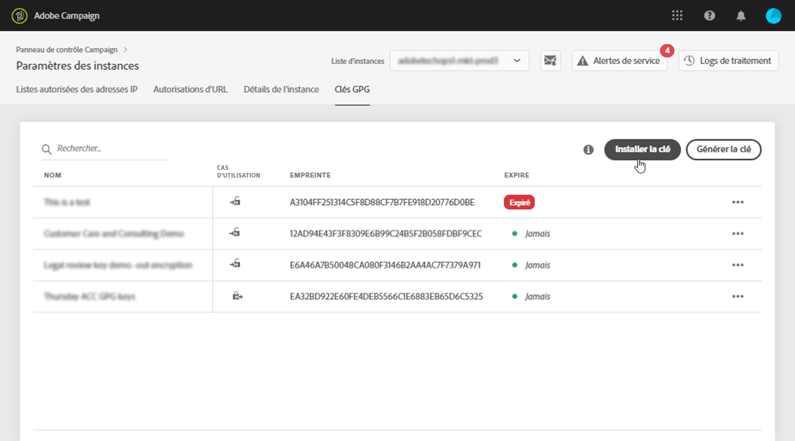
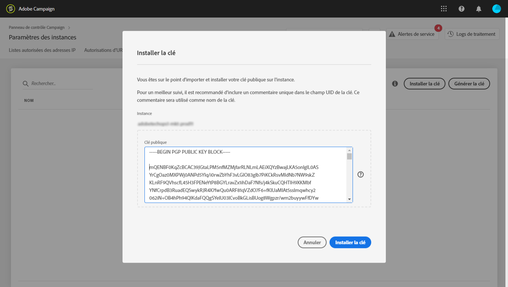

# Gestion des clés GPG {#gpg-keys-management}

## À propos du chiffrement GPG {#about-gpg-encryption}

Le cryptage GPG permet de protéger vos données à l’aide d’un système de paires de clés publique-privée qui respectent la spécification [OpenPGP](https://www.openpgp.org/about/standard/).

Une fois ce système mis en œuvre, les données entrantes peuvent être décryptées et les données sortantes cryptées avant le transfert, afin qu’elles ne soient accessibles à personne sans une paire de clés correspondante valide.

 Découvrez cette fonctionnalité dans la vidéo à l&#39;aide d&#39;un [Campaign Classic](https://docs.adobe.com/content/help/fr-FR/campaign-classic-learn/tutorials/administrating/control-panel-acc/gpg-key-management/gpg-key-management-overview.html) ou d&#39;un [Campaign Standard](https://docs.adobe.com/content/help/fr-FR/campaign-standard-learn/tutorials/administrating/control-panel/gpg-key-management/gpg-key-management-overview.html)

Pour mettre en œuvre le cryptage GPG avec Campaign, les clés GPG doivent être installées et/ou générées sur une instance marketing par un utilisateur administrateur directement à partir du panneau de contrôle.

Vous pourrez alors :

* **Crypter les données envoyées** : Adobe Campaign envoie les données après les avoir cryptées avec la clé publique installée.

* **Décrypter les données entrantes** : Adobe Campaign reçoit des données cryptées à partir d’un système externe à l’aide d’une clé publique téléchargée à partir du panneau de contrôle. Adobe Campaign décrypte les données à l’aide d’une clé privée générée à partir du panneau de contrôle.

## Cryptage des données {#encrypting-data}

Le panneau de contrôle permet de crypter les données provenant de votre instance Adobe Campaign.

Pour cela, vous devez générer une paire de clés GPG à partir d’un outil de cryptage PGP, puis installer la clé publique dans le panneau de contrôle. Vous pourrez alors crypter les données avant de les envoyer depuis votre instance. Pour ce faire, suivez les étapes ci-après.

 Découvrez comment générer et installer des clés GPG dans la vidéo en utilisant le [Campaign Classic](https://experienceleague.adobe.com/docs/campaign-classic-learn/control-panel/instance-settings/gpg-key-management/generating-and-installing-gpg-keys-for-data-encryption.html?lang=en#instance-settings) ou le [Campaign Standard](https://experienceleague.adobe.com/docs/campaign-standard-learn/control-panel/instance-settings/gpg-key-management/generating-and-installing-gpg-keys-for-data-encryption.html?lang=en#instance-settings)

1. Générez une paire de clés publique/privée à l’aide d’un outil de cryptage PGP suivant la [spécification OpenPGP](https://www.openpgp.org/about/standard/). Pour cela, installez un utilitaire GPG ou un logiciel GNuPG.

   >[!NOTE]
   >
   >Des logiciels open source gratuits permettant de générer des clés sont disponibles. Veillez toutefois à respecter les directives de votre entreprise et à utiliser l’utilitaire GPG recommandé par le service informatique/de sécurité.

1. Une fois l’utilitaire installé, exécutez la commande ci-dessous, dans la commande Mac Terminal ou Windows.

   `gpg --full-generate-key`

1. Lorsque vous y êtes invité, spécifiez les paramètres de votre clé. Les paramètres requis sont les suivants :

   * **type de clé** : RSA
   * **longueur de clé** : 1 024 à 4 096 bits
   * **nom réel** et **adresse email** : permet de suivre qui a créé la paire de clés. Entrez un nom et une adresse email associés à votre organisation ou votre service.
   * **commentaire** : l’ajout d’un libellé au champ de commentaire vous aidera à identifier facilement la clé à utiliser pour chiffrer vos données.
   * **Expiration** : date ou « 0 » pour aucune date d’expiration.
   * **mot de passe**

   

1. Une fois confirmé, le script génère une clé avec son empreinte associée que vous pouvez exporter dans un fichier ou coller directement dans le panneau de contrôle. Pour exporter le fichier, exécutez cette commande suivie de l’empreinte de la clé que vous avez générée.

   `gpg -a --export <fingerprint>`

1. Pour installer la clé publique dans le Panneau de contrôle, ouvrez la carte **[!UICONTROL Paramètres des instances]**, puis sélectionnez l’onglet **[!UICONTROL Clés GPG]** et l’instance de votre choix.

1. Cliquez sur le bouton **[!UICONTROL Installer la clé]**.

   

1. Collez la clé publique qui a été générée à partir de votre outil de cryptage PGP. Vous pouvez également effectuer directement un glisser-déposer du fichier de clé publique que vous avez exporté.

   >[!NOTE]
   >
   >La clé publique doit être au format OpenPGP.

   

1. Cliquez sur le bouton **[!UICONTROL Installer la clé]**.

Une fois la clé publique installée, elle apparaît dans la liste. Vous pouvez utiliser le bouton **...** pour la télécharger ou copier son empreinte.

La clé peut être ensuite utilisée dans les workflows Adobe Campaign. Vous pouvez l’utiliser pour crypter des données lors de l’utilisation d’activités d’extraction de données.

Pour en savoir plus sur ce sujet, consultez la documentation Adobe Campaign :

**Campaign Classic:**

* [Compresser ou crypter un fichier](https://docs.adobe.com/content/help/fr-FR/campaign-classic/using/automating-with-workflows/general-operation/how-to-use-workflow-data.html#zipping-or-encrypting-a-file)
* [Cas pratique : cryptage et export de données à l’aide d’une clé installée sur le panneau de contrôle](https://docs.adobe.com/content/help/fr-FR/campaign-classic/using/automating-with-workflows/general-operation/how-to-use-workflow-data.html#use-case-gpg-encrypt)

**Campaign Standard:**

* [Gérer des données cryptées](https://docs.adobe.com/content/help/fr-FR/campaign-standard/using/managing-processes-and-data/importing-and-exporting-data/managing-encrypted-data.html)
* [Cas pratique : cryptage et export de données à l’aide d’une clé installée sur le panneau de contrôle](https://docs.adobe.com/content/help/fr-FR/campaign-standard/using/managing-processes-and-data/importing-and-exporting-data/managing-encrypted-data.html#use-case-gpg-encrypt)

 Découvrez comment chiffrer des données dans une vidéo à l’aide d’un [Campaign Classic](https://experienceleague.adobe.com/docs/campaign-classic-learn/control-panel/instance-settings/gpg-key-management/using-a-gpg-key-to-encrypt-data.html?lang=en#instance-settings) ou d’un [Campaign Standard](https://experienceleague.adobe.com/docs/campaign-standard-learn/control-panel/instance-settings/gpg-key-management/using-a-gpg-key-to-encrypt-data.html?lang=en#instance-settings)

## Décrypter des données {#decrypting-data}

Le panneau de contrôle permet de décrypter des données externes entrant dans vos instances Adobe Campaign.

Pour cela, vous devez générer une paire de clés GPG directement à partir du panneau de contrôle.

* La **clé publique** sera partagée avec le système externe. Ce dernier l’utilisera pour crypter les données à envoyer à Campaign.
* Campaign utilisera la **clé privée** pour décrypter les données cryptées entrantes.

 Découvrez cette fonctionnalité dans la vidéo à l&#39;aide d&#39;un [Campaign Classic](https://experienceleague.adobe.com/docs/campaign-classic-learn/control-panel/instance-settings/gpg-key-management/decrypting-data.html?lang=en#decrypting-data) ou d&#39;un [Campaign Standard](https://experienceleague.adobe.com/docs/campaign-standard-learn/control-panel/instance-settings/gpg-key-management/decrypting-data.html?lang=en#instance-settings)

Pour générer une paire de clés dans le panneau de contrôle, procédez comme suit :

1. Ouvrez la carte **[!UICONTROL Paramètres des instances]**, puis sélectionnez l’onglet **[!UICONTROL Clés GPG]** et l’instance Adobe Campaign souhaitée.

1. Cliquez sur le bouton **[!UICONTROL Générer la clé]**.

   

1. Indiquez le nom de la clé, puis cliquez sur **[!UICONTROL Générer la clé]**. Ce nom vous permettra d’identifier la clé à utiliser pour le décryptage dans les workflows de Campaign.

   

Une fois la paire de clés générée, la clé publique apparaît dans la liste. Notez que les paires de clés de décryptage sont générées sans date d’expiration.

Vous pouvez utiliser le bouton **...** pour télécharger la clé publique ou copier son empreinte.

La clé publique peut être alors partagée avec tout système externe. Adobe Campaign pourra utiliser la clé privée dans les activités de chargement de données pour décrypter les données cryptées à l’aide de la clé publique.

Voir à ce propos les documentations d’Adobe Campaign :

**Campaign Classic:**

* [Décompresser ou décrypter un fichier avant traitement](https://docs.adobe.com/content/help/fr-FR/campaign-classic/using/automating-with-workflows/general-operation/importing-data.html#unzipping-or-decrypting-a-file-before-processing)
* [Cas pratique : import de données cryptées à l’aide d’une clé générée par le panneau de contrôle](https://docs.adobe.com/content/help/fr-FR/campaign-classic/using/automating-with-workflows/general-operation/importing-data.html#use-case-gpg-decrypt)

**Campaign Standard:**

* [Gérer des données cryptées](https://docs.adobe.com/content/help/fr-FR/campaign-standard/using/managing-processes-and-data/importing-and-exporting-data/managing-encrypted-data.html)
* [Cas pratique : import de données cryptées à l’aide d’une clé générée par le panneau de contrôle](https://docs.adobe.com/content/help/fr-FR/campaign-standard/using/managing-processes-and-data/importing-and-exporting-data/managing-encrypted-data.html#use-case-gpg-decrypt)

## Surveillance des clés GPG

Pour accéder aux clés GPG installées et générées pour vos instances, ouvrez la carte **[!UICONTROL Paramètres des instances]**, puis sélectionnez l’onglet **[!UICONTROL Clés GPG]**.

La liste contient toutes les clés GPG de cryptage et de décryptage qui ont été installées et générées pour vos instances, avec des informations détaillées sur chaque clé :

* **[!UICONTROL Nom]** : nom défini lors de l’installation ou de la génération de la clé.
* **[!UICONTROL Cas pratique]** : cette colonne indique le cas pratique de la clé :

    : la clé a été installée pour le cryptage des données.

    : la clé a été générée pour permettre le décryptage des données.

* **[!UICONTROL Empreinte]** : empreinte de la clé.
* **[!UICONTROL Expire]** : date d’expiration de la clé. Remarque : le panneau de contrôle donne des indications visuelles à l’approche de sa date d’expiration :

   * Urgent (rouge) s’affiche 30 jours avant.
   * Avertissement (jaune) s’affiche 60 jours avant.
   * Une bannière rouge « Expirée » s’affiche une fois qu’une clé arrive à expiration.

   >[!NOTE]
   >
   >Aucune notification par email ne sera envoyée par le panneau de contrôle.

Il est recommandé de supprimer toute clé dont vous n’avez plus besoin. Pour cela, cliquez sur le bouton **...**, puis sélectionnez **[!UICONTROL Supprimer la clé].**.

>[!IMPORTANT]
>
>Avant de supprimer une clé, vérifiez qu’elle n’est utilisée dans aucun workflow Adobe Campaign pour éviter tout échec.
