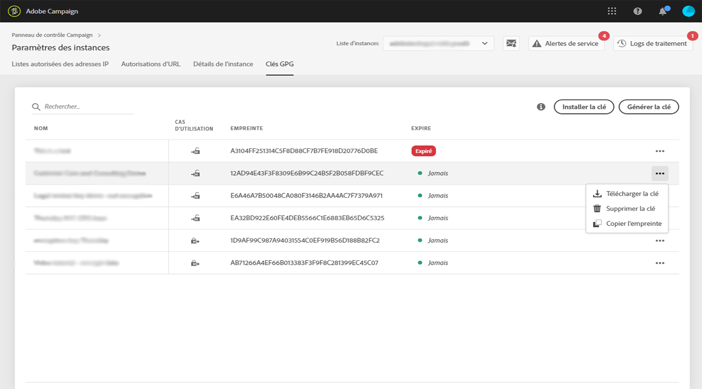

# Gestion des clés GPG {#gpg-keys-management}

## À propos du chiffrement GPG {#about-gpg-encryption}

Le cryptage GPG permet de protéger vos données à l’aide d’un système de paires de clés publique-privée qui respectent la spécification [OpenPGP](https://www.openpgp.org/about/standard/).

Une fois ce système mis en œuvre, les données entrantes peuvent être décryptées et les données sortantes cryptées avant le transfert, afin qu’elles ne soient accessibles à personne sans une paire de clés correspondante valide.

Pour mettre en œuvre le cryptage GPG avec Campaign, les clés GPG doivent être installées et/ou générées sur une instance marketing par un utilisateur administrateur directement à partir du panneau de contrôle.

Vous pourrez alors :

* **Crypter les données envoyées** : Adobe Campaign envoie les données après les avoir cryptées avec la clé publique installée.

* **Décrypter les données entrantes** : Adobe Campaign reçoit des données cryptées à partir d’un système externe à l’aide d’une clé publique téléchargée à partir du panneau de contrôle. Adobe Campaign décrypte les données à l’aide d’une clé privée générée à partir du panneau de contrôle.

## Surveillance des clés GPG

Pour accéder aux clés GPG installées et générées pour vos instances, ouvrez la carte **[!UICONTROL Paramètres des instances]**, puis sélectionnez l&#39;onglet **[!UICONTROL Clés GPG]**.

La liste contient toutes les clés GPG de cryptage et de décryptage qui ont été installées et générées pour vos instances, avec des informations détaillées sur chaque clé :

* **[!UICONTROL Nom]** : nom défini lors de l’installation ou de la génération de la clé.
* **[!UICONTROL Cas pratique]** : cette colonne indique le cas pratique de la clé :

    : la clé a été installée pour le cryptage des données.

    : la clé a été générée pour permettre le décryptage des données.

* **[!UICONTROL Empreinte]** : empreinte de la clé.
* **[!UICONTROL Expire]** : date d’expiration de la clé. Remarque : le panneau de contrôle donne des indications visuelles à l’approche de sa date d’expiration :

   * Urgent (rouge) s’affiche 30 jours avant.
   * Avertissement (jaune) s’affiche 60 jours avant.
   * Une bannière rouge « Expirée » s’affiche une fois qu’une clé arrive à expiration.
   >[!NOTE]
   >
   >Aucune notification par email ne sera envoyée par le panneau de contrôle.

Il est recommandé de supprimer toute clé dont vous n’avez plus besoin. Pour cela, cliquez sur le bouton **...**, puis sélectionnez **[!UICONTROL Supprimer la clé].**.

>[!IMPORTANT]
>
>Avant de supprimer une clé, vérifiez qu’elle n’est utilisée dans aucun workflow Adobe Campaign pour éviter tout échec.

## Cryptage des données {#encrypting-data}

Le panneau de contrôle permet de crypter les données provenant de votre instance Adobe Campaign.

Pour cela, vous devez générer une paire de clés GPG à partir d’un outil de cryptage PGP, puis installer la clé publique dans le panneau de contrôle. Vous pourrez alors crypter les données avant de les envoyer depuis votre instance. Pour ce faire, procédez comme suit :

1. Générez une paire de clés publique/privée à l’aide d’un outil de cryptage GPG suivant la [spécification OpenPGP](https://www.openpgp.org/about/standard/). Pour ce faire, installez un utilitaire GPG ou un logiciel GNuGP.

   >[!NOTE]
   >
   >Un logiciel libre pour générer des clés est disponible. Toutefois, veillez à respecter les directives de votre entreprise et à utiliser l’utilitaire GPG recommandé par votre organisation informatique/sécurité.

1. Une fois l&#39;utilitaire installé, exécutez la commande ci-dessous, sous Mac Terminal ou Windows.

   `gpg --full-generate-key`

1. Lorsque vous y êtes invité, spécifiez les paramètres de votre clé. Les paramètres requis sont les suivants :

   * **type de clé** : RSA
   * **longueur de clé** : 1 024 à 4 096 bits
   * **nom réel** et **adresse email** : permet de suivre qui a créé la paire de clés. Entrez un nom et une adresse email associés à votre organisation ou votre service.
   * **commentaire** : l’ajout d’un libellé au champ de commentaire permet d’identifier facilement la clé dans la liste des clés du panneau de contrôle.
   * **Expiration** : date ou « 0 » pour aucune date d’expiration.
   * **mot de passe**
   

1. Une fois confirmé, le script génère une clé que vous pouvez exporter dans un fichier ou coller directement dans le panneau de contrôle. Pour exporter le fichier, exécutez cette commande suivie de l&#39;empreinte de la clé que vous avez générée.

   `gpg -a --export <fingerprint>`

1. Pour installer la clé publique dans le Panneau de configuration, accédez à l&#39;onglet **[!UICONTROL Clés GPG]**, puis sélectionnez l’instance de votre choix.

1. Cliquez sur le bouton **[!UICONTROL Installer la clé]**.

   

1. Collez la clé publique qui a été générée à partir de votre outil de cryptage PGP. Vous pouvez également effectuer directement un glisser-déposer du fichier de clé publique.

   >[!NOTE]
   >
   >La clé publique doit être au format OpenPGP.

   

1. Cliquez sur le bouton **[!UICONTROL Installer la clé]**.

Une fois la clé publique installée, elle apparaît dans la liste. You can use the **...** button to download it or copy its fingerprint.

La clé peut être ensuite utilisée dans les workflows Adobe Campaign. Vous pouvez l’utiliser pour crypter des données lors de l’utilisation d’activités d’extraction de données.

Pour plus d’informations à ce sujet, reportez-vous à la documentation Adobe Campaign :

**Campaign Classic:**

* [Compresser ou crypter un fichier](https://docs.adobe.com/content/help/fr-FR/campaign-classic/using/automating-with-workflows/general-operation/how-to-use-workflow-data.html#zipping-or-encrypting-a-file)
* [Activité Extraction des données (fichier)](https://docs.adobe.com/content/help/fr-FR/campaign-classic/using/automating-with-workflows/action-activities/extraction--file-.html)

**Campaign Standard:**

* [Gérer des données cryptées](https://docs.adobe.com/content/help/fr-FR/campaign-standard/using/managing-processes-and-data/workflow-general-operation/importing-data.html#managing-encrypted-data)
* [Activité Extraction de fichier](https://docs.adobe.com/content/help/fr-FR/campaign-standard/using/managing-processes-and-data/data-management-activities/extract-file.html)

## Décrypter des données {#decrypting-data}

Le panneau de contrôle permet de décrypter des données externes entrant dans vos instances Adobe Campaign.

Pour cela, vous devez générer une paire de clés GPG directement à partir du panneau de contrôle.

* La **clé publique** sera partagée avec le système externe. Ce dernier l’utilisera pour crypter les données à envoyer à Campaign.
* Campaign utilisera la **clé privée** pour décrypter les données cryptées entrantes.

Pour générer une paire de clés dans le panneau de contrôle, procédez comme suit :

1. Accédez à l&#39;onglet **[!UICONTROL Clés GPG]**, puis sélectionnez l’instance Adobe Campaign de votre choix.

1. Cliquez sur le bouton **[!UICONTROL Générer la clé]**.

   

1. Indiquez le nom de la clé, puis cliquez sur **!UICONTROL Générer la clé&#x200B;**. Ce nom vous permettra d’identifier la clé à utiliser pour le décryptage dans les workflows de Campaign.

   

Une fois la paire de clés générée, la clé publique apparaît dans la liste. Notez que les paires de clés de décryptage sont générées sans date d’expiration.

You can use the **...** button to download the public key or copy its fingerprint.

La clé publique peut être alors partagée avec tout système externe. Adobe Campaign pourra utiliser la clé privée dans les activités de chargement de données pour déchiffrer les données chiffrées à l’aide de la clé publique.

Pour plus d’informations à ce sujet, reportez-vous à la documentation Adobe Campaign :

**Campaign Classic:**

* [Décompresser ou décrypter un fichier avant traitement](https://docs.adobe.com/content/help/fr-FR/campaign-classic/using/automating-with-workflows/general-operation/importing-data.html#unzipping-or-decrypting-a-file-before-processing)
* [Activité Chargement (fichier)](https://docs.adobe.com/content/help/fr-FR/campaign-classic/using/automating-with-workflows/action-activities/data-loading--file-.html)

**Campaign Standard:**

* [Gérer des données cryptées](https://docs.adobe.com/content/help/fr-FR/campaign-standard/using/managing-processes-and-data/workflow-general-operation/importing-data.html#managing-encrypted-data)
* [Activité Chargement de fichier](https://docs.adobe.com/content/help/fr-FR/campaign-standard/using/managing-processes-and-data/data-management-activities/load-file.html)