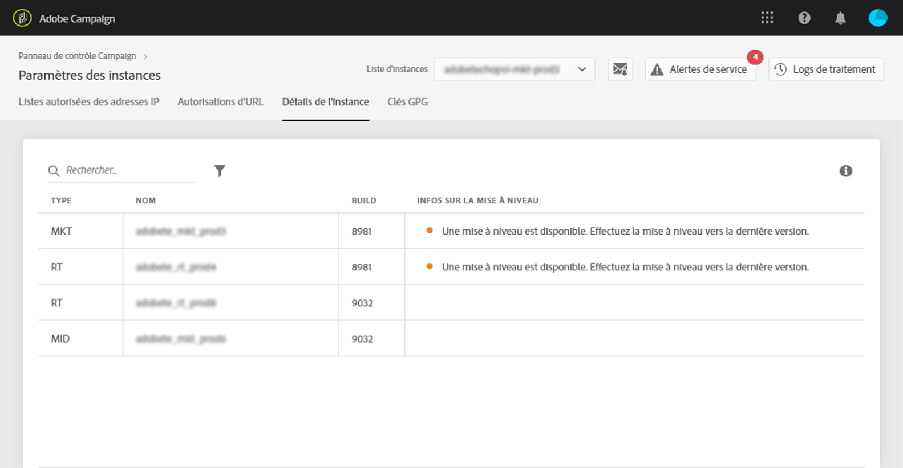

# Détails de lʼinstance {#instance-details}

>[!CONTEXTUALHELP]
>id="cp_instancesettings_instancedetails"
>title="À propos des détails de lʼinstance"
>abstract="Affichez les détails de vos instances Adobe Campaign : types, noms, informations de build et recommandations de mises à niveau éventuelles."

## À propos des détails de l’instance {#about-instance-details}

>[!IMPORTANT]
>
>Cette fonctionnalité est disponible uniquement pour les instances de Campaign v7/v8.

L’architecture de votre instance Adobe Campaign peut contenir plusieurs serveurs pour garantir la flexibilité des activités marketing. Par exemple, des serveurs Marketing, Real Time (ou Message Center) et Mid-sourcing peuvent prendre en charge votre instance.

La fonctionnalité Détails de l’instance vous permet d’afficher l’architecture plane de votre instance. En plus de fournir des informations sur le serveur, elle vous permet également de savoir si le build de votre instance est à jour ou pas et vous indique les upgrades recommandés lorsque cela est nécessaire.

>[!NOTE]
>
>Nous vous recommandons de mettre à niveau vos instances au moins une fois par an afin d&#39;éviter une dégradation des performances et de pouvoir profiter des fonctionnalités et correctifs les plus récents proposés par Adobe Campaign v7/v8.

**Rubriques connexes :**

* [Réalisation d’un upgrade de build](https://docs.campaign.adobe.com/doc/AC/getting_started/FR/buildUpgrade.html)
* [Mise à jour d’Adobe Campaign](https://docs.campaign.adobe.com/doc/AC/en/PRO_Updating_Adobe_Campaign_Introduction.html)

## Récupération d’informations sur vos instances {#retrieving-information-about-instances}

Pour obtenir des informations sur les serveurs connectés à vos instances, procédez comme suit :

1. Ouvrez la carte **[!UICONTROL Paramètres des instances]** pour accéder à l’onglet **[!UICONTROL Détails de l’instance]**.

   >[!NOTE]
   >
   >Si la carte Paramètres de l’instance n’est pas visible sur la page d’accueil du Panneau de Contrôle, cela signifie que votre identifiant de l’organisation IMS n’est associé à aucune instance Adobe Campaign v7/v8.

1. Dans le panneau de gauche, sélectionnez l’instance Campaign désirée.

   >[!NOTE]
   >
   >Toutes vos instances Campaign s&#39;affichent dans la liste du volet gauche. La fonction Détails de l’instance étant réservée aux instances de Campaign v7/v8, le message &quot;Instance non applicable&quot; s’affiche si vous sélectionnez une instance de Campaign Standard.

1. Les serveurs connectés à l’instance s’affichent.

   

Les informations disponibles sont les suivantes :

* **[!UICONTROL Type]** : type du serveur. Les valeurs possibles sont MKT (Marketing), MID (Mid-sourcing) et RT (Message Center/Real-time messaging).
* **[!UICONTROL Nom]** : nom du serveur.
* **[!UICONTROL Build]** : la version de build installée sur le serveur.
* **[!UICONTROL Infos sur la mise à niveau]** : cette colonne vous indique si une mise à jour est requise pour le serveur.
   * Vert : votre serveur est à jour et aucun upgrade n’est requis.
   * Jaune : vous devez envisager un upgrade. Vous ne disposez pas des fonctionnalités et des correctifs les plus récents.
   * Rouge : effectuez un upgrade dès que possible. Vous ne disposez pas des nouvelles fonctionnalités et les performances du serveur ne sont peut-être pas optimales.

Si l’un de vos serveurs nécessite un upgrade, reportez-vous à [cette documentation](https://docs.campaign.adobe.com/doc/AC/getting_started/EN/buildUpgrade.html) pour plus de détails sur la manière de procéder.

## Questions courantes {#common-questions}

**Je ne vois pas le serveur MID dans l’architecture de mon instance ; cela veut-il dire que mes instances ne fonctionnent pas correctement ? Ai-je besoin de l’instance RT pour une tâche que je ne suis pas en mesure d’effectuer aujourd’hui ?**

Votre propre instance peut sembler très différente et ne pas disposer de tous les types de serveurs, ou peut disposer de plusieurs instances du même serveur. Ne pas disposer d’un type de serveur ou d’un autre ne signifie pas que vous ne pouvez pas envoyer un message en temps réel ou effectuer d’autres types d’activités. Vous pouvez demander de la capacité de serveur supplémentaire. Dans ce cas, des frais supplémentaires s’appliqueront.

Contactez l’assistance clientèle si vous pensez que certains serveurs n’apparaissent pas sur la page Détails de l’instance. Veillez à indiquer l’URL de l’instance spécifique dans votre message.
