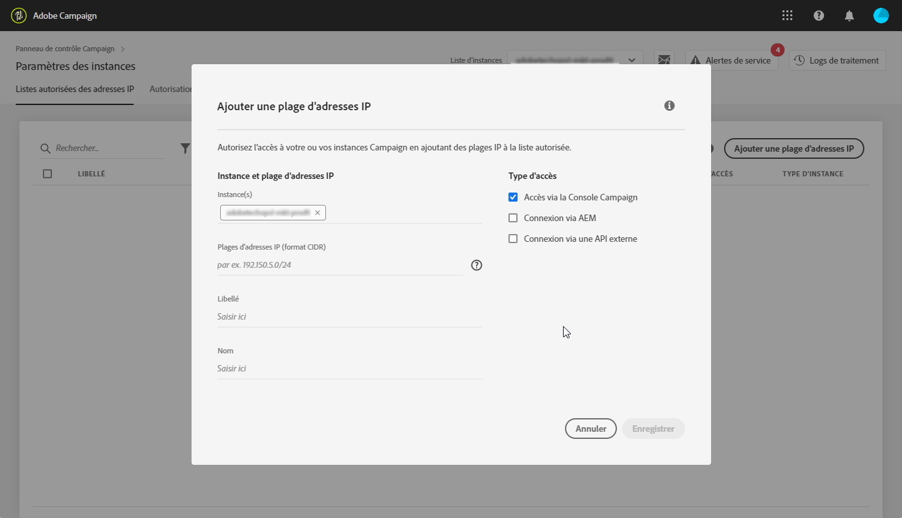

# Listes autorisées d’adresses IP {#ip-allow-listing}

>[!CONTEXTUALHELP]
>id="cp_instancesettings_iprange"
>title="À propos des listes autorisées d’adresses IP"
>abstract="Ajoutez des adresses IP à la liste autorisée pour accéder à vos instances."
>additional-url="https://images-tv.adobe.com/mpcv3/045cac99-f948-478e-ae04-f8c161dcb9e2_1568132508.1920x1080at3000_h264.mp4" text="Regarder une vidéo de démonstration"

## À propos des listes autorisées d’adresses IP {#about-ip-allow-listing}

>[!IMPORTANT]
>
>Cette fonctionnalité est disponible uniquement pour les instances Campaign v7/v8.
>
>Si vous utilisez une instance avec un modèle d’hébergement hybride, vous ne pourrez ajouter des adresses IP que dans « Connexion API externe » pour l’instance RT.

Par défaut, votre instance Adobe Campaign n’est accessible qu’à partir de certaines adresses IP.

Si votre adresse IP n’a pas été ajoutée à la liste autorisée, vous ne pourrez pas vous connecter à l’instance à partir de cette adresse. De même, vous ne pourrez peut-être pas connecter une API à votre instance Message Center ou Marketing si l’adresse IP n’a pas été explicitement ajoutée à la liste autorisée avec l’instance.

Le Panneau de contrôle vous permet de configurer de nouvelles connexions à vos instances en ajoutant des plages d’adresses IP à la liste autorisée. Pour ce faire, suivez la procédure ci-dessous.

Une fois les adresses IP ajoutées à la liste autorisée, vous pouvez créer des opérateurs Campaign et les associer à ces adresses afin que les utilisateurs puissent accéder à l’instance.

 [Découvrez cette fonctionnalité en vidéo](https://experienceleague.adobe.com/docs/campaign-classic-learn/control-panel/instance-settings/ip-allow-listing.html?lang=fr#instance-settings)

## Bonnes pratiques {#best-practices}

Veillez à suivre les recommandations et les limites ci-dessous lors de l’ajout des adresses IP à la liste autorisée dans le Panneau de contrôle.

* **N’activez pas l’accès IP pour tous les types d’accès** si vous ne souhaitez pas que l’adresse IP se connecte à vos serveurs RT ou votre zone de sécurité AEM.
* **Si vous avez provisoirement activé l’accès à votre instance pour une adresse IP**, assurez-vous de supprimer les adresses IP de la liste autorisée une fois que vous n’en avez plus besoin pour vous connecter à votre instance.
* **Nous vous déconseillons d’ajouter les adresses IP des lieux publics (aéroports, hôtels, etc.) à la liste autorisée**. Utilisez l’adresse VPN de votre entreprise pour assurer la sécurité permanente de votre instance.

## Ajout d’adresses IP à la liste autorisée pour lʼaccès aux instances {#adding-ip-addresses-allow-list}

>[!CONTEXTUALHELP]
>id="cp_instancesettings_iprange_add"
>title="Configuration des plages dʼadresses IP"
>abstract="Définissez la plage dʼadresses IP que vous souhaitez ajouter à la liste autorisée pour vous connecter à votre instance."

>[!NOTE]
>
>Si la variable **[!UICONTROL Paramètres des instances]** n’est pas visible sur la page d’accueil du Panneau de Contrôle, ce qui signifie que votre [ID d’organisation](https://experienceleague.adobe.com/docs/core-services/interface/administration/organizations.html?lang=fr) n’est associé à aucune instance Adobe Campaign v7/v8.

Pour ajouter des adresses IP à la liste autorisée, procédez comme suit :

1. Ouvrez la carte **[!UICONTROL Paramètres des instances]** pour accéder à l’onglet des listes autorisées d’adresses IP, puis cliquez sur **[!UICONTROL Ajouter une plage d’adresses IP]**.

   

1. Indiquez les informations correspondant à la plage d’adresses IP que vous souhaitez ajouter à la liste autorisée comme décrit ci-dessous.

   

   * **[!UICONTROL Instance(s)]** : les instances auxquelles les adresses IP seront en mesure de se connecter. Plusieurs instances peuvent être manipulées en même temps. Par exemple, des listes autorisées d’adresses IP peuvent être créées à la fois pour les instances de production et de test via la même étape.
   * **[!UICONTROL Plage d’adresses IP]** : la plage d’adresses IP à ajouter à la liste autorisée, au format CIDR. Veuillez noter qu’une plage d’adresses IP ne peut pas chevaucher une plage existante dans la liste autorisée. Dans ce cas, supprimez d’abord la plage qui contient l’adresse IP qui chevauche.

   >[!NOTE]
   >
   >Le format CIDR (Classless Inter-Domain Routing) est le format pris en charge lors de l’ajout de plages d’adresses IP avec l’interface du Panneau de contrôle. La syntaxe se compose d’une adresse IP, suivie d’un caractère « / » et d’un nombre décimal. Le format et sa syntaxe sont présentés en détail dans [cet article](https://whatismyipaddress.com/cidr).
   >
   >Vous pouvez rechercher sur Internet des outils en ligne gratuits qui vous permettront de convertir la plage IP qui vous intéresse au format CIDR.

   * **[!UICONTROL Libellé]** : libellé qui s’affichera dans la liste autorisée.
   * **[!UICONTROL Nom]** : le nom doit être unique pour le type d’accès, l’instance (dans le cas d’une connexion API externe) et l’adresse IP.

1. Spécifiez le type d’accès que vous souhaitez accorder aux adresses IP :

   * **[!UICONTROL Accès à la console Campaign]** : les adresses IP seront autorisées pour se connecter à la console cliente Campaign. Notez que l’accès à la console n’est activé que pour les instances Marketing. L’accès aux instances MID et RT n’est pas autorisé et n’est donc pas activé.
   * **[!UICONTROL Connexion via AEM]** : les adresses IP AEM spécifiées seront autorisées à se connecter à l’instance Marketing.
   * **[!UICONTROL Connexion via une API externe]** : les API externes ayant les adresses IP spécifiées seront autorisées à se connecter aux instances Marketing et/ou Message Center (RT). Notez que la connexion à la console des instances RT n’est pas activée.

      >[!NOTE]
      >
      >Si vous utilisez une instance avec un modèle d’hébergement hybride, vous ne pourrez ajouter des adresses IP que dans « Connexion API externe » pour l’instance RT.
   

1. Cliquez sur le bouton **[!UICONTROL Enregistrer]**. La plage d’adresses IP est ajoutée à la liste autorisée.

   <!---->

Par défaut, votre instance Adobe Campaign n’est accessible qu’à partir de certaines adresses IP.

Pour supprimer une ou plusieurs plages dʼadresses IP de la liste autorisée, sélectionnez-les puis cliquez sur le bouton **[!UICONTROL Supprimer la plage dʼadresses IP]**.

**Rubrique connexe :**

* [Liaison d’une zone de sécurité à un opérateur](https://docs.campaign.adobe.com/doc/AC/en/INS_Additional_configurations_Configuring_Campaign_server.html#Linking_a_security_zone_to_an_operator)
