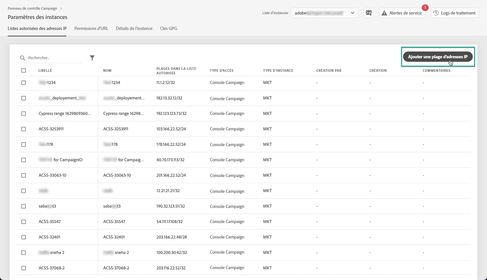

# Liste d’autorisations IP {#ip-allow-listing}

>[!CONTEXTUALHELP]
>id="cp_instancesettings_iprange"
>title="A propos de l&#39;inscription autorisée par IP"
>abstract="Ajoutez des adresses IP à la liste autorisée pour accéder à vos instances."
>additional-url="https://images-tv.adobe.com/mpcv3/045cac99-f948-478e-ae04-f8c161dcb9e2_1568132508.1920x1080at3000_h264.mp4" text="Regarder une vidéo de démonstration"

>[!IMPORTANT]
>
>Cette fonctionnalité est disponible uniquement pour les instances Campaign Classic.

## A propos de l&#39;inscription autorisée par IP {#about-ip-allow-listing}

Par défaut, votre instance Adobe Campaign Classic n’est pas accessible à partir de diverses adresses IP.

Si votre adresse IP n&#39;a pas été ajoutée à la liste autorisée, vous ne pourrez pas vous connecter à l&#39;instance à partir de cette adresse. De la même manière, il se peut que vous ne puissiez pas connecter une API à votre Centre de messages ou instance de marketing si l&#39;adresse IP n&#39;a pas été ajoutée à la liste autorisée avec l&#39;instance explicitement.

Le Panneau de configuration vous permet de configurer de nouvelles connexions à vos instances en ajoutant des plages d&#39;adresses IP à la liste autorisée. Pour ce faire, suivez la procédure ci-dessous.

Une fois les adresses IP sur la liste autorisée, vous pouvez créer des opérateurs Campaign et les lier afin que les utilisateurs puissent y accéder.

## Bonnes pratiques {#best-practices}

Veillez à respecter les recommandations et les restrictions ci-dessous lors de l’ajout d’adresses IP à la liste autorisée dans le Panneau de configuration.

* **N’activez pas l’accès IP à tous les types d’accès** si vous ne souhaitez pas que l’adresse IP se connecte à vos serveurs RT ou votre zone de sécurité AEM.
* **Si vous avez temporairement activé l’accès à votre instance pour une adresse** IP, veillez à supprimer les adresses IP de la liste autorisée une fois que vous n’avez plus besoin de vous connecter à votre instance.
* **Nous vous recommandons de ne pas ajouter à la liste autorisée** les adresses IP des lieux publics (aéroports, hôtels, etc.). Utilisez l’adresse VPN de votre entreprise pour assurer la sécurité permanente de votre instance.

## Ajouter des adresses IP à la liste autorisée pour l’accès aux instances {#adding-ip-addresses-allow-list}

>[!CONTEXTUALHELP]
>id="cp_instancesettings_iprange_add"
>title="Ajouter une nouvelle plage Ip"
>abstract="Définissez la plage d&#39;adresses IP que vous souhaitez ajouter à la liste autorisée pour vous connecter à votre instance."

Pour ajouter des adresses IP à la liste autorisée, procédez comme suit :

1. Open the **[!UICONTROL Instances Settings card]** to access the IP allow listing tab, then click **[!UICONTROL Add new IP Range]**.

   >[!NOTE]
   >
   >Si la carte Paramètres des instances n’est pas visible sur la page d’accueil du panneau de contrôle, cela signifie que votre identifiant de l’organisation IMS n’est associé à aucune instance Adobe Campaign Classic.

   

1. Renseignez les informations relatives à la plage d&#39;adresses IP que vous souhaitez ajouter à la liste autorisée, comme décrit ci-dessous.

   

   * **[!UICONTROL Instance(s)]** : les instances auxquelles les adresses IP seront en mesure de se connecter. Plusieurs instances peuvent être manipulées en même temps. Par exemple, la liste des autorisations IP peut être effectuée sur les instances Production et Stage à la même étape.
   * **[!UICONTROL Plage]** IP : Plage IP à ajouter à la liste autorisée, au format CIDR. Notez qu’une plage d’adresses IP ne peut pas chevaucher une plage existante sur la liste autorisée. Dans ce cas, supprimez d’abord la plage qui contient l’adresse IP whitelistée.

   >[!NOTE]
   >
   >Le format CIDR (Classless Inter-Domain Routing) est le format pris en charge lors de l’ajout de plages d’adresses IP avec l’interface du panneau de contrôle. La syntaxe se compose d’une adresse IP, suivie d’un caractère « / » et d’un nombre décimal. Le format et sa syntaxe sont présentés en détail dans [cet article](https://whatismyipaddress.com/cidr).
   >
   >Vous pouvez rechercher sur Internet des outils en ligne gratuits qui vous permettront de convertir la plage IP qui vous intéresse au format CIDR.

   * **[!UICONTROL Libellé]**: Libellé qui s’affichera dans la liste autorisée.
   * **[!UICONTROL Nom]** : le nom doit être unique pour le type d’accès, l’instance (dans le cas d’une connexion API externe) et l’adresse IP.

1. Spécifiez le type d’accès que vous souhaitez accorder aux adresses IP :

   * **[!UICONTROL Accès via la Console Campaign]** : les adresses IP seront autorisées à se connecter à la console Campaign Classic. Notez que l’accès à la console n’est activé que pour les instances Marketing. L’accès aux instances MID et RT n’est pas autorisé et n’est donc pas activé.
   * **[!UICONTROL Connexion via AEM]** : les adresses IP AEM spécifiées seront autorisées à se connecter à l’instance Marketing.
   * **[!UICONTROL Connexion via une API externe]** : les API externes ayant les adresses IP spécifiées seront autorisées à se connecter aux instances Marketing et/ou Message Center (RT). Notez que la connexion à la console des instances RT n’est pas activée.

   

1. Cliquez sur le bouton **[!UICONTROL Enregistrer]**. La plage d&#39;adresses IP est ajoutée à la liste autorisée.

   

Pour supprimer des plages d’adresses IP de la liste autorisée, sélectionnez-les, puis cliquez sur le bouton **[!UICONTROL Supprimer une plage]** d’adresses IP.

**Rubriques connexes :**
* [Liste des autorisations d’accès IP (vidéo didacticiel)](https://docs.adobe.com/content/help/en/campaign-learn/campaign-classic-tutorials/administrating/control-panel-acc/ip-allow-listing.html)
* [Liaison d’une zone de sécurité à un opérateur](https://docs.campaign.adobe.com/doc/AC/en/INS_Additional_configurations_Configuring_Campaign_server.html#Linking_a_security_zone_to_an_operator)
