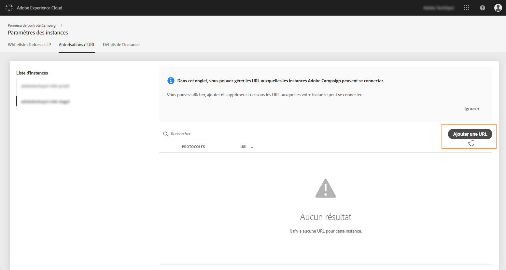
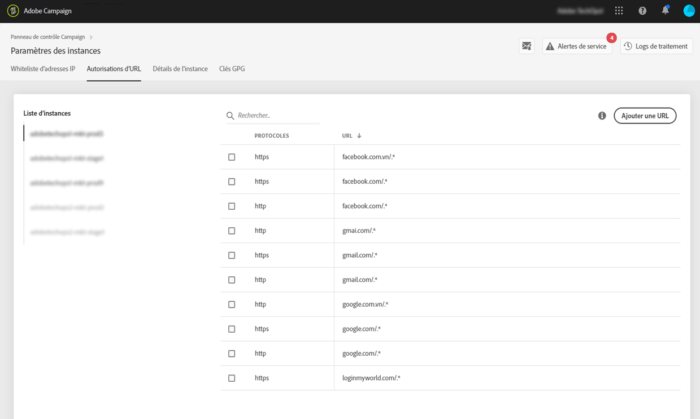

# Autorisations d’URL {#url-permissions}

>[!CONTEXTUALHELP]
>id="cp_instancesettings_urlpermissions"
>title="À propos des autorisations d’URL"
>abstract="Gérez les URL auxquelles vos instances Adobe Campaign peuvent se connecter."
>additional-url="https://images-tv.adobe.com/mpcv3/91206a19-d9af-4b6a-8197-0d2810a78941_1563488165.1920x1080at3000_h264.mp4" text="Regarder une vidéo de démonstration"

## À propos des autorisations d’URL {#about-url-permissions}

>[!IMPORTANT]
>
>Cette fonctionnalité est disponible uniquement pour les instances Campaign v8 et Campaign Classic v7, à partir du build 8850. Si vous utilisez un build précédent, vous devez effectuer la mise à niveau pour utiliser cette fonctionnalité.

La liste par défaut des URL pouvant être appelées par des codes JavaScript (workflows et autres) de vos instances Campaign est limitée. Il s’agit des URL qui permettent à vos instances de fonctionner correctement.

Par défaut, les instances ne sont pas autorisées à se connecter à des URL externes. Le panneau de contrôle permet d’ajouter des URL externes à la liste des URL autorisées afin que votre instance puisse s’y connecter. Vous pouvez ainsi connecter vos instances Campaign à des systèmes externes, comme des serveurs SFTP ou des sites web, afin d’activer le transfert de fichiers et/ou de données.

Une fois qu’une URL est ajoutée, elle est référencée dans le fichier de configuration de l’instance (serverConf.xml).

 [Découvrez cette fonctionnalité en vidéo](https://experienceleague.adobe.com/docs/campaign-classic-learn/control-panel/instance-settings/adding-url-permissions.html?lang=fr#instance-settings)

**Rubriques connexes :**

* [Configuration du serveur Campaign](https://docs.campaign.adobe.com/doc/AC/en/INS_Additional_configurations_Configuring_Campaign_server.html)
* [Protection des connexions sortantes](https://experienceleague.adobe.com/docs/campaign-classic/using/installing-campaign-classic/security-privacy/server-configuration.html?lang=fr#outgoing-connection-protection)

## Bonnes pratiques {#best-practices}

* Ne connectez pas votre instance Campaign à des sites web/serveurs auxquels vous ne souhaitez pas vous connecter.
* Supprimez les URL que vous n’utilisez plus. Sachez toutefois que si une autre partie de votre entreprise se connecte toujours à l’URL que vous avez supprimée, personne ne pourra l’utiliser.
* Le panneau de contrôle prend en charge les protocoles **http**, **https** et **sftp**. La saisie d’URL ou de protocoles non valides entraînera des erreurs.

## Gestion des autorisations d’URL {#managing-url-permissions}

>[!CONTEXTUALHELP]
>id="cp_instancesettings_url_add"
>title="Définition des URL"
>abstract="Ajoutez des URL pour autoriser les connexions à votre instance Campaign."

Pour ajouter une URL à laquelle votre instance peut se connecter, procédez comme suit :

1. Ouvrez la carte **[!UICONTROL Paramètres des instances]** pour accéder à l’onglet **[!UICONTROL Autorisations d’URL]**.

   >[!NOTE]
   >
   >Si la carte Paramètres des instances n’est pas visible sur la page d’accueil du panneau de contrôle, cela signifie que votre identifiant de l’organisation IMS n’est associé à aucune instance Adobe Campaign
   >
   >L’onglet <b>Autorisations d’URL</b> répertorie toutes les URL externes auxquelles votre instance peut se connecter. Cette liste ne comprend pas les URL requises pour que Campaign fonctionne (par exemple, les connexions entre les éléments d’infrastructure).

1. Dans le volet gauche, sélectionnez l’instance de votre choix, puis cliquez sur le bouton **[!UICONTROL Ajouter une URL]**.

   

   >[!NOTE]
   >
   >Toutes vos instances Campaign s’affichent dans la liste du volet gauche.
   >
   >La gestion des autorisations d’URL étant réservée aux instances Campaign Classic, le message « Instance non applicable » s’affiche si vous sélectionnez une instance Campaign Standard.

1. Saisissez l’URL à autoriser, avec le protocole associé (http, https ou sftp).

   >[!NOTE]
   >
   >Il est possible d’autoriser plusieurs instances à se connecter à l’URL. Pour cela, ajoutez-les directement à partir du champ Instance(s) en saisissant leur première lettre.

   

1. L’URL est ajoutée à la liste. Vous pouvez maintenant vous y connecter.

   >[!NOTE]
   >
   >Les caractères « /.* » sont automatiquement ajoutés à la fin de l’URL saisie après sa validation, afin de couvrir toutes les sous-pages de la page saisie.

   

Vous pouvez supprimer une URL à tout moment en la sélectionnant et en cliquant sur le bouton **[!UICONTROL Supprimer l’URL]**.

Souvenez-vous que si vous supprimez une URL, votre instance ne pourra plus la rappeler.

## Questions courantes {#common-questions}

**J’ai ajouté une URL, mais mon instance ne parvient toujours pas à s’y connecter. Pourquoi ?**

Dans certains cas, les URL auxquelles vous essayez de vous connecter nécessitent un ajout aux listes autorisées, la saisie d’un mot de passe ou une autre forme d’authentification. Le panneau de contrôle ne gère pas d’authentification supplémentaire.
