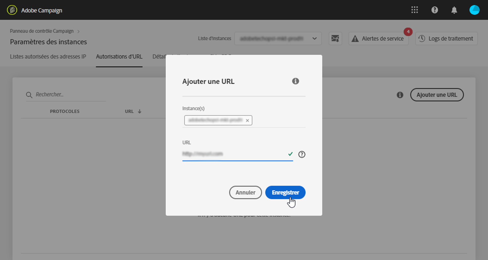

# Autorisations d'URL {#url-permissions}

>[!CAUTION]
>
>Cette fonctionnalité est disponible uniquement pour les instances Campaign Classic.

## A propos des autorisations d'URL {#about-url-permissions}

La liste par défaut des URL pouvant être appelées par des codes JavaScript (workflows, etc.) de vos instances Campaign Classic est limitée. Ce sont les URL qui permettent à vos instances de fonctionner correctement.

Par défaut, les instances ne sont pas autorisées à se connecter à des URL externes. Le panneau de contrôle permet d'ajouter des URL externes à la liste des URL autorisées afin que votre instance puisse s'y connecter. Vous pouvez ainsi connecter vos instances Campaign à des systèmes externes, comme des serveurs SFTP ou des sites web, afin d'activer le transfert de fichiers et/ou de données.

Une fois qu'une URL est ajoutée, elle est référencée dans le fichier de configuration de l'instance (serverConf.xml).

**Rubriques connexes :**

* [Configuration du serveur de campagne](https://docs.campaign.adobe.com/doc/AC/en/INS_Additional_configurations_Configuring_Campaign_server.html)
* [Protection des connexions sortantes](https://docs.campaign.adobe.com/doc/AC/en/INS_Additional_configurations_Configuring_Campaign_server.html#Outgoing_connection_protection)
* [Ajout d'autorisations d'URL (tutoriel vidéo)](https://docs.adobe.com/content/help/en/campaign-learn/campaign-classic-tutorials/administrating/control-panel-acc/adding-url-permissions.html)

## Bonnes pratiques {#best-practices}

* Ne connectez pas votre instance Campaign à des sites web/serveurs auxquels vous ne souhaitez pas vous connecter.
* Supprimez les URL que vous n'utilisez plus. Sachez toutefois que si une autre partie de votre entreprise se connecte toujours à l'URL que vous avez supprimée, personne ne pourra l'utiliser.
* The Control Panel supports **http**, **https**, and **sftp** protocols. La saisie d'URL ou de protocoles non valides entraînera des erreurs.

## Gestion des autorisations d'URL {#managing-url-permissions}

Pour ajouter une URL à laquelle votre instance peut se connecter, procédez comme suit :

1. Ouvrez la carte **[!UICONTROL Paramètres des instances]** pour accéder à l’onglet **[!UICONTROL Permissions d’URL]**.

   >[!NOTE]
   >
   >Si la vignette Paramètres des instances n'est pas visible sur la page d'accueil du panneau de contrôle, cela signifie que votre identifiant de l'organisation IMS n'est associé à aucune instance Adobe Campaign Classic.
   >
   >The <b>URL permissions</b> tab lists all outside URLs that your instance can connect to. Cette liste ne comprend pas les URL requises pour que Campaign fonctionne (par exemple, les connexions entre les éléments d'infrastructure).

1. Dans le volet gauche, sélectionnez l'instance de votre choix, puis cliquez sur le bouton **[!UICONTROL Ajouter une URL].**

   

   >[!NOTE]
   >
   >Toutes vos instances Campaign s'affichent dans la liste du volet gauche.
   >
   >La gestion des autorisations d’URL étant réservée aux instances de Campaign Classic uniquement, le message "Instance non applicable" s’affiche si vous sélectionnez une instance de Campaign Standard.

1. Saisissez l'URL à autoriser, avec son protocole associé (http, https ou sftp).

   >[!NOTE]
   >
   >Il est possible d'autoriser plusieurs instances à se connecter à l'URL. Pour cela, ajoutez-les directement à partir du champ Instance(s) en saisissant leur première lettre.

   

1. L'URL est ajoutée à la liste. Vous pouvez maintenant vous y connecter.

   >[!NOTE]
   >
   >Les caractères "/.*" sont automatiquement ajoutés à la fin de l'URL saisie après sa validation, afin de couvrir toutes les sous-pages de la page saisie.

   

You can delete a URL at any time by selecting it and clicking the **[!UICONTROL Delete URL]** button.

Souvenez-vous que si vous supprimez une URL, votre instance ne pourra plus la rappeler.

## Questions courantes {#common-questions}

**J'ai ajouté une URL, mais mon instance ne parvient toujours pas à s'y connecter. Pourquoi ?**

Dans certains cas, les URL auxquelles vous essayez de vous connecter nécessitent une mise en whiteliste, la saisie d'un mot de passe ou une autre forme d'authentification. Le panneau de contrôle ne gère pas d'authentification supplémentaire.
