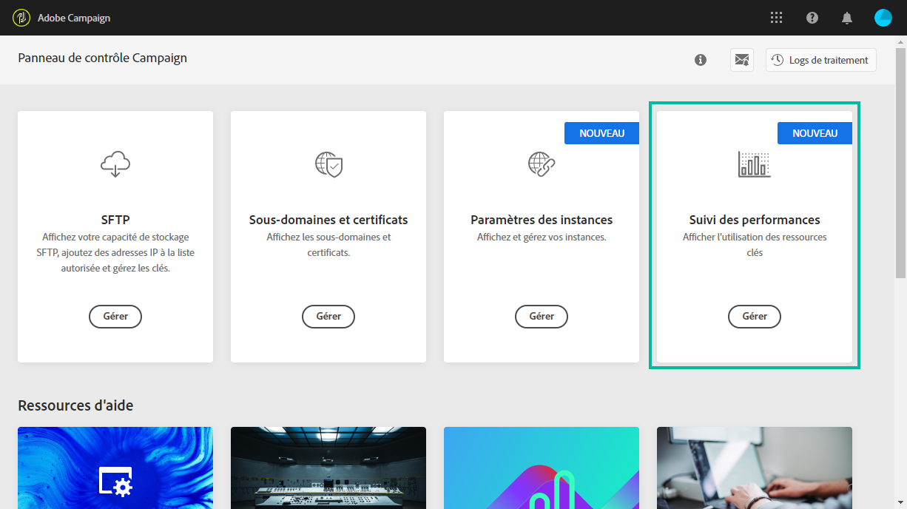

# À propos du suivi des performances {#about-performance-monitoring}

Le panneau de contrôle propose plusieurs fonctionnalités pour vous aider à surveiller vos instances et à garantir des performances optimales.

La carte **[!UICONTROL Suivi des performances]** de la page d’accueil du panneau de contrôle permet de surveiller l’utilisation de vos instances Campaign, comme, par exemple, leur capacité de base de données. Voir à ce propos [cette section](../../performance-monitoring/using/database-monitoring.md).

>[!NOTE]
>
>Les prochaines versions du panneau de contrôle proposeront d’autres fonctionnalités de suivi dans cette carte.

Le panneau de contrôle permet en outre de vous abonner à des notifications par email pour être averti dès qu’un problème est détecté sur l’une de vos instances Campaign. Voir à ce propos [cette section](../../performance-monitoring/using/email-alerting.md).
