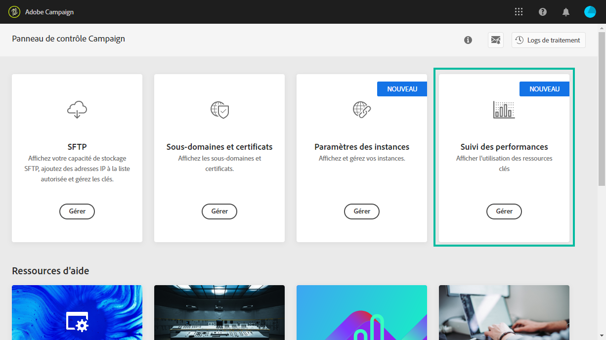

# À propos du suivi des performances {#about-performance-monitoring}

Le Panneau de contrôle propose plusieurs fonctionnalités pour vous aider à surveiller vos instances et à garantir des performances optimales.

La carte **[!UICONTROL Suivi des performances]** de la page d’accueil du Panneau de contrôle permet de surveiller l’utilisation de vos instances Campaign, comme, par exemple, leur capacité de base de données. Pour plus d’informations, consultez [cette section](../../performance-monitoring/using/database-monitoring.md).

>[!NOTE]
>
>Les prochaines versions du Panneau de contrôle proposeront d’autres fonctionnalités de suivi dans cette carte.

