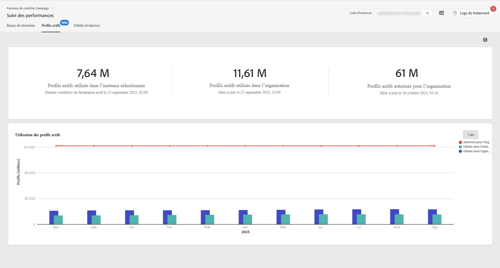

# Surveiller les profils actifs {#active-profiles-monitoring}

## À propos des profils actifs {#about-active-profiles}

>[!IMPORTANT]
>
>La surveillance des profils actifs depuis le Panneau de contrôle est disponible en version Beta et est sujette à de fréquentes mises à jour et modifications sans préavis. Elle est disponible à partir de la version Campaign Standard 10368.

Conformément à votre contrat, chacune de vos instances Campaign est configurée avec un nombre spécifique de profils actifs comptabilisés à des fins de facturation. Consultez votre dernier contrat pour connaître le nombre de profils actifs achetés.

Un « Profil » désigne un enregistrement d’informations (par exemple : un enregistrement dans la table nmsRecipient ou une table externe contenant un identifiant de cookie, un identifiant client, un identifiant mobile ou d’autres informations relatives à un canal particulier) représentant un client final ou un prospect.

Les profils sont considérés comme actifs s’ils ont été ciblés ou ont fait l’objet d’une communication via un canal au cours des 12 derniers mois.

>[!NOTE]
>
>Les canaux Facebook et X (anciennement Twitter) ne sont pas pris en compte.

Pour en savoir plus sur les profils actifs, consultez la documentation de [Campaign Standard](https://experienceleague.adobe.com/docs/campaign-standard/using/profiles-and-audiences/managing-profiles/active-profiles.html?lang=fr) et de [Campaign v7/v8](https://experienceleague.adobe.com/docs/campaign-classic/using/getting-started/profile-management/about-profiles.html?lang=fr#active-profiles).

## Surveiller l’utilisation des profils actifs {#monitoring-active-profiles}

>[!CONTEXTUALHELP]
>id="cp_performancemonitoring_active_profile"
>title="À propos de la surveillance des profils actifs"
>abstract="Dans cet onglet, retrouvez des informations en temps réel sur lʼutilisation et lʼévolution des profils actifs les plus récents et historiques pour chacune de vos instances Campaign et votre organisation."

Pour surveiller l’utilisation de vos profil actifs dans le panneau de contrôle, accédez à la carte **[!UICONTROL Surveillance des performances]** > **[!UICONTROL Profils actifs]** et sélectionnez l’instance de votre choix dans la **[!UICONTROL Liste des instances]**.

Des informations s’affichent concernant votre utilisation des profils actifs.

La section supérieure affiche les informations suivantes :

* Le nombre de profils actifs actuellement utilisés dans l’instance sélectionnée, ainsi que la date et l’heure de la dernière exécution du workflow de facturation pour votre instance.

* Le nombre total de profils actifs utilisés dans l’ensemble de votre organisation dans toutes les instances.

  >[!NOTE]
  >
  >Cette section n’est visible que si plusieurs instances sont associées à votre organisation.

* Le nombre total de profils actifs affectés à votre organisation.

La section inférieure fournit une représentation visuelle de l’utilisation des profils actifs au cours des 30 derniers jours. Vous pouvez définir cette période sur 1 an à l’aide du filtre situé dans le coin supérieur droit. Pointez sur le graphique pour obtenir le nombre exact de profils actifs utilisés au cours de la période sélectionnée.

Les informations relatives à l’utilisation des profils actifs sont mises à jour dans le panneau de contrôle en fonction des workflows techniques « Facturation » de [!DNL Campaign], qui s’exécutent tous les jours sur vos instances.

| Version de Campaign | Workflow technique | Exécutions |
|  ---  |  ---  |  ---  |
| Campaign Standard | [Facturation](https://experienceleague.adobe.com/docs/campaign-standard/using/administrating/application-settings/technical-workflows.html?lang=fr) | Quotidien |
| Campaign v7/v8 | [Facturation](https://experienceleague.adobe.com/docs/campaign-classic/using/automating-with-workflows/advanced-management/about-technical-workflows.html?lang=fr#automating-with-workflows) | Mensuel |

