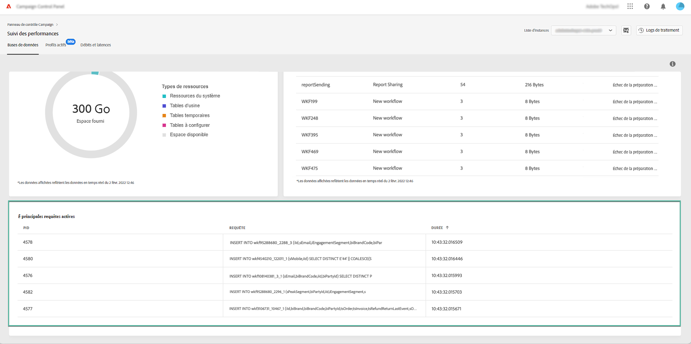

# Surveillance des requêtes actives {#long-running-queries}

La zone relative aux **[!UICONTROL Requêtes actives]**, sous l’onglet **[!UICONTROL Bases de données]**, répertorie les cinq requêtes qui ont été exécutées le plus longtemps sur l’instance sélectionnée.

Les colonnes **[!UICONTROL Durée]** indiquent la durée d’exécution d’une requête sur l’instance. La durée s’affiche au format suivant : `hh:mm:ss.ms`.

>[!IMPORTANT]
>
>Si l’une des requêtes est active depuis plus de 24 heures, contactez l’assistance clientèle afin qu’elle identifie et résolve le problème. Vous devrez alors indiquer la valeur de la colonne **[!UICONTROL PID]**, qui est un identifiant unique pour la requête.
