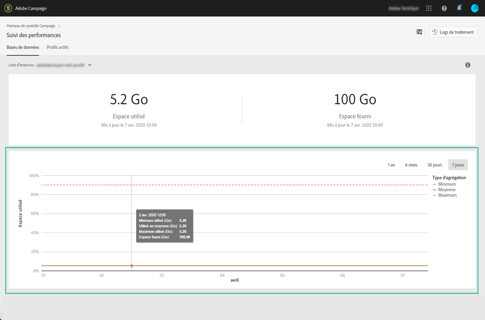
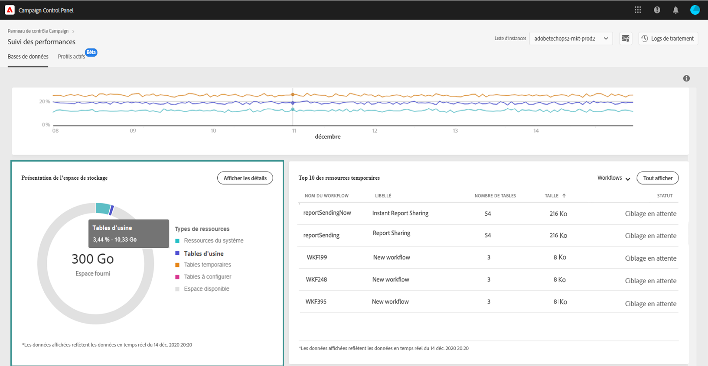
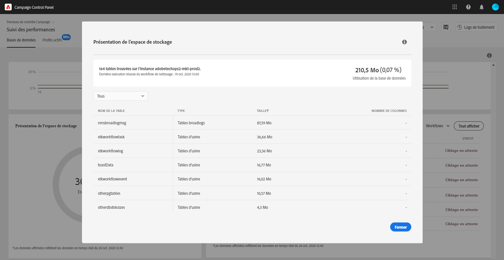
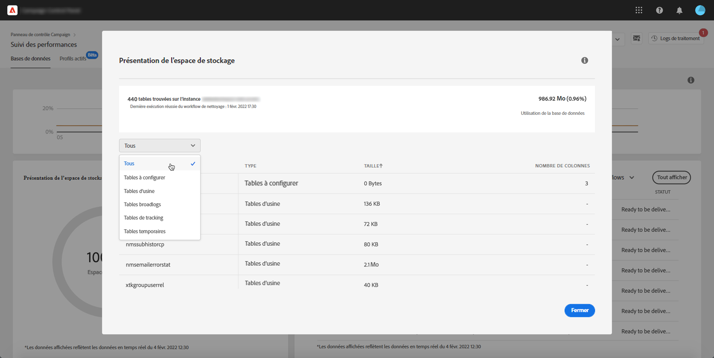
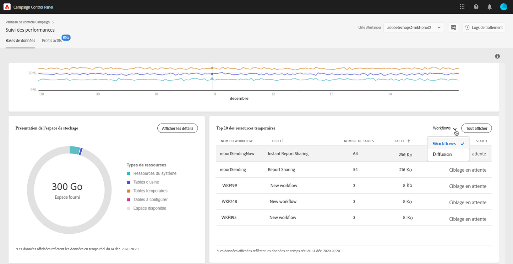
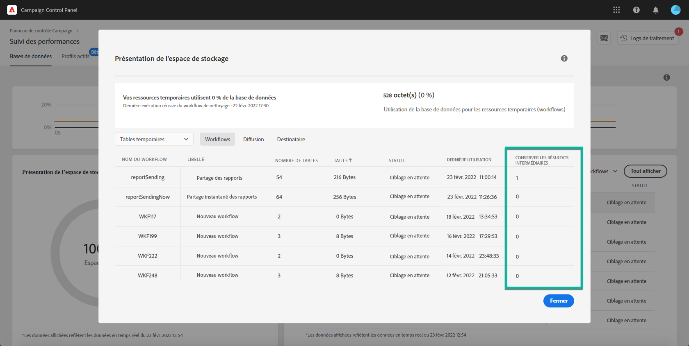

# Surveillance des bases de données {#database-monitoring}

## À propos des bases de données d’instances {#about-instances-databases}

Conformément à votre contrat, chacune de vos instances Campaign est dotée d’un espace de base de données spécifique.

Les bases de données englobent les **ressources**, les **workflows** et les **données** stockées dans Adobe Campaign.

Au fil du temps, elles peuvent atteindre leur capacité maximale, en particulier si les ressources stockées ne sont jamais supprimées de l’instance ou si de nombreux workflows sont mis en pause.

Le dépassement de la capacité d’une base de données d’instance peut entraîner différents problèmes (impossibilité de se connecter, d’envoyer des emails, etc.). La surveillance des bases de données d’instances est donc essentielle pour garantir des performances optimales.

>[!NOTE]
>
>Si la quantité d’espace de base de données disponible, indiquée dans le panneau de contrôle, ne correspond pas à la quantité spécifiée dans votre contrat, contactez l’assistance clientèle.

## Surveillance de l’utilisation des bases de données {#monitoring-instances-database}

>[!CONTEXTUALHELP]
>id="cp_performancemonitoring_database"
>title="A propos de la surveillance des bases de données"
>abstract="Dans cet onglet, vous pouvez obtenir des informations en temps réel sur l&#39;utilisation et l&#39;évolution les plus récentes et historiques des bases de données pour chacune de vos instances Campaign."
>additional-url="https://experienceleague.adobe.com/docs/control-panel/using/performance-monitoring/about-performance-monitoring.html?lang=fr" text="À propos de la surveillance des performances"

 Découvrez cette fonctionnalité en vidéo dans [Campaign Classic](https://experienceleague.adobe.com/docs/campaign-classic-learn/control-panel/performance-monitoring/monitoring-databases.html#performance-monitoring) ou [Campaign Standard](https://experienceleague.adobe.com/docs/campaign-standard-learn/control-panel/performance-monitoring/monitoring-databases.html#performance-monitoring)

Le panneau de contrôle permet de surveiller l’utilisation de la base de données pour chacune de vos instances Campaign. Pour ce faire, ouvrez la carte **[!UICONTROL Suivi des performances]**, puis sélectionnez l’onglet **[!UICONTROL Bases de données]**.

Sélectionnez l’instance de votre choix dans la **[!UICONTROL Liste d’instances]** pour afficher des informations sur la capacité de la base de données et l’espace utilisé pour cette instance.

>[!NOTE]
>
>Notez que les données de ce tableau de bord sont mises à jour en fonction du **[!UICONTROL workflow technique de nettoyage de la base]** qui s’exécute sur votre instance Campaign (voir la documentation [Campaign Standard](https://experienceleague.adobe.com/docs/campaign-standard/using/administrating/application-settings/technical-workflows.html#list-of-technical-workflows) et [Campaign Classic](https://experienceleague.adobe.com/docs/campaign-classic/using/monitoring-campaign-classic/data-processing/database-cleanup-workflow.html)).
>
>En outre, vous pouvez recevoir des notifications lorsque l’une de vos bases de données atteint son niveau c lors de la dernière exécution du workflow sous les mesures **[!UICONTROL Espace utilisé]** et **[!UICONTROL Espace fourni]**. Si le workflow n’est pas en cours d’exécution depuis plus de 3 jours, nous recommandons de contacter l’assistance clientèle d’Adobe pour examiner les raisons pour lesquelles il ne fonctionne pas.

D’autres mesures, décrites ci-dessous, sont disponibles dans ce tableau de bord pour vous aider à analyser l’utilisation de la base de données de l’instance.

### Utilisation de la base de données {#database-utilization}

La zone **[!UICONTROL Utilisation de la base de données]** contient une représentation graphique de l’utilisation minimale, moyenne et maximale de la base de données au cours des 7 derniers jours, ainsi que le seuil d’utilisation de 90 % de la base de données, représenté par une courbe en pointillés rouges.

Pour modifier la période, utilisez les filtres disponibles dans l’angle supérieur droit du graphique.

Pour une meilleure lisibilité, vous pouvez également mettre en surbrillance une ou plusieurs courbes du graphique. Pour cela, sélectionnez-les dans la légende **[!UICONTROL Type d’agrégation]**.

Pour plus d’informations sur une période spécifique, pointez sur le graphique pour afficher des informations sur l’utilisation de la base de données à ce moment.

### Présentation de l’espace de stockage {#storage-overview}

>[!CONTEXTUALHELP]
>id="cp_dbdetails_storagedetails"
>title="Présentation du stockage"
>abstract="Dans cet onglet, vous trouverez des informations détaillées sur les différentes ressources de Campaign qui consomment de l&#39;espace de base de données."

La zone **[!UICONTROL Présentation de l’espace de stockage]** contient une représentation graphique de l’espace occupé par :

* **[!UICONTROL Ressources du système]**

   Notez que si les ressources du système consomment une grande partie de l’espace de la base de données, nous recommandons de contacter l’assistance clientèle.

* **[!UICONTROL Tables d’usine]** fournies par défaut avec vos instances Campaign
* **[!UICONTROL Tables temporaires]** créées par les workflows et les diffusions
* **[!UICONTROL Tables à configurer]** générées après la création de ressources personnalisées

Cliquez sur le bouton **[!UICONTROL Afficher les détails]** pour obtenir davantage de détails sur les différentes ressources qui consomment de l’espace de base de données.

Utilisez le filtre pour affiner votre recherche et n’afficher que les tables d’un type de ressource spécifique.

### Top 10 des ressources temporaires {#top-10}

Le **[!UICONTROL Top 10 des ressources temporaires]** répertorie les 10 plus importantes ressources temporaires générées par les workflows et les diffusions.

La surveillance des workflows et des diffusions qui créent des ressources temporaires importantes est essentielle pour surveiller votre base de données. Si une ressource temporaire consomme trop d’espace de base de données, vérifiez que ce workflow ou cette diffusion est nécessaire et, éventuellement, accédez à votre instance pour l’arrêter.

>[!IMPORTANT]
>
>À titre de recommandation générale, il est préférable d’éviter de placer **plus de 40 colonnes** dans des ressources à configurer.

>[!NOTE]
>
>Si un workflow présente un grand nombre de tables ou des tailles volumineuses de base de données, nous recommandons de le vérifier afin de déterminer pourquoi il génère autant de données.
>
>Des ressources Campaign Standard et Classic sont également disponibles à la fin de cette page pour vous aider à éviter la surcharge de la base de données.

Le bouton **[!UICONTROL Tout afficher]** permet d’accéder à des informations détaillées sur ces ressources temporaires.

La valeur contenue dans la colonne **[!UICONTROL Conserver les résultats intermédiaires]** indique si l’option est activée (« 1 ») ou désactivée (« 0 ») dans Campaign. Cette option permet d’enregistrer les résultats des transitions entre les différentes activités d’un workflow (voir la documentation [Campaign Standard](://experienceleague.adobe.com/docs/campaign-standard/using/managing-processes-and-data/executing-a-workflow/managing-execution-options.html?lang=fr) et [Campaign Classic](https://experienceleague.adobe.com/docs/campaign-classic/using/automating-with-workflows/introduction/workflow-best-practices.html#logs)).

>[!IMPORTANT]
>
>Cette option ne doit jamais être cochée dans un workflow de production. Elle sert à analyser les résultats et est conçue uniquement à des fins de test. Elle ne doit donc être utilisée que dans les environnements de développement ou d’évaluation.
>
>Si la valeur du panneau de contrôle indique que l’option est activée pour l’un de vos workflows, nous vous recommandons vivement de la désactiver dans Campaign.

## Prévention des surcharges des bases de données {#preventing-database-overload}

Campaign Standard et Classic proposent des méthodes différentes pour éviter la surconsommation de l’espace disque des bases de données.

La section ci-dessous contient des ressources utiles issues de la documentation de Campaign pour optimiser l’utilisation de vos bases de données :

**Surveillance des workflows**

* [Meilleures pratiques relatives aux workflows](://experienceleague.adobe.com/docs/campaign-standard/using/managing-processes-and-data/workflow-general-operation/best-practices-workflows.html?lang=fr) (Campaign Standard)
* [Surveillance de l’exécution des workflows](https://experienceleague.adobe.com/docs/campaign-classic/using/automating-with-workflows/monitoring-workflows/monitoring-workflow-execution.html?lang=fr) (Campaign Classic)

**Maintenance de la base de données**

* Workflow technique de nettoyage de la base : [Campaign Standard](https://experienceleague.adobe.com/docs/campaign-standard/using/administrating/application-settings/technical-workflows.html#list-of-technical-workflows) - [Campaign Classic](https://experienceleague.adobe.com/docs/campaign-classic/using/monitoring-campaign-classic/data-processing/database-cleanup-workflow.html)
* [Guide de maintenance de la base de données](://experienceleague.adobe.com/docs/campaign-classic/using/monitoring-campaign-classic/database-maintenance/recommendations.html?lang=fr) (Campaign Classic)
* [Résolution des problèmes de performances de la base de données](https://experienceleague.adobe.com/docs/campaign-classic/using/monitoring-campaign-classic/troubleshooting-toc/database-issues-toc/database-performances.html?lang=fr#monitoring-campaign-classic) (Campaign Classic)
* [Options liées à la base de données](https://experienceleague.adobe.com/docs/campaign-classic/using/installing-campaign-classic/appendices/configuring-campaign-options.html#database) (Campaign Classic)
* Conservation des données : [Campaign Standard](https://experienceleague.adobe.com/docs/campaign-standard/using/administrating/application-settings/data-retention.html) - [Campaign Classic](https://experienceleague.adobe.com/docs/campaign-classic/using/configuring-campaign-classic/data-model/data-model-best-practices.html#data-retention)

>[!NOTE]
>
>En outre, vous pouvez recevoir des notifications lorsque l’une de vos bases de données atteint sa limite de capacité. Pour cela, abonnez-vous aux [alertes par email](../../performance-monitoring/using/email-alerting.md).
