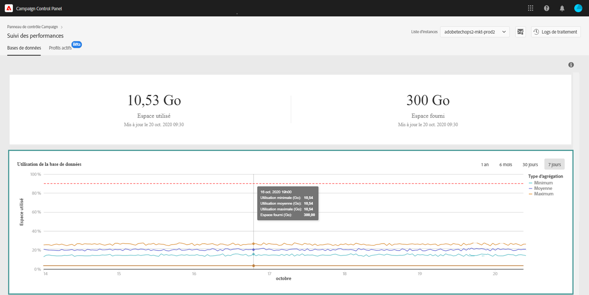

# Surveillance des bases de données {#database-monitoring}

## A propos des instances, bases de données {#about-instances-databases}

Conformément à votre contrat, chacune de vos instances Campaign est dotée d’un espace de base de données spécifique.

Les bases de données comprennent toutes les **ressources**, les **** et les **données** stockées dans  Adobe Campaign.

Au fil du temps, les bases de données peuvent atteindre leur capacité maximale, en particulier si les ressources stockées ne sont jamais supprimées de l’instance, ou s’il existe de nombreux  dans un état suspendu.

Le débordement d’une base de données d’instances peut entraîner plusieurs problèmes (impossibilité de se connecter, d’envoyer des courriers électroniques, etc.). La surveillance des bases de données de vos instances est donc essentielle pour garantir des performances optimales.

>[!NOTE]
>
>La quantité d&#39;espace de base de données fournie comme indiqué dans le Panneau de configuration peut ne pas refléter la quantité d&#39;espace de base de données spécifiée dans votre contrat. La plupart du temps, un espace de base de données plus grand vous est fourni temporairement pour garantir les performances de votre système.

## Contrôle de l’utilisation des bases de données {#monitoring-instances-database}

Le Panneau de configuration vous permet de surveiller l’utilisation de la base de données pour chacune de vos instances Campaign. Pour ce faire, suivez les étapes ci-après.

1. Ouvrez la **[!UICONTROL Performance Monitoring]** carte, puis sélectionnez l’ **[!UICONTROL Databases]** onglet.

1. Sélectionnez une instance dans la **[!UICONTROL Instance List]**.

   La zone supérieure fournit des informations sur la capacité de base de données de l’instance et l’espace utilisé.

   

   La zone inférieure fournit une représentation graphique de l’utilisation de la base de données au cours des 7 derniers jours. Vous pouvez modifier la période affichée à l’aide du  de disponible dans le coin supérieur droit.

   Passez la souris sur le graphique pour obtenir des informations détaillées sur la période sélectionnée.

   

>[!NOTE]
>
>Vous pouvez également recevoir des notifications lorsque l’une de vos bases de données atteint sa capacité. Pour ce faire, abonnez-vous aux alertes par [courrier électronique](../../performance-monitoring/using/email-alerting.md)

## Prévention de la surcharge de base de données {#preventing-database-overload}

Campaign Standard et Classic  différentes manières d’éviter la surconsommation de l’espace disque de la base de données.

La section ci-dessous fournit des ressources utiles issues de Campaign documentations pour vous aider à optimiser l’utilisation de vos bases de données :

**Surveillance des**

* [Meilleures pratiques](https://docs.adobe.com/content/help/en/campaign-standard/using/managing-processes-and-data/workflow-general-operation/best-practices-workflows.html) (Campaign Standard)
* [Surveillance de l’exécution](https://docs.adobe.com/help/en/campaign-classic/using/automating-with-workflows/monitoring-workflows/monitoring-workflow-execution.html) du processus (Campaign Classic)

**Maintenance de la base de données**

* Processus technique de nettoyage de base de données ([Campaign Standard](https://docs.adobe.com/help/en/campaign-standard/using/administrating/application-settings/technical-workflows.html#list-of-technical-workflows) / [Campaign Classic](https://docs.adobe.com/help/en/campaign-classic/using/monitoring-campaign-classic/data-processing/database-cleanup-workflow.html))
* [Guide](https://docs.adobe.com/content/help/en/campaign-classic/using/monitoring-campaign-classic/database-maintenance/recommendations.html) de maintenance de base de données (Campaign Classic)
* [Dépannage](https://docs.adobe.com/content/help/en/campaign-classic/using/monitoring-campaign-classic/troubleshooting/database-performances.html) des performances de la base de données (Campaign Classic)
* [Options](https://docs.adobe.com/help/en/campaign-classic/using/installing-campaign-classic/appendices/configuring-campaign-options.html#database) liées à la base de données (Campaign Classic)
