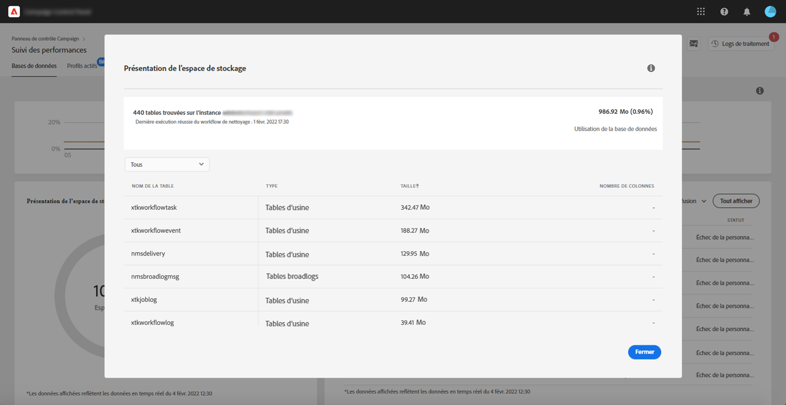

# Surveillance des bases de données {#database-monitoring}

## À propos des bases de données d’instances {#about-instances-databases}

Conformément à votre contrat, chacune de vos instances Campaign est dotée d’un espace de base de données spécifique.

Les bases de données englobent les **ressources**, les **workflows** et les **données** stockées dans Adobe Campaign.

Au fil du temps, elles peuvent atteindre leur capacité maximale, en particulier si les ressources stockées ne sont jamais supprimées de l’instance ou si de nombreux workflows sont mis en pause.

Le dépassement de la capacité d’une base de données d’instance peut entraîner différents problèmes (impossibilité de se connecter, d’envoyer des emails, etc.). La surveillance des bases de données d’instances est donc essentielle pour garantir des performances optimales.

>[!NOTE]
>
>Si le volume d’espace de base de données fourni tel qu’indiqué dans le Panneau de Contrôle ne reflète pas le montant spécifié dans votre contrat, contactez le service à la clientèle.

## Surveillance de l’utilisation des bases de données {#monitoring-instances-database}

Le Panneau de contrôle permet de surveiller l’utilisation de la base de données pour chacune de vos instances Campaign. To do this, open the **[!UICONTROL Performance Monitoring]** card, then select the **[!UICONTROL Databases]** tab.

Sélectionnez l’instance de votre choix dans la Liste **[!UICONTROL d’]** instances pour afficher des informations sur la capacité de base de données de l’instance et sur l’espace utilisé.

>[!NOTE]
>
>Notez que les données de ce tableau de bord sont mises à jour en fonction du processus **[!UICONTROL technique de nettoyage de la]** base de données qui s’exécute sur votre instance Campaign (voir la documentation [Campaign Standard](https://docs.adobe.com/help/fr-FR/campaign-standard/using/administrating/application-settings/technical-workflows.html#list-of-technical-workflows) et [Campaign Classic](https://docs.adobe.com/help/fr-FR/campaign-classic/using/monitoring-campaign-classic/data-processing/database-cleanup-workflow.html) ).
>
>Vous pouvez vérifier la dernière fois que le processus s’est exécuté sous les mesures Espace **** utilisé et Espace **** fourni. Notez que, si le processus n’est pas en cours d’exécution depuis plus de 3 jours, nous vous recommandons de contacter le service à la clientèle Adobe afin qu’il examine les raisons pour lesquelles le processus n’est pas en cours d’exécution.

D’autres mesures, décrites ci-dessous, sont disponibles dans ce tableau de bord pour vous aider à analyser l’utilisation de la base de données de l’instance :

* [Utilisation de la base de données](../../performance-monitoring/using/database-monitoring.md#database-utilization)
* [Présentation de l’espace de stockage](../../performance-monitoring/using/database-monitoring.md#storage-overview)
* [Top 10 des ressources temporaires](../../performance-monitoring/using/database-monitoring.md#top-10)

### Database utilization {#database-utilization}

The **[!UICONTROL Database utilization]** area provides a graphical representation of the minimum, average and maximum database utilization over the last 7 days as well as the 90% database utilization threshold represented by a red dotted curve.

Pour modifier la période, utilisez les filtres disponibles dans le coin supérieur droit du graphique.

Pour une meilleure lisibilité, vous pouvez également mettre en surbrillance une ou plusieurs courbes du graphique. Pour cela, sélectionnez-les dans la légende **[!UICONTROL Type d’agrégation]**.

Pour plus d’informations sur une période spécifique, passez la souris sur le graphique pour afficher des informations sur l’utilisation de la base de données effectuée à ce moment.

### Présentation de l’espace de stockage {#storage-overview}

La zone **[!UICONTROL d&#39;aperçu]** des Enregistrements présente sous forme graphique l&#39;espace occupé par :

* **[!UICONTROL Ressources du système]**

   Notez que si les ressources système consomment une grande partie de l’espace de base de données, nous vous recommandons de contacter le service d’assistance clientèle.

* **[!UICONTROL Les tableaux]** prêts à l’emploi fournis par défaut avec vos instances Campaign,
* **[!UICONTROL Tableaux]** temporaires créés par workflows et diffusions,
* **[!UICONTROL Tableaux]** non prêts à l’emploi générés après la création de ressources personnalisées.

Cliquez sur le bouton Détails **[!UICONTROL de la]** Vuepour obtenir plus de détails sur les différents actifs qui consomment de l’espace de base de données.

Utilisez le filtre pour affiner votre recherche et afficher les tableaux d’un type de ressource spécifique uniquement.

### Top 10 des ressources temporaires {#top-10}

Le **[!UICONTROL Top 10 des ressources]** temporaires liste les 10 plus importantes ressources temporaires générées par les workflows et les diffusions.

La surveillance des workflows et des diffusions qui créent des ressources temporaires importantes est une étape clé pour surveiller votre base de données. Si une ressource temporaire consomme trop d&#39;espace de base de données, assurez-vous que ce flux de travail ou cette diffusion est nécessaire et, éventuellement, accédez à votre instance pour l&#39;arrêter.

>[!IMPORTANT]
>
>La recommandation générale consiste à éviter que **plus de 40 colonnes** ne soient placées dans des ressources non prêtes à l&#39;emploi.

>[!NOTE]
>
>Si un flux de travail présente un grand nombre de tables ou de tailles de base de données, nous vous recommandons de le revoir afin de déterminer pourquoi il génère autant de données.
>
>Les ressources Campaign Standard et Classic sont également disponibles à la fin de cette page pour vous aider à éviter la surcharge de la base de données.

Le bouton **[!UICONTROL Vue all]** vous permet d&#39;accéder à des informations détaillées sur ces ressources temporaires.

>[!NOTE]
>
>La valeur de la colonne **[!UICONTROL Conserver les résultats]** intermédiaires indique si l’option est activée (&quot;1&quot;) ou désactivée (&quot;0&quot;) dans Campaign. L’option **[!UICONTROL Conserver les résultats]** provisoires est accessible dans les propriétés des workflows. Il vous permet d’enregistrer les résultats des transitions entre les différentes activités d’un flux de travail (voir la documentation [Campaign Standard](https://docs.adobe.com/content/help/en/campaign-standard/using/managing-processes-and-data/executing-a-workflow/managing-execution-options.html) et [Campaign Classic](https://docs.adobe.com/content/help/en/campaign-classic/using/automating-with-workflows/general-operation/workflow-best-practices.html#logs) ).
>
>Si l&#39;option est activée pour l&#39;un de vos workflows, le processus de nettoyage de la base de données ne pourra pas récupérer l&#39;espace consommé par les résultats intermédiaires. Il est donc recommandé de revoir le flux de travail pour vérifier si l’option peut être désactivée.

## Prévention des surcharges des bases de données {#preventing-database-overload}

Campaign Standard et Classic proposent des méthodes différentes pour éviter la surconsommation de l’espace disque des bases de données.

La section ci-dessous contient des ressources utiles issues de la documentation de Campaign pour optimiser l’utilisation de vos bases de données :

**Surveillance des workflows**

* [Meilleures pratiques relatives aux workflows](https://docs.adobe.com/content/help/fr-FR/campaign-standard/using/managing-processes-and-data/workflow-general-operation/best-practices-workflows.html) (Campaign Standard)
* [Surveillance de l’exécution des workflows](https://docs.adobe.com/help/fr-FR/campaign-classic/using/automating-with-workflows/monitoring-workflows/monitoring-workflow-execution.html) (Campaign Classic)

**Maintenance de la base de données**

* Database cleanup technical workflow ([Campaign Standard](https://docs.adobe.com/help/fr-FR/campaign-standard/using/administrating/application-settings/technical-workflows.html#list-of-technical-workflows) / [Campaign Classic](https://docs.adobe.com/help/fr-FR/campaign-classic/using/monitoring-campaign-classic/data-processing/database-cleanup-workflow.html))
* [Guide de maintenance de la base de données](https://docs.adobe.com/content/help/fr-FR/campaign-classic/using/monitoring-campaign-classic/database-maintenance/recommendations.html) (Campaign Classic)
* [Résolution des problèmes de performances de la base de données](https://docs.adobe.com/content/help/fr-FR/campaign-classic/using/monitoring-campaign-classic/troubleshooting/database-performances.html) (Campaign Classic)
* [Options liées à la base de données](https://docs.adobe.com/help/fr-FR/campaign-classic/using/installing-campaign-classic/appendices/configuring-campaign-options.html#database) (Campaign Classic)
* Conservation des données ([Campaign Standard](https://docs.adobe.com/help/en/campaign-standard/using/administrating/application-settings/data-retention.html) / [Campaign Classic](https://docs.adobe.com/help/en/campaign-classic/using/configuring-campaign-classic/data-model/data-model-best-practices.html#data-retention))

>[!NOTE]
>
>De plus, vous pouvez recevoir des notifications lorsque l&#39;une de vos bases de données atteint sa capacité. Pour cela, abonnez-vous aux [alertes par email](../../performance-monitoring/using/email-alerting.md).
