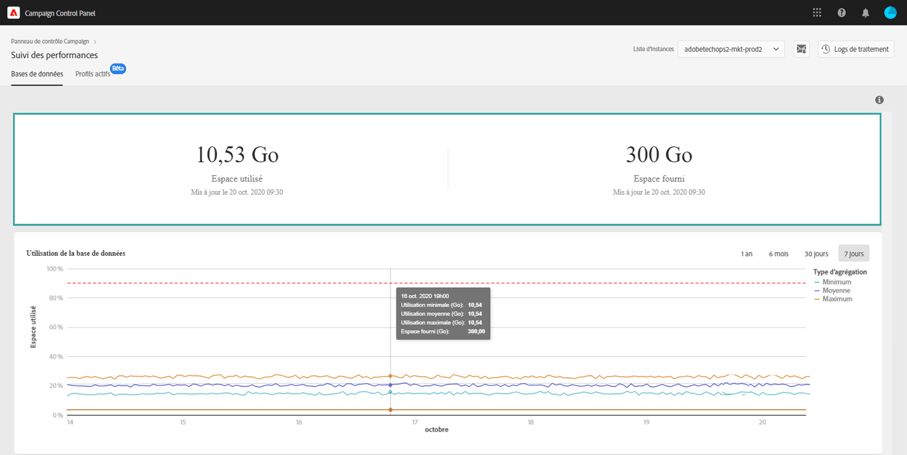

# Surveillance des bases de données {#database-monitoring}

## À propos des bases de données d’instances {#about-instances-databases}

Conformément à votre contrat, chacune de vos instances Campaign est dotée d’un espace de base de données spécifique.

Les bases de données englobent les **ressources**, les **workflows** et les **données** stockées dans Adobe Campaign.

Au fil du temps, elles peuvent atteindre leur capacité maximale, en particulier si les ressources stockées ne sont jamais supprimées de l’instance ou si de nombreux workflows sont mis en pause.

Le dépassement de la capacité d’une base de données d’instance peut entraîner différents problèmes (impossibilité de se connecter, d’envoyer des emails, etc.). La surveillance des bases de données d’instances est donc essentielle pour garantir des performances optimales.

>[!NOTE]
>
>La quantité d’espace de base de données indiquée dans le Panneau de contrôle peut ne pas correspondre à celle spécifiée dans votre contrat. La plupart du temps, un espace de base de données supérieur vous est fourni temporairement pour garantir les performances du système.

## Surveillance de l’utilisation des bases de données {#monitoring-instances-database}

Le Panneau de contrôle permet de surveiller l’utilisation de la base de données pour chacune de vos instances Campaign. Pour ce faire, suivez les étapes ci-après.

1. Ouvrez la **[!UICONTROL Performance Monitoring]** carte, puis sélectionnez l’ **[!UICONTROL Databases]** onglet.

1. Select the desired instance from the **[!UICONTROL Instance List]**.

   La zone supérieure contient des informations relatives à la capacité de la base de données de l’instance et à l’espace utilisé.

   

   La zone inférieure fournit une représentation graphique de l’utilisation minimale, moyenne et maximale de la base de données au cours des 7 derniers jours, ainsi que du seuil d’utilisation de la base de données de 90 %, représenté par une courbe en pointillés rouges.

   Vous pouvez modifier la période affichée à l’aide des filtres proposés dans l’angle supérieur droit.

   Pour une meilleure lisibilité, vous pouvez également mettre en surbrillance une ou plusieurs courbes du graphique. Pour ce faire, sélectionnez-les dans la **[!UICONTROL Aggregation Type]** légende.

   Pointez sur le graphique pour obtenir des informations détaillées sur la période sélectionnée.

   

>[!NOTE]
>
>En outre, ce vous permet de recevoir des notifications lorsque l’une de vos bases de données atteint sa capacité. Pour cela, abonnez-vous aux [alertes par email](../../performance-monitoring/using/email-alerting.md)

## Prévention des surcharges des bases de données {#preventing-database-overload}

Campaign Standard et Classic proposent des méthodes différentes pour éviter la surconsommation de l’espace disque des bases de données.

La section ci-dessous contient des ressources utiles issues de la documentation de Campaign pour optimiser l’utilisation de vos bases de données :

**Surveillance des workflows**

* [Meilleures pratiques relatives aux workflows](https://docs.adobe.com/content/help/fr-FR/campaign-standard/using/managing-processes-and-data/workflow-general-operation/best-practices-workflows.html) (Campaign Standard)
* [Surveillance de l’exécution des workflows](https://docs.adobe.com/help/fr-FR/campaign-classic/using/automating-with-workflows/monitoring-workflows/monitoring-workflow-execution.html) (Campaign Classic)

**Maintenance de la base de données**

* Workflow technique de nettoyage de la base de données ([Campaign Standard](https://docs.adobe.com/help/fr-FR/campaign-standard/using/administrating/application-settings/technical-workflows.html#list-of-technical-workflows) / [Campaign Classic](https://docs.adobe.com/help/fr-FR/campaign-classic/using/monitoring-campaign-classic/data-processing/database-cleanup-workflow.html))
* [Guide de maintenance de la base de données](https://docs.adobe.com/content/help/fr-FR/campaign-classic/using/monitoring-campaign-classic/database-maintenance/recommendations.html) (Campaign Classic)
* [Résolution des problèmes de performances de la base de données](https://docs.adobe.com/content/help/fr-FR/campaign-classic/using/monitoring-campaign-classic/troubleshooting/database-performances.html) (Campaign Classic)
* [Options liées à la base de données](https://docs.adobe.com/help/fr-FR/campaign-classic/using/installing-campaign-classic/appendices/configuring-campaign-options.html#database) (Campaign Classic)
