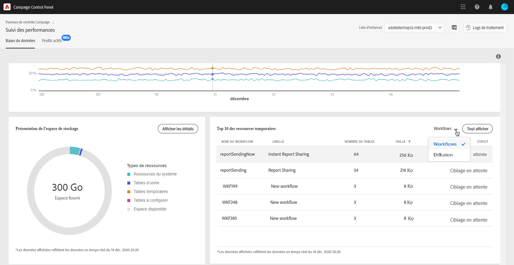

# Top 10 des ressources temporaires {#top-10}

Le **[!UICONTROL Top 10 des ressources temporaires]** répertorie les 10 plus importantes ressources temporaires générées par les workflows et les diffusions.

La surveillance des workflows et des diffusions qui créent des ressources temporaires importantes est essentielle pour surveiller votre base de données. Si une ressource temporaire consomme trop d’espace de base de données, vérifiez que ce workflow ou cette diffusion est nécessaire et, éventuellement, accédez à votre instance pour l’arrêter.

>[!IMPORTANT]
>
>À titre de recommandation générale, il est préférable d’éviter de placer **plus de 40 colonnes** dans des ressources à configurer.

>[!NOTE]
>
>Si un workflow présente un grand nombre de tables ou des tailles volumineuses de base de données, nous recommandons de le vérifier afin de déterminer pourquoi il génère autant de données.
>
>Des ressources Campaign Standard et Classic sont également disponibles à la fin de cette page pour vous aider à éviter la surcharge de la base de données.

Le bouton **[!UICONTROL Tout afficher]** permet d’accéder à des informations détaillées sur ces ressources temporaires.

La valeur contenue dans la colonne **[!UICONTROL Conserver les résultats intermédiaires]** indique si l’option est activée (« 1 ») ou désactivée (« 0 ») dans Campaign. Cette option permet d’enregistrer les résultats des transitions entre les différentes activités d’un workflow (voir la documentation [Campaign Standard](https://experienceleague.adobe.com/docs/campaign-standard/using/managing-processes-and-data/executing-a-workflow/managing-execution-options.html?lang=fr) et [Campaign Classic](https://experienceleague.adobe.com/docs/campaign-classic/using/automating-with-workflows/introduction/workflow-best-practices.html?lang=fr#logs)).

>[!IMPORTANT]
>
>Cette option ne doit jamais être cochée dans un workflow de production. Elle sert à analyser les résultats et est conçue uniquement à des fins de test. Elle ne doit donc être utilisée que dans les environnements de développement ou d’évaluation.
>
>Si la valeur du Panneau de contrôle indique que l’option est activée pour l’un de vos workflows, nous vous recommandons vivement de la désactiver dans Campaign.
