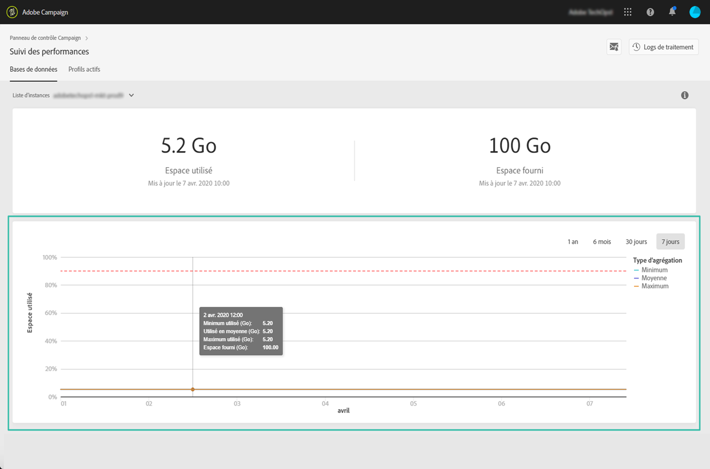

# Utilisation de la base de données {#database-utilization}

La zone **[!UICONTROL Utilisation de la base de données]** contient une représentation graphique de l’utilisation minimale, moyenne et maximale de la base de données au cours des 7 derniers jours, ainsi que le seuil d’utilisation de 90 % de la base de données, représenté par une courbe en pointillés rouges.

Pour modifier la période, utilisez les filtres disponibles dans l’angle supérieur droit du graphique.

Pour une meilleure lisibilité, vous pouvez également mettre en surbrillance une ou plusieurs courbes du graphique. Pour cela, sélectionnez-les dans la légende **[!UICONTROL Type d’agrégation]**.

Pour plus d’informations sur une période spécifique, pointez sur le graphique pour afficher des informations sur l’utilisation de la base de données à ce moment.

