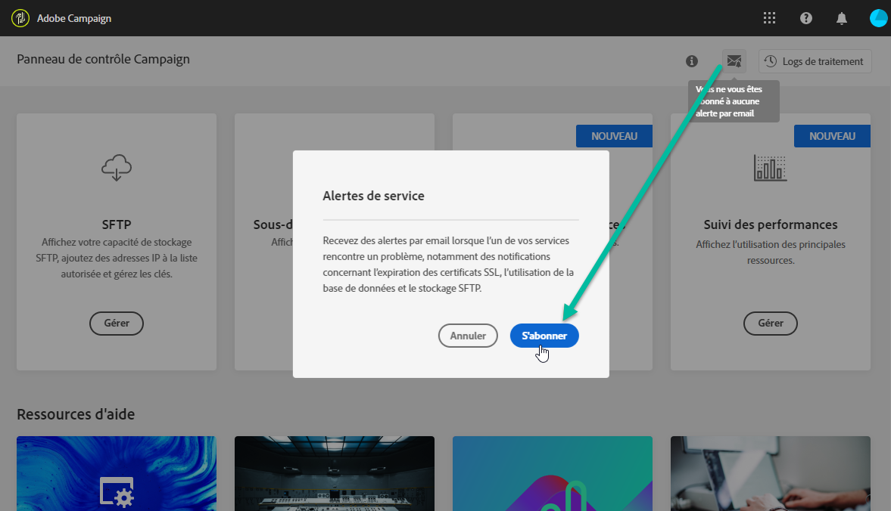
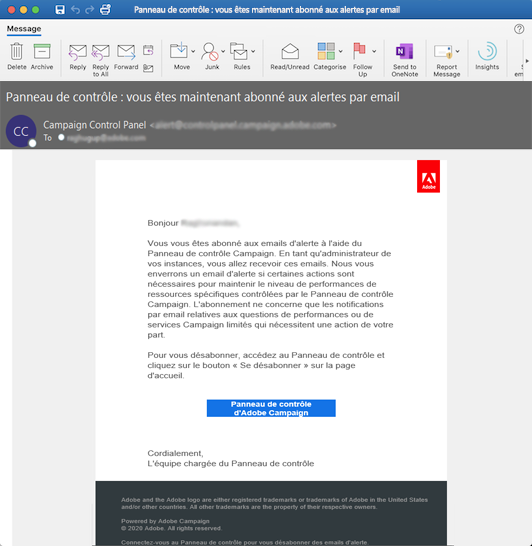
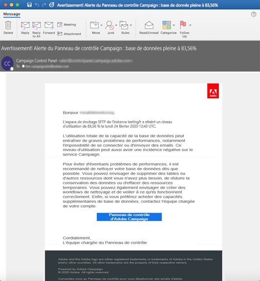

# Alertes par email {#email-alerting}

Pour apporter davantage de flexibilité à votre travail, le panneau de contrôle possède une fonctionnalité d’alerte par email en temps réel.

Pour vous abonner à ces alertes, procédez comme suit :

1. Cliquez sur le bouton **[!UICONTROL Notifications d’alertes]** disponible à n’importe quel emplacement du Panneau de contrôle, puis cliquez sur **[!UICONTROL S’abonner]**.

   

1. Un email vous est envoyé pour confirmer votre abonnement.

   

1. Une fois votre abonnement effectué, le Panneau de contrôle vous avertira des problèmes du système et vous recommandera les mesures à prendre. Les alertes par email sont envoyées à toutes les personnes pour **toutes les instances** qu’elles administrent.

   

La liste des alertes est la suivante :

* **Utilisation de l’espace de stockage SFTP** : l’un de vos serveurs SFTP a atteint 80 % ou plus de sa capacité. Voir [Gestion de l’espace de stockage SFTP](../../sftp/using/sftp-storage-management.md).

* **Utilisation de la base de données** : l’une des bases de données de vos instances a atteint 80 % ou plus de sa capacité. Voir [Surveillance des bases de données](../../performance-monitoring/using/database-monitoring.md).

* **Expiration du certificat SSL** : l’un des certificats SSL de vos sous-domaines est arrivé à expiration ou arrivera à expiration dans 60 jours ou moins. Voir [Surveillance des certificats SSL des sous-domaines](../../subdomains-certificates/using/monitoring-ssl-certificates.md).
