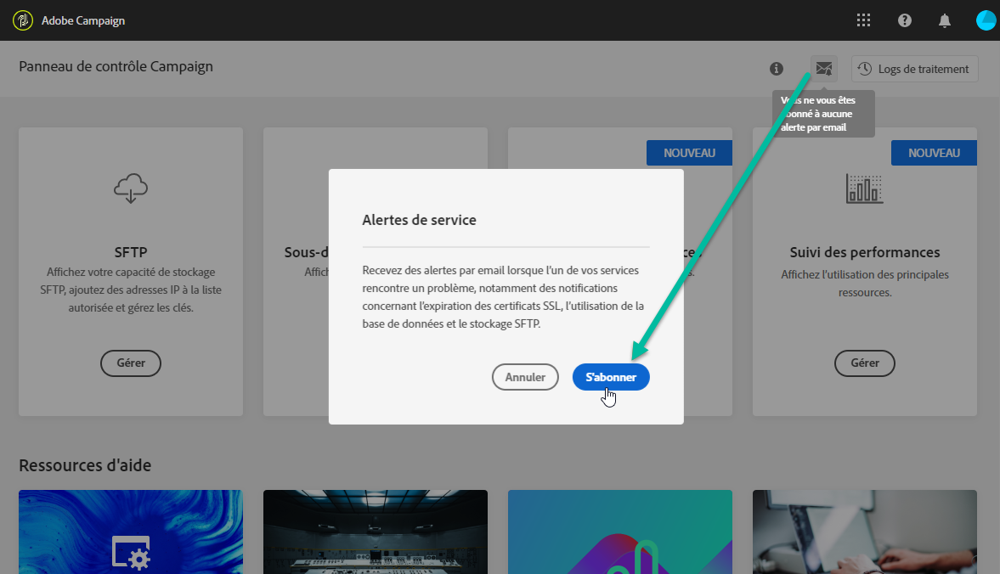
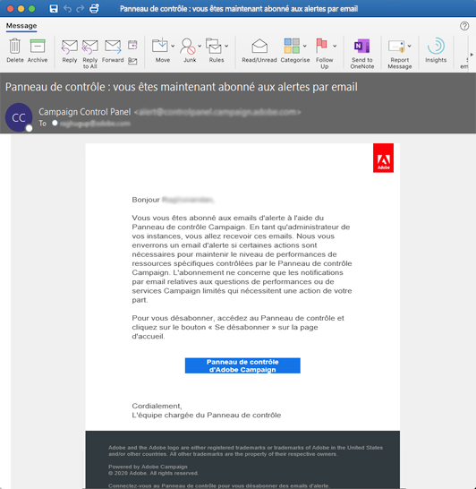
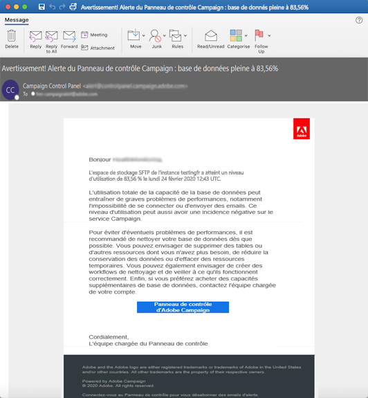

# Alertes par e-mail {#email-alerting}

Pour apporter davantage de flexibilité à votre travail, le Panneau de contrôle possède une fonctionnalité d’alerte par e-mail en temps réel.

## Liste des alertes {#list}

La liste des alertes est la suivante :

* **Utilisation de l’espace de stockage SFTP** : l’un de vos serveurs SFTP a atteint 80 % ou plus de sa capacité. Voir [Gestion de l’espace de stockage SFTP](../../sftp/using/sftp-storage-management.md).

* **Utilisation de la base de données** : l’une des bases de données de vos instances a atteint 80 % ou plus de sa capacité. Voir [Surveillance des bases de données](../../performance-monitoring/using/database-monitoring.md).

* **Expiration de liste autorisée d’adresses IP SFTP** : l’une des plages d’adresses IP que vous avez définies est arrivée ou arrivera à expiration dans 10 jours ou moins. Consultez la section [Listes autorisées des plages d’adresses IP](../../sftp/using/ip-range-allow-listing.md).

* **Expiration de clé publique SFTP** : l’une des clés publiques que vous avez définies est arrivée ou arrivera à expiration dans 10 jours ou moins. Consultez la section [Gestion des clés](../../sftp/using/key-management.md).

* **Expiration du certificat SSL** : l’un des certificats SSL de vos sous-domaines est arrivé à expiration ou arrivera à expiration dans 30 jours ou moins. Voir [Surveillance des certificats SSL des sous-domaines](../../subdomains-certificates/using/monitoring-ssl-certificates.md).

<!--* **Long running Queries**: A query has been running for more than 24 hours on one of your instances. See [Monitoring active queries](database-active-queries.md).-->

>[!NOTE]
>
>En outre, le panneau de contrôle vous permet de **définir des rappels** afin d’être averti par e-mail avant qu’un événement ne se produise sur vos instances (versions et révisions de service).
>
>Pour ce faire, vous devez être abonné aux alertes par e-mail et définir un rappel pour les événements à venir souhaités. [Découvrez comment définir des rappels pour les événements à venir](../../service-events/service-events.md#reminders)

## S’abonner aux alertes {#subscribe}

Pour vous abonner à ces alertes, procédez comme suit :

1. Cliquez sur le bouton **[!UICONTROL Notifications d’alertes]** disponible à n’importe quel emplacement du Panneau de contrôle, puis cliquez sur **[!UICONTROL S’abonner]**.

   

1. Un email vous est envoyé pour confirmer votre abonnement.

   

1. Une fois votre abonnement effectué, le Panneau de contrôle vous avertira des problèmes du système et vous recommandera les mesures à prendre. Les alertes par email sont envoyées à toutes les personnes pour **toutes les instances** qu’elles administrent.

   
