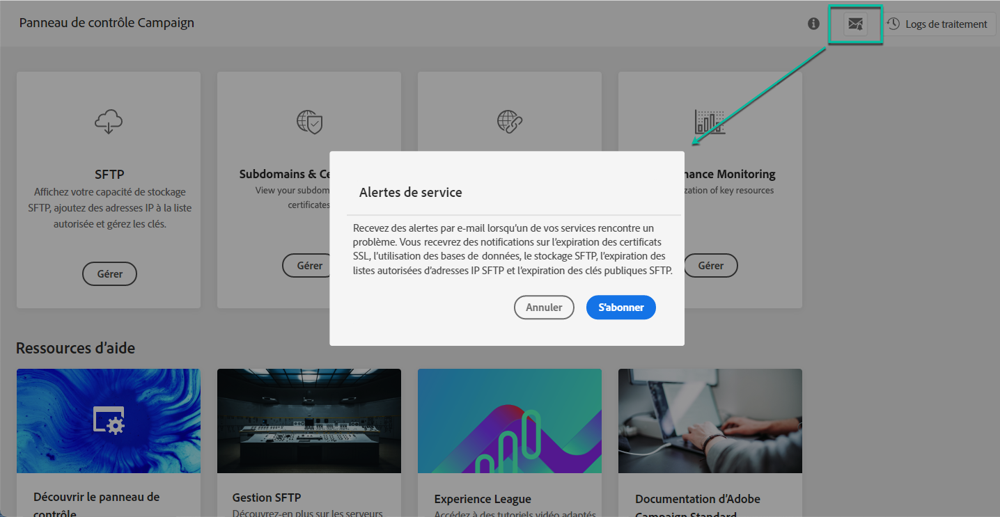

# Alertes par courrier électronique {#email-alerting}

## A propos des alertes par courrier électronique {#about-email-alerts}

Afin d’offrir une plus grande flexibilité à votre travail, le Panneau de configuration est équipé d’une fonctionnalité d’alerte par courrier électronique en temps réel.

Pour vous abonner à ces alertes, procédez comme suit :

1. Cliquez sur le **[!UICONTROL Alerting notifications]** bouton disponible à partir de n’importe quel emplacement du Panneau de configuration, puis cliquez sur **[!UICONTROL Subscribe]**.

   

1. Un e-mail est envoyé pour confirmer votre  .

   

1. Après s&#39;être abonné, le Panneau de configuration avertit des problèmes du système et recommande les actions à entreprendre. Des alertes par courrier électronique sont envoyées à toutes les personnes qui se sont inscrites pour **toutes les instances** dont elles sont administrateurs.

   

Le  des alertes est le suivant :

* **SFTP  utilisation** du : L’un de vos serveurs SFTP a atteint 80 % ou plus de sa capacité. See [SFTP storage management](../../sftp/using/sftp-storage-management.md).

* **Utilisation** de la base de données : L’une des bases de données de vos instances a atteint 80 % ou plus de sa capacité. Voir Surveillance [des](../../performance-monitoring/using/database-monitoring.md)bases de données.

* **Expiration** du certificat SSL : L’un des certificats SSL de vos sous-domaines a expiré ou va expirer dans 60 jours ou moins. See [Monitoring subdomains&#39; SSL certificates](../../subdomains-certificates/using/monitoring-ssl-certificates.md).

