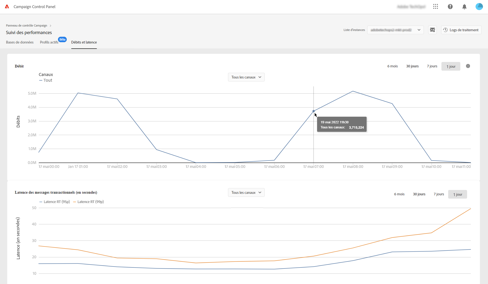
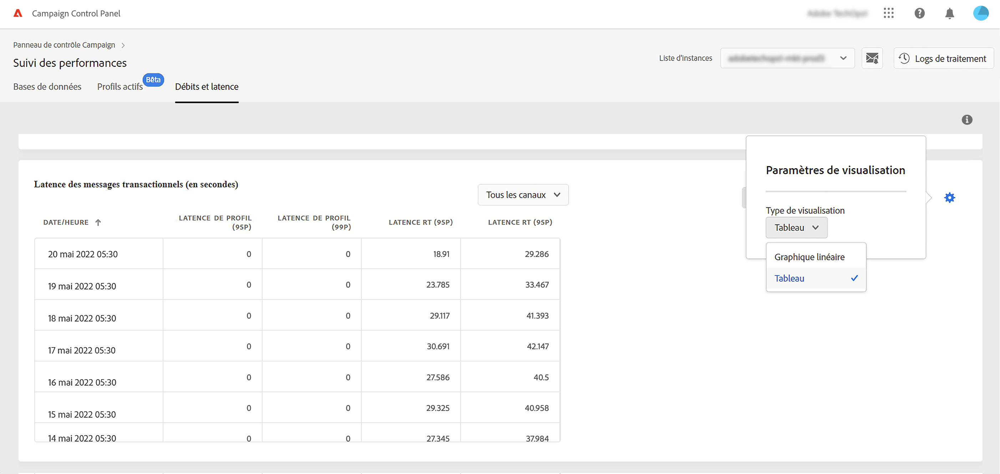

# Surveillance des débits et de la latence {#throughputs-latency-monitoring}

>[!CONTEXTUALHELP]
>id="cp_performancemonitoring_throughputslatencies"
>title="À propos de la surveillance des débits et de la latence "
>abstract="Dans cet onglet, vous pouvez surveiller les fluctuations des débits de diffusion et de latence sur vos instances au cours dʼune période donnée."

Panneau de Contrôle vous permet de surveiller les débits de diffusion et la latence pour chacune de vos instances.

>[!IMPORTANT]
>
>Cette fonctionnalité est disponible pour tous les clients Campaign Standard et v8, ainsi que pour les clients de Campaign V7 dont les numéros de build 9032 9330, 9346 ou 9349 comportent des [autonome](https://experienceleague.adobe.com/docs/campaign-classic/using/installing-campaign-classic/deployment-types-/standalone-deployment.html) déploiements (sans instance mid).

La surveillance des fluctuations des débits de diffusion et de latence sur une période donnée est essentielle pour comprendre lʼutilisation de vos instances et vous assurer de leur bon fonctionnement.

Ces informations sont disponibles dans le panneau de contrôle pour chacune de vos instances Campaign, dans la vignette **[!UICONTROL Surveillance des performances]** et sous lʼonglet **[!UICONTROL Débits et latence]** (notez que le panneau de contrôle peut prendre jusqu’à 1 heure pour afficher les chiffres).

* La zone relative au **[!UICONTROL Débit]** fournit des informations concernant le nombre de messages envoyés par heure à partir de l’instance Campaign sélectionnée, pour tous les canaux de communication auxquels vous avez droit.

   >[!NOTE]
   >
   >Pour Campaign v7/v8, le numéro de débit affiché est le débit obtenu à partir des instances MID (mid-sourcing). Pour les déploiements de marketing autonome (MKT) (sans instance MID), le débit de l’instance MKT s’affiche à la place.

* La zone relative à la **[!UICONTROL Latence]** fournit des informations concernant la latence rencontrée sur l’instance sélectionnée lors de l’envoi de communications transactionnelles en temps réel. Les latences sont capturées et visualisées aux 95e et 99e centiles, ce qui signifie que 95 % et 99 % des requêtes doivent être plus rapides que la latence donnée.

>[!NOTE]
>
>Tous les chiffres fournis dans cet onglet sont approximatifs et ne sont donnés quʼà titre indicatif.

Par défaut, les données sont affichées pour la journée en cours. Vous pouvez modifier la période affichée à l’aide des boutons **[!UICONTROL 6 mois]**, **[!UICONTROL 30 jours]** et **[!UICONTROL 7 jours]**.

Vous pouvez également visualiser les informations dans un format de tableau avec des colonnes triables plutôt que dans un graphique. Pour ce faire, cliquez sur le bouton **[!UICONTROL Paramètres de visualisation]**, puis sélectionnez **[!UICONTROL Tableau]**.

