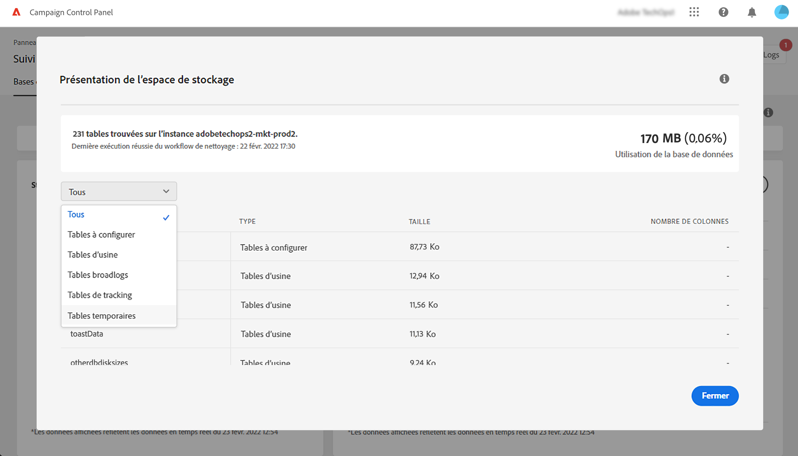
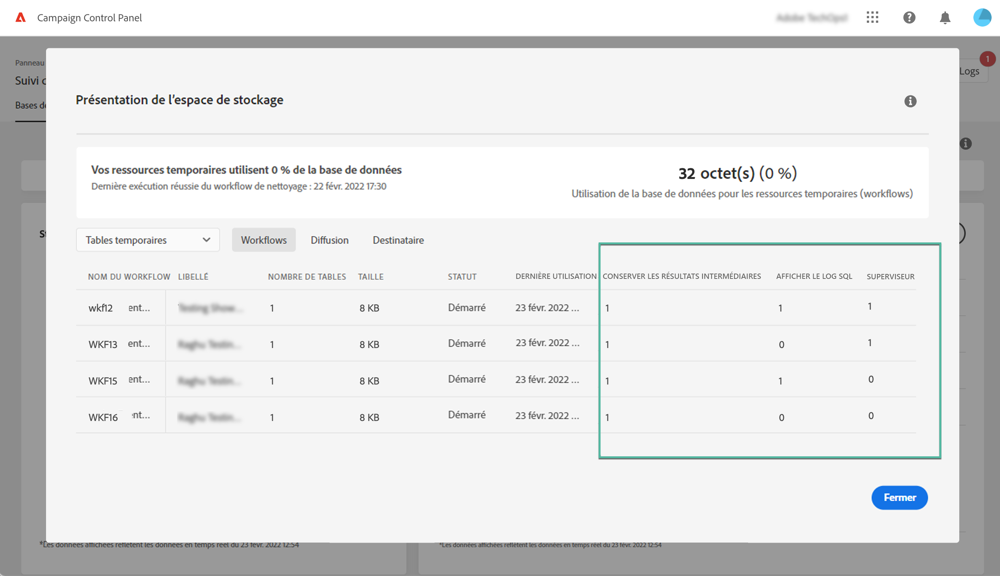
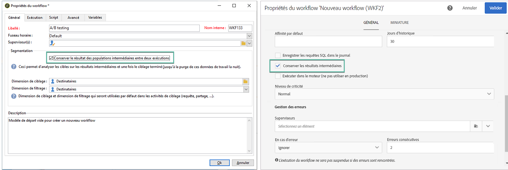
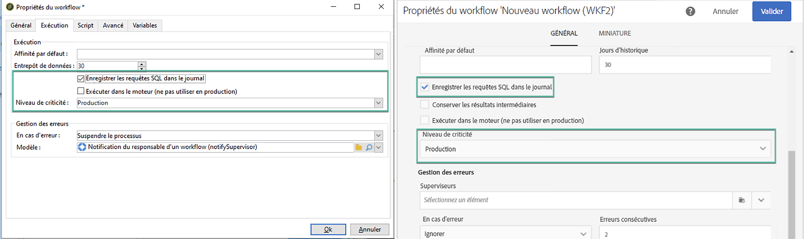
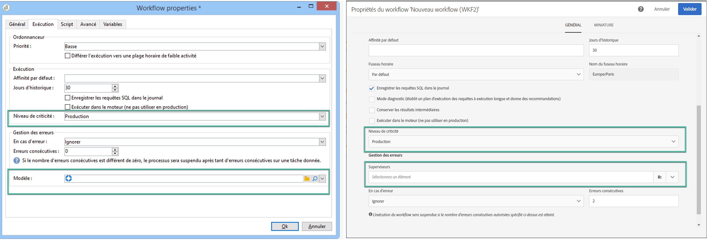

# Surveillance des workflows {#monitor-workflows}

<!-- Clean paused and completed workflows

When [!DNL Adobe Campaign] workflows are paused or completed, they leave temporary tables on your instances database that consume space and can lead to performance issues.

Control Panel allows you to identify those workflows and clean the temporary resources generated on your instances.

>[!NOTE]
>
>Technically, this operation executes the **[!UICONTROL Database cleanup technical workflow]** that runs on your Campaign instance everyday (see [Campaign Standard](https://experienceleague.adobe.com/docs/campaign-standard/using/administrating/application-settings/technical-workflows.html#list-of-technical-workflows) and [Campaign Classic](https://experienceleague.adobe.com/docs/campaign-classic/using/monitoring-campaign-classic/data-processing/database-cleanup-workflow.html) documentation). 

To clean paused and completed workflows, follow these steps:

1. Navigate to the **[!UICONTROL Performance monitoring]** card.

1. In the **[!UICONTROL Databases]** tab, select the instance where you want to perform the operation.

1. Access the **[!UICONTROL Storage overview]** details, then filter the list on **[!UICONTROL Temporary tables]**. Learn more on **[!UICONTROL Storage overview]** in [this page](database-storage-overview.md).

    

1. All temporary tables generated on your instances by workflows and deliveries display. Click the **[!UICONTROL Clean now]** button to delete the resources generated by paused and completed workflows.

    

1. Once the operation is confirmed, you can track the estimated remaining time in the **[!UICONTROL Storage overview]** list.

    

Monitor workflow parameters -->

Dans Adobe Campaign, certains paramètres de workflow peuvent nécessiter une attention particulière pour éviter tout problème sur vos instances. Les détails de la **[!UICONTROL Présentation de l’espace de stockage]** du panneau de contrôle vous permettent de vérifier si l’une de ces options est activée pour vos workflows.

## **[!UICONTROL Conserver les résultats intermédiaires]** {#keep-results}

Lorsqu’elle est activée (valeur « 1 »), cette option enregistre les résultats des transitions entre les différentes activités d’un workflow. En savoir plus dans la documentation de [Campaign Standard](https://experienceleague.adobe.com/docs/campaign-standard/using/managing-processes-and-data/executing-a-workflow/managing-execution-options.html?lang=fr) et [Campaign Classic](https://experienceleague.adobe.com/docs/campaign-classic/using/automating-with-workflows/introduction/workflow-best-practices.html?lang=fr#logs).

>[!IMPORTANT]
>
>Cette option ne doit jamais être cochée dans un workflow de production. Elle est utilisée à des fins d’analyse et de test, et ne doit donc être utilisée que sur des environnements de développement ou d’évaluation. Nous recommandons vivement de la désactiver dans Campaign.

## **[!UICONTROL Afficher le log SQL]** {#sql}

Lorsque cette option est activée, les requêtes SQL envoyées à la base de données pendant l’exécution du workflow sont affichées dans Adobe Campaign. En savoir plus dans la documentation de [Campaign Standard](https://experienceleague.adobe.com/docs/campaign-standard/using/managing-processes-and-data/executing-a-workflow/managing-execution-options.html?lang=fr) et [Campaign Classic](https://experienceleague.adobe.com/docs/campaign-classic/using/automating-with-workflows/advanced-management/workflow-properties.html?lang=fr#execution).

La valeur « 1 » indique que le champ **Gravité** du workflow est défini sur « Production » et que l’option relative aux logs des requêtes SQL est activée.

>[!IMPORTANT]
>
>L’activation de cette option peut avoir un impact sur les performances et renseigner les fichiers de logs sur le serveur. Elle ne doit être utilisée qu’à des fins d’analyse et de diagnostic.

## **[!UICONTROL Superviseurs]** {#supervisors}

Ce champ vous permet d’affecter un opérateur à un workflow. Si le workflow échoue, l’opérateur associé est alerté. En savoir plus dans la documentation de [Campaign Standard](https://experienceleague.adobe.com/docs/campaign-standard/using/managing-processes-and-data/executing-a-workflow/monitoring-workflow-execution.html?lang=fr#error-management) et [Campaign Classic](https://experienceleague.adobe.com/docs/campaign-classic/using/automating-with-workflows/advanced-management/workflow-properties.html?lang=fr#error-management).

La valeur « 1 » indique que le champ **Gravité** du workflow est défini sur « Production » et qu’aucun groupe de superviseurs n’a été affecté au workflow.

