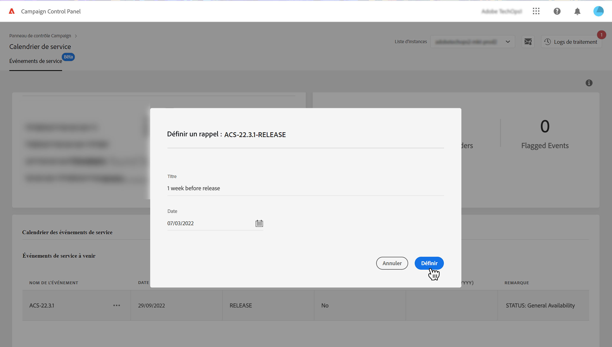
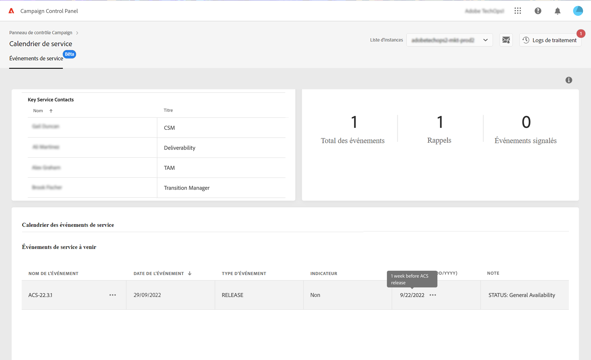

# Identifier les contacts principaux et les événements {#keycontacts-events}

>[!CONTEXTUALHELP]
>id="cp_servicecalendar_serviceevents"
>title="Calendrier de service"
>abstract="La section des contacts principaux dresse une liste des personnes de contact chez Adobe, que vous pouvez appeler pour toute demande ou problème se produisant sur vos instances. Dans la section Calendrier des événements du service, vous pouvez identifier les versions et les alertes antérieures et à venir pour l’instance sélectionnée, et configurer des rappels pour un événement spécifique."

>[!IMPORTANT]
>
>Le calendrier de service est disponible en version Beta et est sujet à de fréquentes mises à jour et modifications sans préavis.

Pour surveiller efficacement vos instances Campaign, il est essentiel de suivre les événements importants qui peuvent potentiellement avoir un impact sur vos instances. Le panneau de contrôle vous permet d’identifier des événements tels que de nouvelles versions, mises à niveau, correctifs, correctifs logiciels, etc. et fournit une liste des contacts principaux d’Adobe pour toutes les demandes ou problèmes.

Ces informations sont accessibles depuis la vignette **[!UICONTROL Calendrier de service]** sur la page d’accueil du panneau de contrôle.

## Contacts principaux {#key-contacts}

La section **[!UICONTROL Contacts principaux]** dresse une liste des personnes de contact chez Adobe, que vous pouvez appeler pour toute demande ou problème se produisant sur vos instances.

>[!NOTE]
>
>Cette section affiche uniquement des informations sur les comptes de services gérés.

Les contacts principaux exercent les rôles suivants :

* **[!UICONTROL TAM]** : gestionnaire de compte technique,
* **[!UICONTROL CSM]** : responsable du succès client,
* **[!UICONTROL Délivrabilité]** : point de contact pour les opérations de délivrabilité,
* **[!UICONTROL Gestionnaire de transition]** : gestionnaire de transition Managed Services (compte Managed Services uniquement),
* **[!UICONTROL Spécialiste de l’intégration]** : spécialiste affecté au compte pour vous aider lors de l’intégration à Campaign Classic (compte Managed Services uniquement).

## Suivre les événements importants {#events}

La section **[!UICONTROL Calendrier des événements de service]** présente toutes les versions antérieures et à venir, ainsi que les alertes auxquelles les utilisateurs et utilisatrices se sont abonnés dans les alertes par e-mail du panneau de contrôle. En outre, le panneau de contrôle permet aux utilisateurs et utilisatrices de configurer des rappels et de marquer les événements pertinents concernant l’instance sélectionnée pour une meilleure organisation et efficacité.

Les événements sont affichés dans un calendrier ou dans une liste. Vous pouvez basculer entre les deux vues à l’aide des boutons **[!UICONTROL Calendrier]** et **[!UICONTROL Liste]** dans le coin supérieur droit de la section.

<table><tr style="border: 0;">
<td>
</td><td>Dans la vue Calendrier, des boutons de navigation sont disponibles dans le coin supérieur droit pour vous aider à parcourir les événements. Utilisez les <b>doubles flèches</b> pour accéder au premier événement présent après/avant le mois sélectionné, et les <b>flèches simples</b> pour passer d’un mois à un autre. Cliquez sur le <b>bouton cercle</b> pour revenir à la vue d’aujourd'hui.</td>
</tr></table>

Trois types d’événements s’affichent :

* Les **rappels** sont définis par les utilisateurs et utilisatrices pour recevoir des notifications avant qu’un événement ne se produise. Elles s’affichent en vert dans la vue Calendrier. [Découvrir comment définir un rappel](#reminders)
* Les **alertes** sont envoyées par e-mail par le panneau de contrôle pour informer les utilisateurs et utilisatrices de problèmes sur leurs instances, tels que la surcharge de stockage ou l’expiration du certificat SSL. Elles s’affichent en orange dans la vue Calendrier. La description de l’événement indique si l’alerte est envoyée à l’utilisateur ou à l’utilisatrice connecté(e), selon son abonnement aux alertes par e-mail. [En savoir plus sur les fonctionnalités des alertes par e-mail du panneau de contrôle](../performance-monitoring/using/email-alerting.md)

* Les **versions** indiquent les déploiements précédents et à venir sur l’instance, en gris et bleu respectivement dans la vue Calendrier. Les détails de l’événement spécifient le type de version associé à chaque déploiement :

   * **[!UICONTROL Disponibilité générale]** : dernier build stable disponible.
   * **[!UICONTROL Disponibilité limitée]** : déploiement à la demande uniquement.
   * **[!UICONTROL Release Candidate]** : validée par les ingénieurs Adobe. En attente de contrôle en production.
   * **[!UICONTROL Version préliminaire]** : disponibilité anticipée pour les besoins spécifiques des clients.
   * **[!UICONTROL Plus disponible]** : cette version ne contient aucun problème majeur, mais un build plus récent est disponible avec des correctifs supplémentaires. Une mise à niveau est requise.
   * **[!UICONTROL Obsolète]** : le build contient des régressions connues. Le build n’est plus pris en charge. La mise à niveau est obligatoire.

Vous pouvez attribuer un indicateur à un ou plusieurs événements à venir et ainsi en effectuer le suivi. Pour ce faire, cliquez sur le bouton représentant des points de suspension en regard du nom de l’événement.

## Définir des rappels {#reminders}

Avec le calendrier de service, vous pouvez définir des rappels afin d’être averti par e-mail avant qu’un événement ne se produise.

>[!NOTE]
>
>Pour être averti des événements à venir, vous devez être abonné aux alertes par e-mail dans le panneau de contrôle. [En savoir plus](../performance-monitoring/using/email-alerting.md)

Pour définir une alerte pour un événement, procédez comme suit :

1. Pointez sur sur l’événement pour lequel vous souhaitez recevoir un rappel ou cliquez sur le bouton représentant des points de suspension dans la vue Liste, puis sélectionnez **[!UICONTROL Définir un rappel]**.

1. Donnez un titre au rappel, puis sélectionnez la date à laquelle vous souhaitez recevoir une alerte avant l’événement.

   

   >[!NOTE]
   >
   >Si vous ne vous êtes pas abonné aux alertes du panneau de contrôle, un message s’affichera ; vous pourrez alors vous inscrire pour recevoir des notifications par e-mail.

1. Le rappel est maintenant défini pour l’événement sélectionné. Vous pouvez le survoler à tout moment avec la souris pour voir le titre correspondant.

   

   >[!NOTE]
   >
   >Vous pouvez configurer jusqu’à 2 rappels pour le même événement.

1. À la date spécifiée dans le rappel, un e-mail vous sera envoyé pour vous informer de l’événement à venir. Le rappel sera automatiquement supprimé des **[!UICONTROL Rappels]** dans le menu Calendrier de service.
