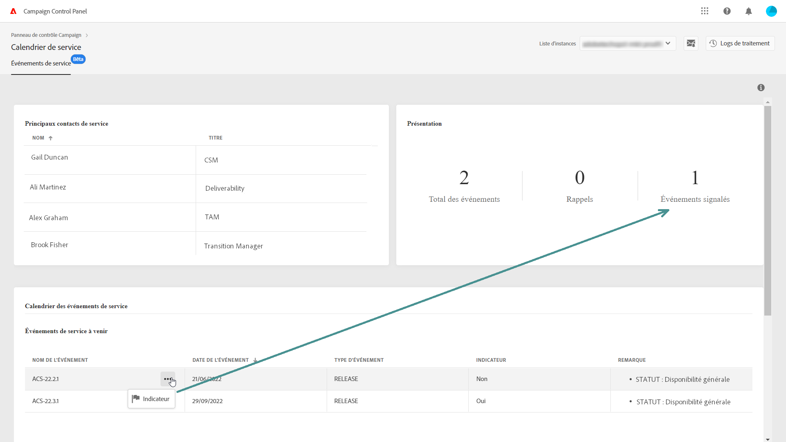

# Surveiller les contacts principaux et les événements {#keycontacts-events}

>[!CONTEXTUALHELP]
>id="cp_servicecalendar_serviceevents"
>title="Calendrier de service"
>abstract="La section des contacts principaux dresse une liste des personnes de contact chez Adobe, que vous pouvez appeler pour toute demande ou problème se produisant sur vos instances. Dans la section Calendrier des événements de service, vous pouvez identifier toutes les versions antérieures et à venir ainsi que les révisions de service pour l’instance sélectionnée."

>[!IMPORTANT]
>
>Le calendrier de service est disponible en version Beta et est sujet à de fréquentes mises à jour et modifications sans préavis.

Pour assurer la surveillance de vos instances Campaign, l’identification des événements planifiés sur celles-ci revêt un caractère essentiel.

Grâce au panneau de contrôle, vous pouvez surveiller les versions et les révisions de service se produisant sur vos instances, ainsi qu’accéder à une liste de contacts principaux chez Adobe pour toute demande ou problème.

Ces informations sont accessibles depuis la vignette **[!UICONTROL Calendrier de service]** sur la page d’accueil du panneau de contrôle.

## Contacts principaux {#key-contacts}

La section **[!UICONTROL Contacts principaux]** dresse une liste des personnes de contact chez Adobe, que vous pouvez appeler pour toute demande ou problème se produisant sur vos instances.

>[!NOTE]
>
>Cette section affiche des informations uniquement pour les comptes de services gérés.

Les contacts principaux exercent les rôles suivants :

* **[!UICONTROL TAM]** : gestionnaire de compte technique,
* **[!UICONTROL CSM]** : responsable du succès client,
* **[!UICONTROL Délivrabilité]** : point de contact pour les opérations de délivrabilité,
* **[!UICONTROL Gestionnaire de transition]** : gestionnaire de transition Managed Services (compte Managed Services uniquement),
* **[!UICONTROL Spécialiste de l’intégration]** : spécialiste affecté au compte pour vous aider lors de l’intégration à Campaign Classic (compte Managed Services uniquement).

## Événements {#events}

La section **[!UICONTROL Calendrier des événements de service]** affiche toutes les versions antérieures et à venir ainsi que les révisions de service pour l’instance sélectionnée.

La colonne **[!UICONTROL Remarque]** fournit des informations sur le statut de chaque version :

* **[!UICONTROL Disponibilité générale]** : dernier build stable disponible.
* **[!UICONTROL Disponibilité limitée]** : déploiement à la demande uniquement.
* **[!UICONTROL Release Candidate]** : validée par les ingénieurs Adobe. En attente de contrôle en production.
* **[!UICONTROL Version préliminaire]** : disponibilité anticipée pour les besoins spécifiques des clients.
* **[!UICONTROL Plus disponible]** : cette version ne contient aucun problème majeur, mais un build plus récent est disponible avec des correctifs supplémentaires. Une mise à niveau est requise.
* **[!UICONTROL Obsolète]** : le build contient des régressions connues.
Le build n’est plus pris en charge. La mise à niveau est obligatoire.

Vous pouvez attribuer un indicateur à un ou plusieurs événements à venir et ainsi en effectuer le suivi. Pour ce faire, cliquez sur le bouton Ellipse en regard du nom de l’événement.

