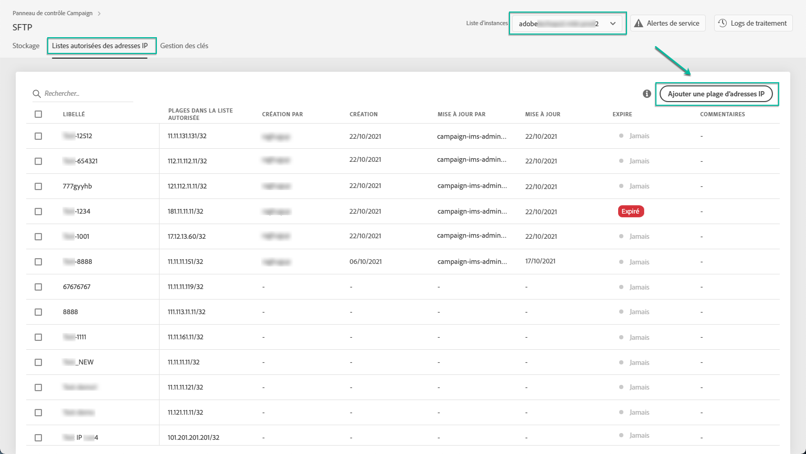

# Listes autorisées des plages d’adresses IP {#ip-range-allow-listing}

>[!CONTEXTUALHELP]
>id="cp_ip_whitelist"
>title="À propos des listes autorisées d’adresses IP"
>abstract="Dans cet onglet, vous pouvez ajouter des plages d’adresses IP à la liste autorisée, afin d’établir une connexion à vos serveurs SFTP. Seuls les serveurs SFTP auxquels vous avez accès sont visibles ici. Contactez l’administrateur pour demander un accès aux autres serveurs SFTP."
>additional-url="https://images-tv.adobe.com/mpcv3/8a977e03-d76c-44d3-853c-95d0b799c870_1560205338.1920x1080at3000_h264.mp4#t=98" text="Regarder une vidéo de démonstration"

Les serveurs SFTP sont protégés. Pour pouvoir y accéder afin d&#39;en vue des fichiers ou d&#39;en écrire de nouveaux, vous devez ajouter l&#39;adresse IP publique du système ou du client qui accède aux serveurs à la liste autorisée.

## À propos du format CIDR {#about-cidr-format}

Le format CIDR (Classless Inter-Domain Routing) est le format pris en charge lors de l’ajout de plages IP avec l’interface du panneau de contrôle.

La syntaxe se compose d’une adresse IP, suivie d’un caractère « / » et d’un nombre décimal. Le format et sa syntaxe sont présentés en détail dans [cet article](https://whatismyipaddress.com/cidr).

Vous pouvez rechercher sur Internet des outils en ligne gratuits qui vous permettront de convertir la plage IP qui vous intéresse au format CIDR.

## Bonnes pratiques {#best-practices}

Veillez à suivre les recommandations et les limites ci-dessous lors de l’ajout des adresses IP à la liste autorisée dans le panneau de contrôle.

* **Ajoutez des plages d’adresses IP sur la liste autorisée** plutôt que sur des adresses IP uniques. Pour ajouter une seule adresse IP à la liste autorisée, ajoutez un &quot;/32&quot; pour indiquer que la plage ne comprend qu&#39;une seule adresse IP.
* **N’ajoutez pas de plages très larges à la liste autorisée**, par exemple > 265 adresses IP. Le panneau de contrôle rejettera les plages au format CIDR comprises entre /0 et /23.
* Seules les adresses **IP** publiques peuvent être ajoutées à la liste autorisée.
* Veillez à supprimer **régulièrement des adresses** IP dont vous n&#39;avez plus besoin de la liste autorisée.

## Ajouter des adresses IP à la liste autorisée {#adding-ip-addresses-allow-list}

>[!CONTEXTUALHELP]
>id="cp_sftp_iprange_add"
>title="Ajouter une plage d’adresses IP"
>abstract="Définissez les plages d’adresses IP à ajouter à la liste autorisée afin de vous connecter à vos serveurs SFTP."

Pour ajouter une plage d’adresses IP à la liste autorisée, procédez comme suit :

1. Ouvrez la carte **[!UICONTROL SFTP]**, puis sélectionnez l’onglet **[!UICONTROL Whiteliste d’adresses IP]**.
1. La liste des adresses IP sur la liste autorisée s’affiche pour chaque instance. Sélectionnez l’instance souhaitée dans la liste de gauche, puis cliquez sur le bouton **[!UICONTROL Ajouter une plage d’adresses IP]**.

   

1. Définissez la plage d’adresses IP à ajouter à la liste autorisée, au format CIDR, puis définissez l’étiquette qui s’affichera dans la liste.

   >[!NOTE]
   >
   >Les caractères spéciaux suivants sont autorisés dans le champ Libellé :
   > `. _ - : / ( ) # , @ [ ] + = & ; { } ! $`

   

   >[!IMPORTANT]
   >
   >Une plage IP ne peut pas chevaucher une plage existante sur la liste autorisée. Dans ce cas, supprimez d’abord la plage qui contient l’adresse IP whitelistée.
   >
   >Il est possible d’ajouter une plage sur la liste autorisée pour plusieurs instances. Pour ce faire, appuyez sur la touche Flèche vers le bas ou saisissez les premières lettres de l’instance souhaitée, puis sélectionnez-la dans la liste de suggestions.

   

1. Cliquez sur le bouton **[!UICONTROL Enregistrer]**. L’ajout d’IP à la liste autorisée s’affichera comme EN ATTENTE jusqu’à ce que la demande soit entièrement traitée. Cette situation ne devrait pas durer plus de quelques secondes.

Pour supprimer des plages d’adresses IP de la liste autorisée, sélectionnez-les puis cliquez sur le bouton **[!UICONTROL Supprimer une plage d’adresses IP]**.

>[!NOTE]
>
>Il est actuellement impossible de modifier une plage sur la liste autorisée. Pour modifier une plage d’adresses IP, supprimez-la, puis créez-en une correspondant à vos besoins.

## Surveillance des changements {#monitoring-changes}

The **[!UICONTROL Job Logs]** in the Control Panel home page let you monitor all changes that have been made to IP addresses on the allow list.

Pour plus d’informations sur l’interface du panneau de contrôle, reportez-vous à [cette section](../../discover/using/discovering-the-interface.md).

