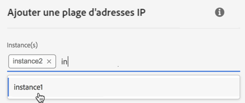
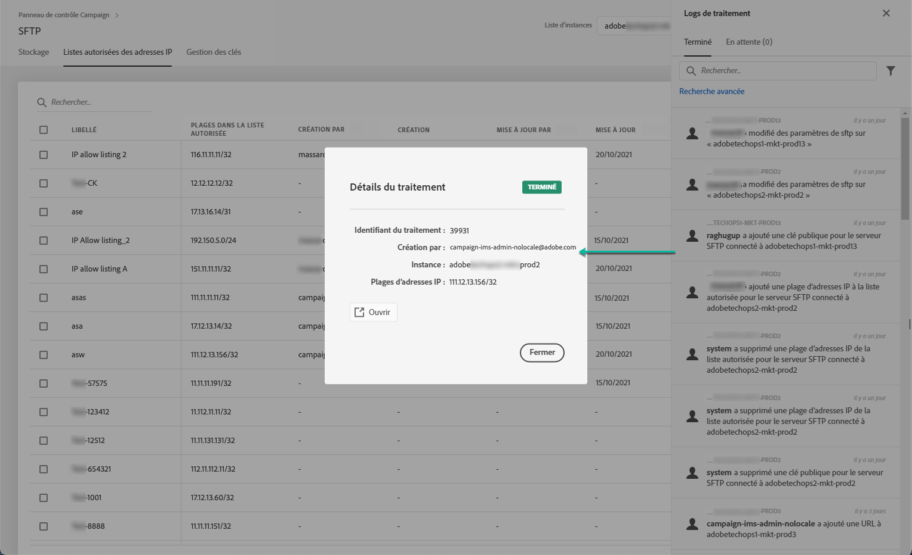

# Listes autorisées des plages d’adresses IP {#ip-range-allow-listing}

>[!CONTEXTUALHELP]
>id="cp_ip_whitelist"
>title="À propos des listes autorisées d’adresses IP"
>abstract="Dans cet onglet, vous pouvez ajouter des plages d’adresses IP à la liste autorisée pour établir une connexion à vos serveurs SFTP. Seuls les serveurs SFTP auxquels vous avez accès sont visibles ici. Contactez l’administrateur pour demander un accès à d’autres serveurs SFTP."
>additional-url="https://images-tv.adobe.com/mpcv3/8a977e03-d76c-44d3-853c-95d0b799c870_1560205338.1920x1080at3000_h264.mp4#t=98" text="Regarder une vidéo de démonstration"

Les serveurs SFTP sont protégés. Afin de pouvoir y accéder pour afficher des fichiers ou en écrire de nouveaux, vous devez ajouter à la liste autorisée l’adresse IP publique du système ou du client qui accède aux serveurs.

 Découvrez cette fonctionnalité en vidéo dans [Campaign Classic](https://experienceleague.adobe.com/docs/campaign-classic-learn/control-panel/sftp-management/adding-ip-range-to-allow-list.html?lang=fr#sftp-management) ou [Campaign Standard](https://experienceleague.adobe.com/docs/campaign-standard-learn/control-panel/sftp-management/adding-ip-range-to-allow-list.html?lang=fr#sftp-management)

## À propos du format CIDR {#about-cidr-format}

Le format CIDR (Classless Inter-Domain Routing) est le format pris en charge lors de l’ajout de plages d’adresses IP avec l’interface du panneau de contrôle.

La syntaxe se compose d’une adresse IP, suivie d’un caractère « / » et d’un nombre décimal. Le format et sa syntaxe sont présentés en détail dans [cet article](https://whatismyipaddress.com/cidr).

Vous pouvez rechercher sur Internet des outils en ligne gratuits qui vous permettront de convertir la plage IP qui vous intéresse au format CIDR.

## Bonnes pratiques {#best-practices}

Veillez à suivre les recommandations et les limites ci-dessous lors de l’ajout des adresses IP à la liste autorisée dans le panneau de contrôle.

* **Ajoutez des plages d’adresses IP à la liste autorisée** plutôt que des adresses IP uniques. Pour ajouter une seule adresse IP à la liste autorisée, ajoutez-lui « /32 » afin d’indiquer qu’une seule adresse IP est comprise dans la plage.
* **N’ajoutez pas de plages très larges à la liste autorisée**, par exemple des plages contenant plus de 265 adresses IP. Le panneau de contrôle rejettera les plages au format CIDR comprises entre /0 et /23.
* Seules les **adresses IP publiques** peuvent être ajoutées à la liste autorisée.
* Veillez à **supprimer régulièrement les adresses IP** dont vous n’avez plus besoin de la liste autorisée.

## Ajouter des adresses IP à la liste autorisée {#adding-ip-addresses-allow-list}

>[!CONTEXTUALHELP]
>id="cp_sftp_iprange_add"
>title="Ajouter une plage d’adresses IP"
>abstract="Définissez la plage d’adresses IP que vous souhaitez ajouter à la liste autorisée pour vous connecter à vos serveurs SFTP."

Pour ajouter une plage d’adresses IP à la liste autorisée, procédez comme suit :

1. Ouvrez la carte **[!UICONTROL SFTP]**, puis sélectionnez l’onglet **[!UICONTROL Listes autorisées des adresses IP]**.
1. La liste des adresses IP sur la liste autorisée s’affiche pour chaque instance. Sélectionnez l’instance souhaitée dans la liste de gauche, puis cliquez sur le bouton **[!UICONTROL Ajouter une plage d’adresses IP]**.

   

1. Indiquez la plage d’adresses IP que vous voulez ajouter à la liste autorisée, au format CIDR, puis définissez le libellé qui s’affichera dans la liste.

   >[!NOTE]
   >
   >Les caractères spéciaux suivants sont autorisés dans le champ Libellé :
   > `. _ - : / ( ) # , @ [ ] + = & ; { } ! $`

   

   >[!IMPORTANT]
   >
   >Une plage d’adresses IP ne peut pas chevaucher une plage existante dans la liste autorisée. Dans ce cas, supprimez d’abord la plage qui contient l’adresse IP qui chevauche.
   >
   >Il est possible d’ajouter une plage à la liste autorisée pour plusieurs instances. Pour ce faire, appuyez sur la touche Flèche vers le bas ou saisissez les premières lettres de l’instance souhaitée, puis sélectionnez-la dans la liste de suggestions.

   

1. Cliquez sur le bouton **[!UICONTROL Enregistrer]**. L’ajout de la plage d’adresses IP à la liste autorisée s’affichera comme EN ATTENTE jusqu’à ce que la demande soit entièrement traitée. Cette situation ne devrait pas durer plus de quelques secondes.

Pour supprimer des plages d’adresses IP de la liste autorisée, sélectionnez-les puis cliquez sur le bouton **[!UICONTROL Supprimer la plage d’adresses IP]**.

>[!NOTE]
>
>Il est actuellement impossible de modifier une plage sur la liste autorisée. Pour modifier une plage d’adresses IP, supprimez-la, puis créez-en une correspondant à vos besoins.

## Surveillance des changements {#monitoring-changes}

Les **[!UICONTROL logs de traitement]** de la page d’accueil du panneau de contrôle permettent de surveiller tous les changements qui ont été apportés aux adresses IP sur la liste autorisée.

Pour plus d’informations sur l’interface du panneau de contrôle, reportez-vous à [cette section](../../discover/using/discovering-the-interface.md).

