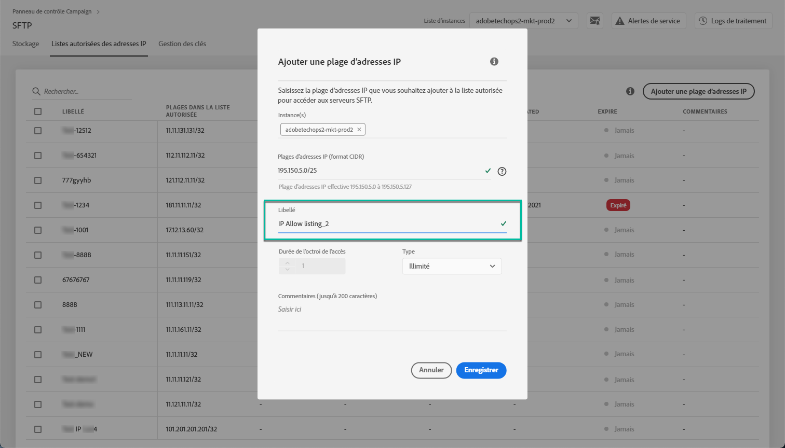

# Listes autorisées des plages d’adresses IP {#ip-range-allow-listing}

>[!CONTEXTUALHELP]
>id="cp_ip_whitelist"
>title="À propos des listes autorisées d’adresses IP"
>abstract="Dans cet onglet, vous pouvez ajouter des plages d’adresses IP à la liste autorisée pour établir une connexion à vos serveurs SFTP. Seuls les serveurs SFTP auxquels vous avez accès sont visibles ici. Contactez l’administrateur pour demander un accès à d’autres serveurs SFTP."
>additional-url="https://images-tv.adobe.com/mpcv3/8a977e03-d76c-44d3-853c-95d0b799c870_1560205338.1920x1080at3000_h264.mp4#t=98" text="Regarder une vidéo de démonstration"

Les serveurs SFTP sont protégés. Afin de pouvoir y accéder pour afficher des fichiers ou en écrire de nouveaux, vous devez ajouter à la liste autorisée l’adresse IP publique du système ou du client qui accède aux serveurs.

 Découvrez cette fonctionnalité en vidéo dans [Campaign Classic](https://experienceleague.adobe.com/docs/campaign-classic-learn/control-panel/sftp-management/adding-ip-range-to-allow-list.html#sftp-management) ou [Campaign Standard](https://experienceleague.adobe.com/docs/campaign-standard-learn/control-panel/sftp-management/adding-ip-range-to-allow-list.html#sftp-management).

## À propos du format CIDR {#about-cidr-format}

Le format CIDR (Classless Inter-Domain Routing) est le format pris en charge lors de l’ajout de plages d’adresses IP avec l’interface du panneau de contrôle.

La syntaxe se compose d’une adresse IP, suivie d’un caractère « / » et d’un nombre décimal. Le format et sa syntaxe sont présentés en détail dans [cet article](https://whatismyipaddress.com/cidr){target=&quot;_blank&quot;}.

Vous pouvez rechercher sur Internet des outils en ligne gratuits qui vous permettront de convertir la plage IP qui vous intéresse au format CIDR.

## Bonnes pratiques {#best-practices}

Veillez à suivre les recommandations et les limites ci-dessous lors de l’ajout des adresses IP à la liste autorisée dans le panneau de contrôle.

* **Ajoutez des plages d’adresses IP à la liste autorisée** plutôt que des adresses IP uniques. Pour ajouter une seule adresse IP à la liste autorisée, ajoutez-lui « /32 » afin d’indiquer qu’une seule adresse IP est comprise dans la plage.
* **N’ajoutez pas de plages très larges à la liste autorisée**, par exemple des plages contenant plus de 265 adresses IP. Le panneau de contrôle rejettera les plages au format CIDR comprises entre /0 et /23.
* Seules les **adresses IP publiques** peuvent être ajoutées à la liste autorisée.
* Veillez à **suppression régulière des adresses IP** que vous n&#39;avez plus besoin de la liste autorisée.

## Ajout d’adresses IP à la liste autorisée {#adding-ip-addresses-allow-list}

>[!CONTEXTUALHELP]
>id="cp_sftp_iprange_add"
>title="Configuration de plage IP"
>abstract="Définissez la plage d’adresses IP que vous souhaitez ajouter à la liste autorisée pour vous connecter à vos serveurs SFTP."

Pour ajouter une plage d’adresses IP à la liste autorisée, procédez comme suit :

1. Ouvrez la carte **[!UICONTROL SFTP]**, puis sélectionnez l’onglet **[!UICONTROL Listes autorisées des adresses IP]**.
1. La liste des adresses IP sur la liste autorisée s’affiche pour chaque instance. Sélectionnez l’instance souhaitée dans la liste de gauche, puis cliquez sur le bouton **[!UICONTROL Ajouter une plage d’adresses IP]**.

   

1. Définissez la plage d’adresses IP que vous souhaitez ajouter à la liste autorisée. Ce champ accepte uniquement les plages d’adresses IP au format CIDR, par exemple *192.150.5.0/24*.

   

   >[!IMPORTANT]
   >
   >Une plage d’adresses IP ne peut pas chevaucher une plage existante dans la liste autorisée. Dans ce cas, supprimez d’abord la plage qui contient l’adresse IP qui chevauche.

1. Il est possible d’ajouter une plage à la liste autorisée pour plusieurs instances. Pour ce faire, appuyez sur la touche Flèche vers le bas ou saisissez les premières lettres de l’instance souhaitée, puis sélectionnez-la dans la liste de suggestions.

   

1. Définissez le libellé qui s’affichera pour cette plage d’adresses IP dans la liste.

   

   >[!NOTE]
   >
   >Les caractères spéciaux suivants sont autorisés dans le champ **[!UICONTROL Libellé]** :
   > `. _ - : / ( ) # , @ [ ] + = & ; { } ! $`

1. Pour mieux gérer votre liste autorisée IP, vous pouvez définir une durée de disponibilité de chaque plage IP. Pour ce faire, sélectionnez une unité dans la liste déroulante **[!UICONTROL Type]** et définissez une durée dans le champ correspondant. Pour plus d’informations sur l’expiration de la plage d’adresses IP, voir [cette section](#expiry).

   

   >[!NOTE]
   >
   >Par défaut, le champ **[!UICONTROL Type]** est défini sur **[!UICONTROL Illimité]**, ce qui signifie que la plage d’adresses IP n’expire jamais.

1. Dans le **[!UICONTROL Commentaire]** , vous pouvez indiquer une raison pour autoriser cette plage d’adresses IP (pourquoi, pour qui, etc.).

1. Cliquez sur le bouton **[!UICONTROL Enregistrer]**. L’ajout de la plage d’adresses IP à la liste autorisée apparaît comme **[!UICONTROL En attente]** jusqu’à ce que la demande soit entièrement traitée, ce qui ne prend en général que quelques secondes.

   

>[!IMPORTANT]
>
>Si vous essayez de connecter vos serveurs SFTP à un nouveau système et ajoutez par conséquent de nouvelles plages d’adresses IP à la liste autorisée, il vous faudra peut-être saisir de nouvelles clés publiques pour établir la connexion. Pour plus d’informations, consultez [cette section](key-management.md).

## Gestion des plages IP {#managing-ip-ranges}

Les plages d’adresses IP que vous créez s’affichent dans l’onglet **[!UICONTROL Listes autorisées des adresses IP]**.

Vous pouvez trier les éléments en fonction de la date de création ou d’édition, de l’utilisateur qui les a créés ou modifiés et de l’expiration de la plage d’adresses IP.

Vous pouvez également effectuer une recherche dans une plage d’adresses IP en commençant à saisir un libellé, une plage, un nom ou un commentaire.

Pour modifier une ou plusieurs plages d’adresses IP, voir [cette section](#editing-ip-ranges).

Pour supprimer une ou plusieurs plages d’adresses IP de la liste autorisée, sélectionnez-les, puis cliquez sur le bouton **[!UICONTROL Supprimer une plage IP]** bouton .

### Expiration {#expiry}

Le **[!UICONTROL Expires]** indique le nombre de jours restants avant l’expiration de la plage d’adresses IP.

Si vous êtes abonné aux [alertes par e-mail](../../performance-monitoring/using/email-alerting.md), vous recevrez des notifications par e-mail 10 jours et 5 jours avant l’expiration d’une plage d’adresses IP. Vous en recevrez également une le jour de son expiration. Lors de la réception de l’alerte, vous pouvez [modifier la plage d’adresses IP ;](#editing-ip-ranges) le cas échéant, pour prolonger sa période de validité.

Une plage d’adresses IP arrivée à expiration est automatiquement supprimée au bout de 7 jours. Il s’affiche comme suit : **[!UICONTROL Expiré]** dans le **[!UICONTROL Expires]** colonne . Dans cette période de 7 jours :

* Une plage d’adresses IP expirée ne peut plus être utilisée pour accéder aux serveurs SFTP.

* Vous ne pouvez pas créer une autre plage d’adresses IP qui chevauche une plage expirée. Vous devez d’abord supprimer la plage d’adresses IP expirée avant de créer la plage.

* Vous pouvez [edit](#editing-ip-ranges) une plage d’adresses IP expirée et mettez à jour sa durée pour la rendre à nouveau disponible.

* Vous pouvez la supprimer de la liste autorisée.

## Modification de plages d’adresses IP {#editing-ip-ranges}

>[!CONTEXTUALHELP]
>id="cp_sftp_iprange_update"
>title="Mise à jour de plages d’adresses IP"
>abstract="Mettez à jour les plages d’adresses IP sélectionnées autorisées à se connecter à votre serveur SFTP."

Pour modifier les plages d’adresses IP, procédez comme suit.

>[!NOTE]
>
>Vous ne pouvez modifier que les plages d’adresses IP créées depuis la version d’octobre 2021 du Panneau de Contrôle.

<!--Edition is not available for IP ranges that have been created before the Control Panel October 2021 release.-->

1. Sélectionnez une ou plusieurs plages d’adresses IP dans la liste **[!UICONTROL Listes autorisées des adresses IP]**.

1. Cliquez sur le bouton **[!UICONTROL Mettre à jour la plage IP]** bouton .

   

1. Vous pouvez uniquement modifier la date d’expiration de la plage d’adresses IP et/ou ajouter un nouveau commentaire.

   >[!NOTE]
   >
   >Pour modifier le format CIDR, son libellé ou éditer la ou les instances associées, vous devez d&#39;abord supprimer la plage d&#39;adresses IP et en créer une correspondant à vos besoins.

   

1. Enregistrez vos modifications.

## Suivi des modifications {#monitoring-changes}

Le **[!UICONTROL Logs de traitement]** sur la page d’accueil du Panneau de Contrôle, vous pouvez suivre et surveiller toutes les modifications apportées aux adresses IP sur la liste autorisée.

Pour plus d’informations sur l’interface du panneau de contrôle, reportez-vous à [cette section](../../discover/using/discovering-the-interface.md).

