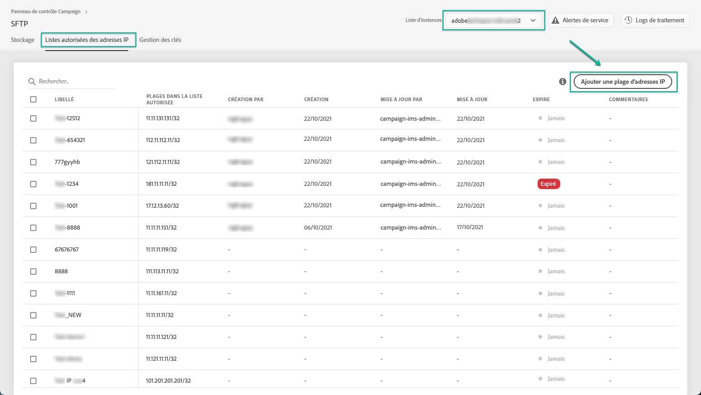
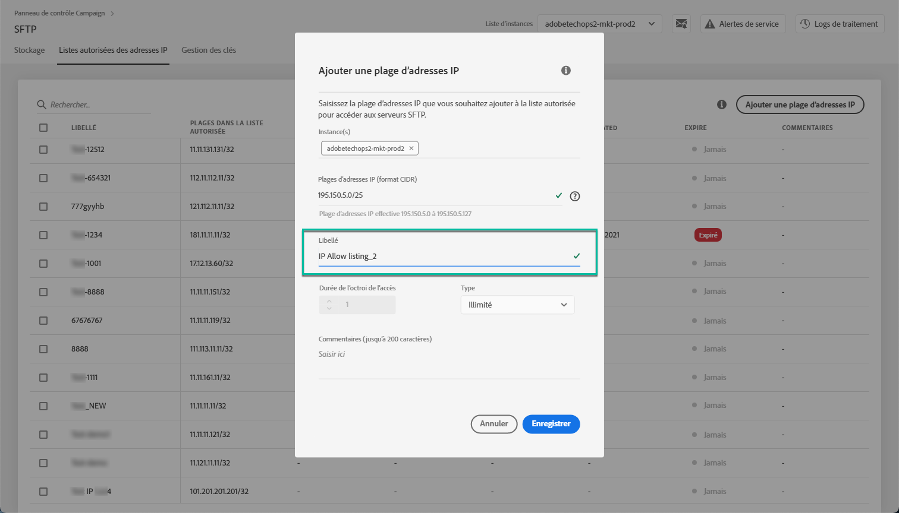
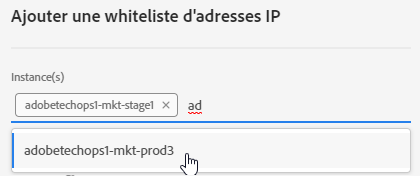
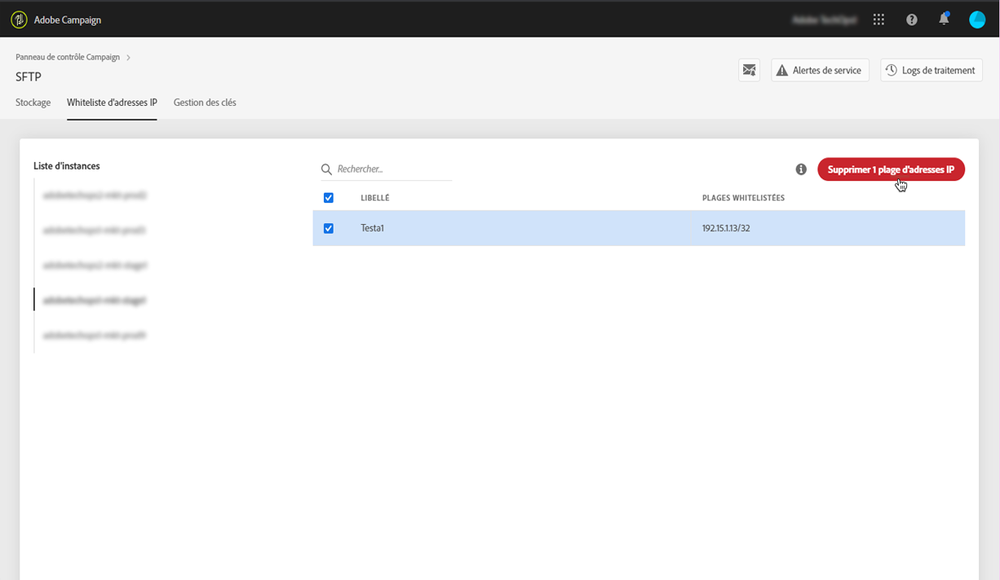
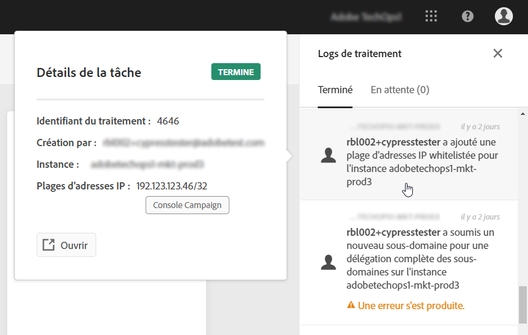

# Mise en whiteliste des plages d’adresses IP {#ip-range-whitelisting}

>[!CONTEXTUALHELP]
>id=&quot;cp_ip_whitelist&quot;
>title=&quot;À propos de la mise en whiteliste d’adresses IP&quot;
>abstract=&quot;Dans cet onglet, vous pouvez whitelister des plages d’adresses IP pour établir une connexion aux serveurs SFTP. Seuls les serveurs SFTP auxquels vous avez accès sont visibles ici. Contactez l’administrateur pour demander un accès aux autres serveurs SFTP.&quot;
>additional-url=&quot;https://images-tv.adobe.com/mpcv3/8a977e03-d76c-44d3-853c-95d0b799c870_1560205338.1920x1080at3000_h264.mp4#t=98&quot; text=&quot;Regarder la vidéo de démonstration&quot;

Les serveurs SFTP sont protégés. Afin de pouvoir y accéder pour afficher des fichiers ou en écrire de nouveaux, vous devez whitelister l’adresse IP publique du système ou du client qui accède aux serveurs.

## À propos du format CIDR {#about-cidr-format}

Le format CIDR (Classless Inter-Domain Routing) est le format pris en charge lors de l’ajout de plages IP avec l’interface du panneau de contrôle.

La syntaxe se compose d’une adresse IP, suivie d’un caractère « / » et d’un nombre décimal. Le format et sa syntaxe sont présentés en détail dans [cet article](https://whatismyipaddress.com/cidr).

Vous pouvez rechercher sur Internet des outils en ligne gratuits qui vous permettront de convertir la plage IP qui vous intéresse au format CIDR.

## Bonnes pratiques {#best-practices}

Veillez à suivre les recommandations et les limites ci-dessous lors de la mise en whiteliste des adresses IP dans le panneau de contrôle.

* **Whitelistez des plages IP** plutôt que des adresses IP uniques. Pour whitelister une seule adresse IP, ajoutez-lui « /32 » afin d’indiquer qu’une seule adresse IP est comprise dans la plage.
* **Ne whitelistez pas des plages très larges**, incluant par exemple plus de 265 adresses IP. Le panneau de contrôle rejettera les plages au format CIDR comprises entre /0 et /23.
* Seules les **adresses IP publiques** peuvent être whitelistées.
* Veillez à **supprimer régulièrement les adresses IP whitelistées** dont vous n’avez plus besoin.

## Mise en whiteliste des adresses IP {#whitelisting-ip-addresses}

>[!CONTEXTUALHELP]
>id=&quot;cp_sftp_iprange_add&quot;
>title=&quot;Ajouter une plage d’adresses IP&quot;
>abstract=&quot;Définissez les plages d’adresses IP que vous souhaitez whitelister pour vous connecter à vos serveurs SFTP.&quot;

Pour whitelister une plage d’adresses IP, procédez comme suit :

1. Ouvrez la **[!UICONTROL SFTP]** carte, puis sélectionnez l’ **[!UICONTROL IP Whistelisting]** onglet.
1. La liste des adresses IP whitelistées s’affiche pour chaque instance. Select the desired instance from the left-hand side list, then click the **[!UICONTROL Add new IP range]** button.

   

1. Indiquez la plage d’adresses IP que vous voulez whitelister, au format CIDR, puis définissez le libellé qui s’affichera dans la liste.

   >[!NOTE]
   >
   >Les caractères spéciaux suivants sont autorisés dans le champ Libellé :
   > `. _ - : / ( ) # , @ [ ] + = & ; { } ! $`

   

   >[!IMPORTANT]
   >
   >Une plage d’adresses IP ne peut pas contenir une plage whitelistée existante. Dans ce cas, supprimez d’abord la plage qui contient l’adresse IP whitelistée.
   >
   >Il est possible de whitelister une plage pour plusieurs instances. Pour ce faire, appuyez sur la touche Flèche vers le bas ou saisissez les premières lettres de l’instance souhaitée, puis sélectionnez-la dans la liste de suggestions.

   

1. Cliquez sur le **[!UICONTROL Save]** bouton. Tant que la demande n’est pas entièrement traitée, la mise en whiteliste des adresses IP apparaît comme étant EN ATTENTE. Cette situation ne devrait pas durer plus de quelques secondes.

To delete whitelisted IP ranges, select them then click the **[!UICONTROL Delete IP range]** button.

>[!NOTE]
>
>Il n’est actuellement pas possible d’éditer une plage whitelistée. Pour modifier une plage d’adresses IP, supprimez-la, puis créez-en une correspondant à vos besoins.

## Surveillance des changements {#monitoring-changes}

The **[!UICONTROL Job Logs]** in the Control Panel home page let you monitor all changes that have been made to whitelisted IP addresses.

Pour plus d’informations sur l’interface du panneau de contrôle, reportez-vous à [cette section](../../discover/using/discovering-the-interface.md).

