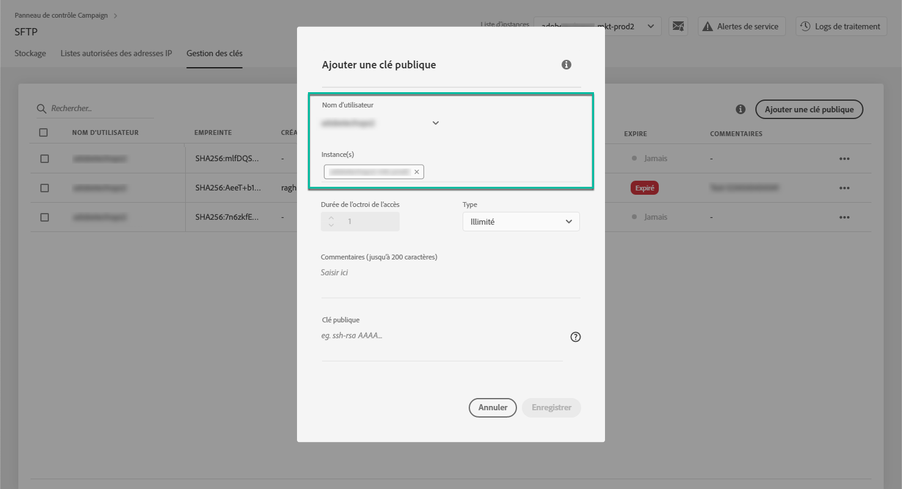
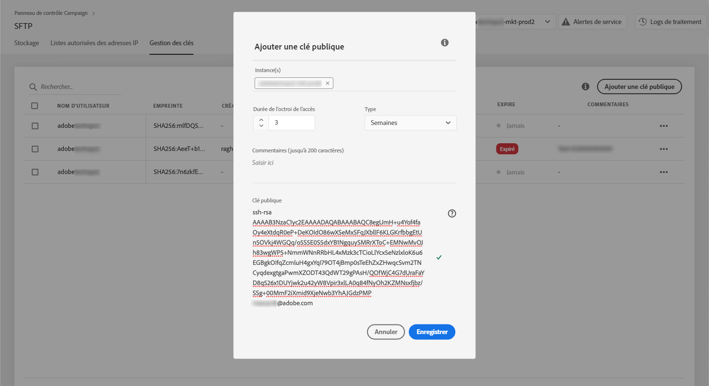

# Gestion des clés {#key-management}

>[!CONTEXTUALHELP]
>id="cp_key_management"
>title="[!CONTEXTUALHELP]
>id=&quot;cp_key_management&quot;
>title=&quot;À propos de la gestion des clés&quot;
>abstract=&quot;Dans cet onglet, vous pouvez gérer vos clés publiques.&quot;
>additional-url=&quot;https://images-tv.adobe.com/mpcv3/8a977e03-d76c-44d3-853c-95d0b799c870_1560205338.1920x1080at3000_h264.mp4#t=166&quot; text=&quot;Regarder la vidéo de démonstration&quot;"
>abstract="Adobe recommande à tous les clients d’établir une connexion à leurs serveurs SFTP avec une **paire de clés publique et privée**."
>additional-url="Les étapes de génération d’une clé SSH publique et de son ajout pour accéder au serveur SFTP sont décrites ci-dessous, ainsi que les recommandations concernant l’authentification." text="Une fois l’accès au serveur configuré, pensez à **whitelister les adresses IP** qui requièrent l’accès au serveur, afin de pouvoir vous y connecter. Voir à ce propos [cette section](../../instances-settings/using/ip-whitelisting-instance-access.md)."

[!NOTE]**

Il n’est actuellement pas possible de supprimer une clé SSH publique.

Bonnes pratiques {#best-practices}**

>**À propos de la clé SSH publique**
>
>Veillez à toujours utiliser la même authentification pour vous connecter au serveur et vérifiez que vous utilisez un format pris en charge pour la clé.

## **Intégration de l’API avec nom d’utilisateur et mot de passe**

**Dans de très rares cas, l’authentification par mot de passe est activée sur certains serveurs SFTP. Adobe vous recommande d’utiliser l’authentification par clé, car cette méthode est plus efficace et plus sûre. Vous pouvez demander à passer à l’authentification par clé en contactant l’Assistance clientèle.**

[!IMPORTANT]

**Si votre mot de passe arrive à expiration, même si des clés sont installées sur votre système, vous ne pourrez pas vous connecter à vos comptes SFTP.**

>Installation de la clé SSH {#installing-ssh-key}
>
>[!CONTEXTUALHELP]
>id=&quot;cp_sftp_publickey_add&quot;
>title=&quot;Ajouter une clé publique&quot;
>abstract=&quot;Ajoutez une clé publique pour une instance.&quot;

[!IMPORTANT]

## Les étapes ci-dessous sont un exemple de création de clé SSH uniquement. Veuillez suivre les directives de votre organisation en ce qui concerne les clés SSH. L’exemple ci-dessous n’est qu’un exemple parmi d’autres et sert de point de référence utile pour communiquer les exigences à votre équipe ou à votre groupe réseau interne.{#installing-ssh-key}

>[!CONTEXTUALHELP]
>id="cp_sftp_publickey_add"
>title="Accédez à l’onglet **[!UICONTROL Gestion des clés]**, puis cliquez sur le bouton **[!UICONTROL Ajouter une clé publique]**."
>abstract=""

>[!IMPORTANT]Dans la boîte de dialogue qui s’ouvre, sélectionnez le nom d’utilisateur pour lequel vous voulez créer la clé publique et le serveur pour lequel vous voulez activer la clé.
>
>[!NOTE]

1. L’interface vérifie si un nom d’utilisateur donné est actif sur une instance particulière et permet d’activer la clé sur une ou plusieurs instances.********

   Il est possible d’ajouter une ou plusieurs clés SSH publiques pour chaque utilisateur.

1. 

   >[!NOTE]Copiez-collez la clé SSH publique. Pour générer une clé publique, suivez les étapes ci-dessous correspondant à votre système d’exploitation :
   >
   >[!NOTE]
   >
   >La taille de la clé SSH publique doit être de **2 048 bits**.

   **Linux et Mac :**

1. Utilisez le terminal pour générer une paire de clés publique et privée :

   >Saisissez cette commande : `ssh-keygen -t rsa -C <your_email@example.com>`.
   >
   >Attribuez un nom à votre clé lorsque vous y êtes invité. Si le répertoire .ssh n’existe pas, le système en créera un pour vous.****

   **Saisissez à deux reprises un mot de passe lorsque vous y êtes invité. Il peut également être laissé vide.**

   Une paire de clés « name » et « name.pub » est créée par le système. Recherchez le fichier « name.pub », puis ouvrez-le. Il doit comporter une chaîne alphanumérique se terminant par l’adresse email que vous avez spécifiée.
   1. **Windows :**
   1. Il se peut que vous deviez installer un outil tiers qui vous aidera à générer une paire de clés privée/publique au même format « name.pub ».
   1. Ouvrez le fichier .pub, puis copiez-collez toute la chaîne commençant par « ssh... » dans le panneau de contrôle.
   1. 
   Cliquez sur le bouton **[!UICONTROL Enregistrer]** pour créer la clé. Le panneau de contrôle enregistre la clé publique et son empreinte digitale associée, cryptée au format SHA256.**

   Vous pouvez utiliser les empreintes digitales pour faire correspondre les clés privées enregistrées sur votre ordinateur avec les clés publiques correspondantes enregistrées dans le panneau de contrôle.

1. 

   Le bouton « **...** » permet de supprimer une clé existante ou de copier son empreinte associée dans le presse-papiers.

1. ]**

You can use fingerprints to match the Private keys that are saved on your computer with the corresponding Public keys saved in Control Panel.

The &quot;**...**&quot; button allows you to delete an existing key, or to copy its associated fingerprint into your clipboard.

