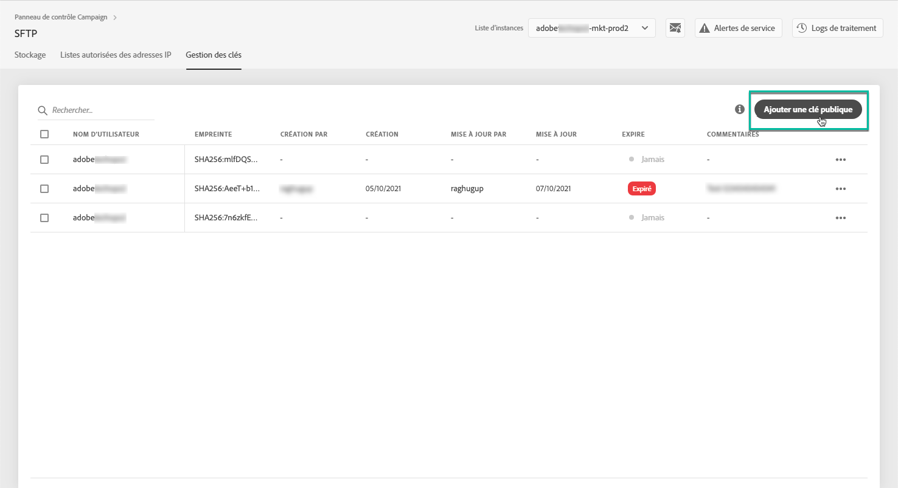

# Gestion des clés {#key-management}

>[!CONTEXTUALHELP]
>id="cp_key_management"
>title="A propos de la gestion des clés publiques"
>abstract="Dans cet onglet, créez, gérez et modifiez vos clés publiques."
>additional-url="https://images-tv.adobe.com/mpcv3/8a977e03-d76c-44d3-853c-95d0b799c870_1560205338.1920x1080at3000_h264.mp4#t=166" text="Regarder une vidéo de démonstration"

Adobe recommande à tous les clients d’établir une connexion à leurs serveurs SFTP avec une **paire de clés publique et privée**.

Les étapes de génération d’une clé SSH publique et de son ajout pour accéder au serveur SFTP sont décrites ci-dessous, ainsi que les recommandations concernant l’authentification.

Une fois l’accès au serveur configuré, pensez à **ajouter à la liste autorisée les adresses IP qui requièrent l’accès au serveur**, afin de pouvoir vous y connecter. Pour plus d’informations, consultez [cette section](../../instances-settings/using/ip-allow-listing-instance-access.md).

 Découvrez cette fonctionnalité en vidéo dans [Campaign Classic](https://experienceleague.adobe.com/docs/campaign-classic-learn/control-panel/sftp-management/generate-ssh-key.html#sftp-management) ou [Campaign Standard](https://experienceleague.adobe.com/docs/campaign-standard-learn/control-panel/sftp-management/generate-ssh-key.html#sftp-management).

## Bonnes pratiques {#best-practices}

**À propos de la clé SSH publique**

Veillez à toujours utiliser la même authentification pour vous connecter au serveur et vérifiez que vous utilisez un format pris en charge pour la clé.

**Intégration de l’API avec nom d’utilisateur et mot de passe**

Dans de très rares cas, l’authentification par mot de passe est activée sur certains serveurs SFTP. Adobe vous recommande d’utiliser l’authentification par clé, car cette méthode est plus efficace et plus sûre. Vous pouvez demander à passer à l’authentification par clé en contactant l’Assistance clientèle.

>[!IMPORTANT]
>
>Si votre mot de passe arrive à expiration, vous ne pourrez pas vous connecter à vos comptes SFTP, et ce, même si des clés sont installées sur votre système.

## Installation de la clé SSH {#installing-ssh-key}

>[!CONTEXTUALHELP]
>id="cp_sftp_publickey_add"
>title="Ajout de la clé publique"
>abstract="Générez une clé SSH publique pour une instance et ajoutez-la au Panneau de Contrôle pour accéder au serveur SFTP."

>[!IMPORTANT]
>
>Vous devez toujours suivre les directives de votre organisation en ce qui concerne les clés SSH. La procédure ci-dessous n’est qu’un exemple de création de clé SSH parmi d’autres. Elle peut représenter un point de référence utile pour vous permettre de communiquer les exigences à votre équipe ou à votre groupe réseau interne.

1. Accédez à l’onglet **[!UICONTROL Gestion des clés]**, puis cliquez sur le bouton **[!UICONTROL Ajouter une clé publique]**.

   

1. Dans la boîte de dialogue qui s’ouvre, sélectionnez le nom d’utilisateur pour lequel vous voulez créer la clé publique et le serveur pour lequel vous voulez activer la clé.

   

   >[!NOTE]
   >
   >Panneau de Contrôle vérifie si un nom d’utilisateur donné est principal sur une instance donnée et permet d’activer la clé sur une ou plusieurs instances.
   >
   >Il est possible d’ajouter une ou plusieurs clés SSH publiques pour chaque utilisateur.

1. Pour mieux gérer vos clés publiques, vous pouvez définir une durée de disponibilité de chaque clé. Pour ce faire, sélectionnez une unité dans la liste déroulante **[!UICONTROL Type]** et définissez une durée dans le champ correspondant. Pour plus d’informations sur l’expiration de la clé publique, voir [cette section](#expiry).

   

   >[!NOTE]
   >
   >Par défaut, le champ **[!UICONTROL Type]** est défini sur **[!UICONTROL Illimité]**, ce qui signifie que la clé publique n’expire jamais.

1. Dans le **[!UICONTROL Commentaire]** , vous pouvez indiquer une raison d’ajouter cette clé publique (pourquoi, pour qui, etc.).

1. Pour pouvoir remplir le champ **[!UICONTROL Clé publique]**, vous devez générer une clé SSH publique. Suivez les étapes ci-dessous en fonction de votre système d’exploitation.

   **Linux et Mac :**

   Utilisez le terminal pour générer une paire de clés publique et privée :
   1. Saisissez cette commande : `ssh-keygen -m pem -t rsa -b 2048 -C "your_email@example.com"`.
   1. Attribuez un nom à votre clé lorsque vous y êtes invité. Si le répertoire .ssh n’existe pas, le système en créera un pour vous.
   1. Saisissez à deux reprises un mot de passe lorsque vous y êtes invité. Il peut également être laissé vide.
   1. Une paire de clés « name » et « name.pub » est créée par le système. Recherchez le fichier « name.pub », puis ouvrez-le. Il doit comporter une chaîne alphanumérique se terminant par l’adresse email que vous avez spécifiée.

   **Windows :**

   Il se peut que vous deviez installer un outil tiers qui vous aidera à générer une paire de clés privée/publique au même format « name.pub ».

1. Ouvrez le fichier .pub, puis copiez-collez toute la chaîne commençant par « ssh… » dans le panneau de contrôle.

   

   >[!NOTE]
   >
   >Le champ **[!UICONTROL Clé publique]** accepte uniquement le format OpenSSH. La taille de la clé SSH publique doit être de **2 048 bits**.

1. Cliquez sur le bouton **[!UICONTROL Enregistrer]** pour créer la clé. Le panneau de contrôle enregistre la clé publique et son empreinte associée, chiffrée au format SHA256.

>[!IMPORTANT]
>
>Si la clé que vous avez créée est utilisée pour établir une connexion à un système qui n’a encore jamais été connecté au serveur SFTP sélectionné, vous devrez ajouter une adresse IP publique de ce système à la liste autorisée avant de pouvoir l’utiliser avec le serveur SFTP. Consultez [cette section](ip-range-allow-listing.md).

Vous pouvez utiliser les empreintes pour faire correspondre les clés privées enregistrées sur votre ordinateur aux clés publiques correspondantes enregistrées dans le panneau de contrôle.

Le bouton « **…** » permet de supprimer une clé ou de copier dans le presse-papiers l’empreinte qui lui est associée.

## Gestion des clés publiques {#managing-public-keys}

Les clés publiques que vous créez s’affichent dans l’onglet **[!UICONTROL Gestion des clés]**.

Vous pouvez trier les éléments en fonction de la date de création ou d’édition, de l’utilisateur qui les a créés ou modifiés et de l’expiration de la plage d’adresses IP.

Vous pouvez également rechercher une clé publique en commençant à saisir un nom ou un commentaire.

Pour modifier une ou plusieurs plages d’adresses IP, voir [cette section](#editing-public-keys).

Pour supprimer une ou plusieurs clés publiques de la liste, sélectionnez-les, puis cliquez sur le bouton **[!UICONTROL Suppression de la clé publique]** bouton .

### Expiration {#expiry}

Le **[!UICONTROL Expires]** indique le nombre de jours restants avant l’expiration de la clé publique.

Si vous êtes abonné aux [alertes par e-mail](../../performance-monitoring/using/email-alerting.md), vous recevrez des notifications par e-mail 10 jours et 5 jours avant l’expiration d’une clé publique. Vous en recevrez également une le jour de son expiration. Lors de la réception de l’alerte, vous pouvez [modification de la clé publique](#editing-public-keys) le cas échéant, pour prolonger sa période de validité.

Une clé publique arrivée à expiration est automatiquement supprimée au bout de 7 jours. Il s’affiche comme suit : **[!UICONTROL Expiré]** dans le **[!UICONTROL Expires]** colonne . Dans cette période de 7 jours :

* Une clé publique expirée ne peut plus être utilisée pour se connecter au serveur SFTP.

* Vous pouvez [edit](#editing-public-keys) une clé publique expirée et mettez à jour sa durée pour la rendre à nouveau disponible.

* Vous pouvez le supprimer de la liste.

## Modification des clés publiques {#editing-public-keys}

>[!CONTEXTUALHELP]
>id="cp_sftp_publickey_update"
>title="Modification des clés publiques"
>abstract="Mettez à jour les clés publiques sélectionnées pour accéder à votre serveur SFTP."

Pour modifier les clés publiques, procédez comme suit.

>[!NOTE]
>
>Vous ne pouvez modifier que les clés publiques créées depuis la version d’octobre 2021 du Panneau de Contrôle.

1. Sélectionnez un ou plusieurs éléments dans la liste **[!UICONTROL Gestion des clés]**.
1. Cliquez sur le bouton **[!UICONTROL Mettre à jour la clé publique]** bouton .

   

1. Vous pouvez uniquement modifier la date d’expiration de la clé publique et/ou ajouter un nouveau commentaire.

   >[!NOTE]
   >
   >Pour modifier le nom d&#39;utilisateur, l&#39;instance et la clé publique au format OpenSSH, supprimez la clé publique et créez-en une correspondant à vos besoins.

1. Enregistrez vos modifications.
