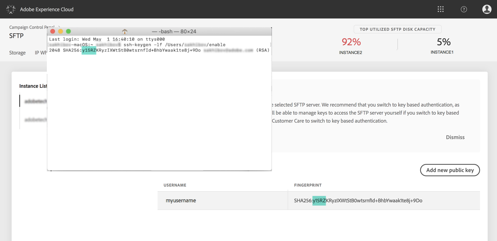

# Connexion à votre serveur SFTP {#logging-into-sft-server}

Les étapes ci-dessous expliquent comment connecter votre serveur SFTP via votre application cliente SFTP.

Avant de vous connecter au serveur, vérifiez les points suivants :

* Your SFTP server is **hosted by Adobe**.
* Votre **nom d’utilisateur** a été configuré pour le serveur. You can check this information directly in the Control Panel, in the **Key management** tab from the SFTP Card.
* Vous disposez d'une **paire de clés privée et publique** pour vous connecter au serveur SFTP. Refer to [this section](../../sftp/using/key-management.md) for more on how to add the SSH key.
* Votre **adresse IP publique a été whitelistée** sur le serveur SFTP. If not, refer to [this section](../../sftp/using/ip-range-whitelisting.md) for more on how to whitelist your IP range.
* You have an access to a **SFTP client software**. Vous pouvez consulter votre service informatique pour connaître l'application cliente SFTP qu'il vous recommande d'utiliser, ou en rechercher une sur Internet si les politiques de votre entreprise le permettent.

Pour vous connecter à votre serveur SFTP, procédez comme suit :

1. Launch the Control Panel, then select the **[!UICONTROL Key Management]** tab from the **[!UICONTROL SFTP]** card.

   

1. Lancez l’application cliente SFTP, puis copiez-collez l’adresse du serveur à partir du Panneau de configuration, suivi de "campaign.adobe.com", puis indiquez votre nom d’utilisateur.

   

1. Dans le champ **[!UICONTROL Clé privée SSH], sélectionnez le fichier de clé privée stocké sur votre ordinateur.** Il correspond à un fichier texte portant le même nom que votre clé publique, sans l'extension ".pub" (par exemple, "enable").

   

   Le champ **[!UICONTROL Mot de passe]est automatiquement renseigné avec la clé du fichier.**

   

   Vous pouvez vérifier que la clé que vous essayez d’utiliser est enregistrée dans le Panneau de configuration en comparant l’empreinte de la clé privée ou publique à l’empreinte des clés figurant dans l’onglet Gestion des clés de la carte SFTP.

   

   >[!NOTE]
   >
   >Si vous utilisez un ordinateur Mac, vous pouvez afficher l’empreinte de la clé privée stockée sur votre ordinateur en exécutant la commande suivante :
   >
   >`ssh-keygen -lf <path of the privatekey>`

1. Une fois toutes les informations indiquées, cliquez sur **[!UICONTROL Connexion]pour vous connecter à votre serveur SFTP.**

   
