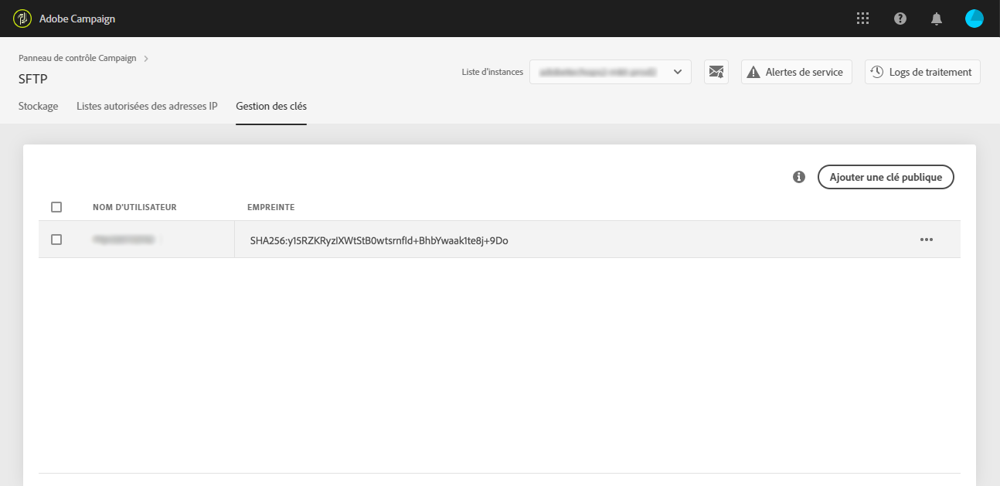

# Connexion à votre serveur SFTP {#logging-into-sft-server}

Les étapes ci-dessous expliquent comment connecter votre serveur SFTP via votre application cliente SFTP.

[ Découvrez cette fonctionnalité en vidéo](https://video.tv.adobe.com/v/27263?quality=12)

Avant de vous connecter au serveur, vérifiez les points suivants :

* Votre serveur SFTP est **hébergé par Adobe**.
* Votre **nom d’utilisateur** a été configuré pour le serveur. Vous pouvez vérifier ces informations directement dans le panneau de contrôle, dans l’onglet **Gestion des clés** de la carte SFTP.
* Vous disposez d’une **paire de clés privée et publique** pour vous connecter au serveur SFTP. Pour plus d’informations sur l’ajout de la clé SSH, reportez-vous à [cette section](../../sftp/using/key-management.md).
* Votre **adresse IP publique a été ajoutée à la liste autorisée** sur le serveur SFTP. Dans le cas contraire, reportez-vous à [cette section](../../sftp/using/ip-range-allow-listing.md) pour plus d’informations sur la manière d’ajouter votre plage d’adresses IP à la liste autorisée.
* Vous disposez d’un accès à un **logiciel client SFTP**. Vous pouvez consulter votre service informatique pour connaître l’application cliente SFTP qu’il vous recommande d’utiliser ou en rechercher une sur Internet si les politiques de votre entreprise le permettent.

Pour vous connecter à votre serveur SFTP, procédez comme suit :

1. Lancez le panneau de contrôle, puis sélectionnez l’onglet **[!UICONTROL Gestion des clés]** dans la carte **[!UICONTROL SFTP]**.

   

1. Lancez votre application cliente SFTP, copiez-collez l’adresse du serveur depuis le panneau de contrôle, suivie de « campaign.adobe.com », puis saisissez votre nom d’utilisateur.

   

1. Dans le champ **[!UICONTROL SSH Private Key]** (Clé privée SSH), sélectionnez le fichier de clé privée stocké sur votre ordinateur. Il correspond à un fichier texte portant le même nom que votre clé publique, sans l’extension « .pub » (par exemple, « enable »).

   

   Le champ **[!UICONTROL Password]** (Mot de passe) est automatiquement renseigné avec la clé du fichier.

   

   Vous pouvez vérifier que la clé que vous essayez d’utiliser est enregistrée dans le panneau de contrôle en comparant l’empreinte digitale de la clé privée ou publique avec celle des clés apparaissant dans l’onglet Gestion des clés de la carte SFTP.

   

   >[!NOTE]
   >
   >Si vous utilisez un ordinateur Mac, vous pouvez visualiser l’empreinte digitale de la clé privée stockée sur votre ordinateur en exécutant cette commande :
   >
   >`ssh-keygen -lf <path of the privatekey>`

1. Une fois toutes les informations indiquées, cliquez sur **[!UICONTROL Connect]** (Connexion) pour vous connecter à votre serveur SFTP.

   
