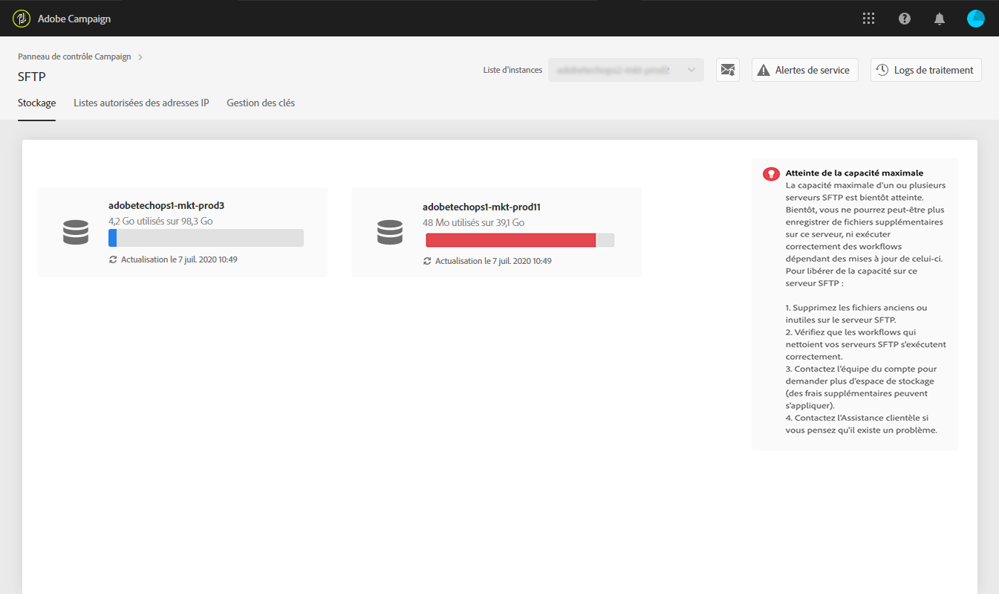
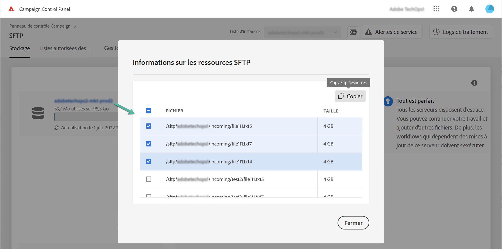

# Gestion de l’espace de stockage SFTP {#sftp-storage-management}

>[!CONTEXTUALHELP]
>id="cp_storage"
>title="À propos de la capacité de stockage"
>abstract="Dans cet onglet, vous pouvez afficher les informations sur la capacité de stockage et l’utilisation des serveurs SFTP. Vous pouvez également répertorier les 10 premiers fichiers qui consomment le plus d’espace sur un serveur SFTP en cliquant sur son nom. Seuls les serveurs SFTP auxquels vous avez accès sont visibles ici. Contactez l’administrateur pour demander un accès aux autres serveurs SFTP."
>additional-url="https://images-tv.adobe.com/mpcv3/8a977e03-d76c-44d3-853c-95d0b799c870_1560205338.1920x1080at3000_h264.mp4" text="Regarder une vidéo de démonstration"

En fonction des modalités de votre contrat, les capacités de stockage de votre serveur SFTP peuvent varier.

Il est essentiel que vous surveilliez régulièrement l’espace disponible pour chacun de vos serveurs SFTP. Sinon, vous risquez de ne plus pouvoir enregistrer de fichiers supplémentaires sur le serveur ou d’exécuter avec succès les workflows qui dépendent des mises à jour de ce serveur.

Si vous vous êtes abonné aux [alertes par e-mail](../../performance-monitoring/using/email-alerting.md), vous recevrez des notifications par e-mail lorsque l’un de vos serveurs SFTP aura atteint 80 % ou plus de sa capacité. Voir [Gestion de l’espace de stockage SFTP](../../sftp/using/sftp-storage-management.md).

 Découvrez cette fonctionnalité en vidéo dans [Campaign v7/v8](https://experienceleague.adobe.com/docs/campaign-classic-learn/control-panel/sftp-management/monitoring-server-capacity.html?lang=fr#sftp-management) ou [Campaign Standard](https://experienceleague.adobe.com/docs/campaign-standard-learn/control-panel/sftp-management/monitoring-server-capacity.html?lang=fr#sftp-management).

## Accès aux informations relatives à la capacité de stockage {#accessing-storage-capacity-information}

Les informations sur l’espace utilisé par toutes les instances auxquelles vous avez accès sont disponibles dans l’onglet **[!UICONTROL Stockage]** de la carte SFTP. Elles sont mises à jour à chaque actualisation de la page.

Pour chaque instance, une alerte visuelle vous indique quand le stockage dépasse la capacité :

* **Orange** : l’instance dépasse 80 % de sa capacité.
* **Rouge** : l’instance dépasse 90 % de sa capacité.

Vous pouvez également identifier les 10 premiers fichiers qui consomment le plus d’espace sur un serveur SFTP en cliquant sur son nom.

D’autres conseils permettent de savoir comment procéder si votre serveur arrive à saturation.

## Bonnes pratiques lorsque la capacité de stockage est épuisée {#best-practices-when-capacity-runs-out}

1. **Nettoyez le serveur SFTP en supprimant des fichiers anciens ou inutiles**. Pour plus d’informations sur l’accès à votre dossier de serveur SFTP, consultez [cette section](../../sftp/using/logging-into-sftp-server.md).
1. Vérifiez que les **workflows** qui nettoient vos serveurs SFTP s’exécutent correctement. Pour plus d’informations sur les workflows techniques dans Adobe Campaign, consultez les documentations dédiées [Campaign v7/v8](https://experienceleague.adobe.com/docs/campaign-classic/using/automating-with-workflows/advanced-management/about-technical-workflows.html?lang=fr#automating-with-workflows) et [Campaign Standard](https://experienceleague.adobe.com/docs/campaign-standard/using/administrating/application-settings/technical-workflows.html?lang=fr#administrating).
1. Contactez l’équipe de votre compte pour **demander plus d’espace de stockage** (des frais supplémentaires peuvent s’appliquer).
1. Contactez l’**assistance clientèle** si vous pensez qu’il y a un problème.
