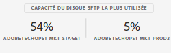

# Gestion de l’espace de stockage SFTP {#sftp-storage-management}

>[!CONTEXTUALHELP]
>id=&quot;cp_ &quot;
>title=&quot;À propos de   capacité de&quot;
>abstract=&quot;Dans cet onglet, vous pouvez  les informations de capacité et d’utilisation  de l’pour vos serveurs SFTP. Seuls les serveurs SFTP auxquels vous avez accès sont visibles ici. Contactez l&#39;administrateur pour demander un accès aux autres serveurs SFTP.&quot;
>additional-url=&quot;https://images-tv.adobe.com/mpcv3/8a977e03-d76c-44d3-853c-95d0b799c870_1560205338.1920x1080at3000_h264.mp4&quot; text=&quot;Regarder la vidéo de démonstration&quot;

En fonction des modalités de votre contrat, les capacités de stockage de votre serveur SFTP peuvent varier.

Il est essentiel que vous surveilliez régulièrement l’espace disponible pour chacun de vos serveurs SFTP. Sinon, vous risquez de ne plus pouvoir enregistrer de fichiers supplémentaires sur le serveur ou d’exécuter avec succès les workflows qui dépendent des mises à jour de ce serveur.

**Rubriques connexes :**

* [Tutoriel vidéo sur Campaign Standard](https://docs.adobe.com/content/help/en/campaign-learn/campaign-standard-tutorials/administrating/control-panel/monitoring-server-capacity-whitelisting-adding-ssh-key.html)
* [Tutoriel vidéo sur Campaign Classic](https://docs.adobe.com/content/help/en/campaign-learn/campaign-classic-tutorials/administrating/control-panel-acc/managing-sftp-servers.html)

## Accès aux informations relatives à la capacité de stockage {#accessing-storage-capacity-information}

The **[!UICONTROL Top utilized SFTP disk capacity]** section in the header includes the top three most utilized servers attached to the instances that you have Admin access to. Ces informations sont disponibles dans chaque onglet de la carte SFTP.

Information about the space used by all instances you have access to is available in the **[!UICONTROL Storage]** tab of the SFTP card. Elles sont mises à jour à chaque actualisation de la page.

Pour chaque instance, une alerte visuelle vous indique quand le stockage dépasse la capacité :

* **Orange** : l’instance dépasse 80 % de sa capacité.
* **Rouge** : l’instance dépasse 90 % de sa capacité.

D’autres conseils permettent de savoir comment procéder si votre serveur arrive à saturation.

## Bonnes pratiques lorsque la capacité de stockage est épuisée {#best-practices-when-capacity-runs-out}

1. **Nettoyez le serveur SFTP en supprimant des fichiers anciens ou inutiles**. Pour plus d’informations sur l’accès à votre dossier de serveur SFTP, reportez-vous à [cette section](../../sftp/using/logging-into-sftp-server.md).
1. Vérifiez que les **workflows** qui nettoient vos serveurs SFTP s’exécutent correctement. Pour plus d’informations sur les workflows techniques dans Adobe Campaign, reportez-vous aux documentations dédiées [Campaign Classic](https://docs.campaign.adobe.com/doc/AC/en/WKF__General_operation_Building_a_workflow.html#Technical_workflows) et [Campaign Standard](https://helpx.adobe.com/campaign/standard/administration/using/technical-workflows.html).
1. Contactez l’équipe de votre compte pour **demander plus d’espace de stockage** (des frais supplémentaires peuvent s’appliquer).
1. Contactez l’**Assistance clientèle** si vous pensez qu’il y a un problème.
