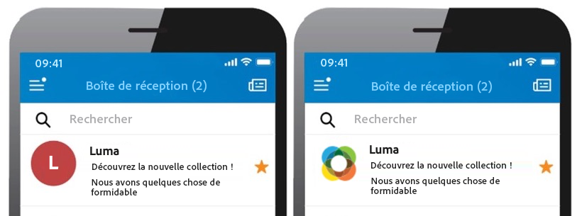

# Ajouter des enregistrements BIMI {#dmarc}

## À propos des enregistrements BIMI {#about}

BIMI (Brand Indicators for Message Identification) est une norme du secteur qui permet l’affichage d’un logo approuvé en regard de l’adresse e-mail d’une personne expéditrice dans les boîtes de réception des fournisseurs de messagerie afin d’améliorer la reconnaissance de la marque et la confiance en elle. Elle permet d’empêcher l’usurpation d’identitié et le phishing en vérifiant l’identité de la personne expéditrice d’un e-mail via l’authentification DMARC, rendant plus difficile l’usurpation d’identité des marques légitimes dans les e-mails de la part de personnes malveillantes.

Vous pouvez avoir plusieurs logos pour un sous-domaine donné. Pour ce faire, vous devez configurer un enregistrement BIMI pour chaque logo et attribuer un sélecteur BIMI à chaque enregistrement. [Découvrez comment ajouter un enregistrement BIMI](#add)

Des informations détaillées sur la mise en œuvre de BIMI sont disponibles dans le [Guide des bonnes pratiques en matière de délivrabilité d’Adobe](https://experienceleague.adobe.com/docs/deliverability-learn/deliverability-best-practice-guide/additional-resources/technotes/implement-bimi.html?lang=fr).

{width="70%" align="center"}

## Limites et prérequis {#limitations}

* Les enregistrements SPF, DKIM et DMARC sont indispensables pour créer un enregistrement BIMI.
* Les enregistrements BIMI ne peuvent être ajoutés que pour les sous-domaines à l’aide de la délégation complète de sous-domaines. [En savoir plus sur les méthodes de configuration des sous-domaines.](subdomains-branding.md#subdomain-delegation-methods)
* Conditions préalables pour les enregistrements DMARC :

   * Le type de politique d’enregistrement du sous-domaine doit être défini sur « Quarantaine » ou « Rejeter ». La création d’enregistrement BIMI n’est pas possible avec un type de politique DMARC défini sur « Aucun ».
   * Le pourcentage d’e-mails auxquels la politique DMARC est appliquée doit être de 100 %. BIMI ne prend pas en charge les politiques DMARC avec ce pourcentage défini sur moins de 100 %.

[Découvrez comment configurer des enregistrements DMARC.](dmarc.md)

## Ajouter un enregistrement BIMI pour un sous-domaine {#add}

Pour ajouter un enregistrement BIMI pour un sous-domaine, procédez comme suit :

1. Dans la liste des sous-domaines, cliquez sur le bouton représentant des points de suspension en regard du sous-domaine souhaité, puis sélectionnez **[!UICONTROL Détails du sous-domaine]**.

1. Cliquez sur le bouton **[!UICONTROL Ajouter un enregistrement TXT]**, puis choisissez **[!UICONTROL BIMI]** dans la liste déroulante **[!UICONTROL Type d’enregistrement]**.

   

1. La variable **[!UICONTROL Sélecteur]** vous permet de spécifier un sélecteur BIMI pour l’enregistrement. Un sélecteur BIMI est un identifiant unique que vous pouvez affecter à un enregistrement BIMI. Vous pouvez ainsi définir plusieurs logos pour un sous-domaine donné.

1. Dans **[!UICONTROL URL du logo de l’entreprise]**, spécifiez l’URL du fichier du SVG contenant votre logo.

1. Bien que l’**[!UICONTROL URL du certificat]** soit facultative, elle est nécessaire pour certains fournisseurs de messagerie tels que Gmail et Apple, qui couvrent 80 % du marché des messageries. Nous vous recommandons donc d’obtenir un certificat VMC pour vraiment tirer parti de BIMI.

   +++Comment obtenir un certificat VMC ?

   Les principales étapes pour obtenir un certificat VMC sont les suivantes :

   1. Enregistrez le logo de votre marque en tant que marque déposée auprès d’un bureau de propriété intellectuelle reconnu par les émetteurs de certificats VMC. Si vous disposez d’une équipe juridique, nous vous recommandons de travailler avec elle pour que votre logo devienne une marque commerciale ou pour vérifier qu’il l’est déjà.

   1. Une fois que vous avez vérifié que votre logo est une marque, contactez l’autorité de certification DigiCert ou Entrust pour demander un certificat VMC.

   1. Une fois votre certificat VMC approuvé, vous recevrez un fichier PEM (Privacy Enhanced Mail) de certificat d’entité. Ajoutez tous les autres certificats intermédiaires que vous obtenez de l’autorité de certification à ce fichier PEM. Chargez le fichier PEM (ainsi que les fichiers ajoutés) sur votre serveur web public et notez l’URL du fichier PEM. Vous utiliserez l’URL dans votre enregistrement TXT BIMI.

   1. Une fois que l’enregistrement BIMI est visible dans la page des détails des sous-domaines pour un sous-domaine particulier, vous pouvez utiliser l’inspecteur BIMI disponible [ici](https://bimigroup.org/bimi-generator/) pour vérifier si l’enregistrement BIMI fonctionne correctement.

   Des informations détaillées sur la mise en œuvre de BIMI sont disponibles dans la [documentation sur la norme BIMI](https://bimigroup.org/implementation-guide/).
+++

1. Cliquez sur **[!UICONTROL Ajouter]** pour confirmer la création de l’enregistrement BIMI.

Une fois la création de l’enregistrement BIMI traitée (environ 5 minutes), il s’affiche dans l’écran des détails des sous-domaines. [Découvrez comment surveiller les enregistrements TXT pour vos sous-domaines.](gs-txt-records.md#monitor)
