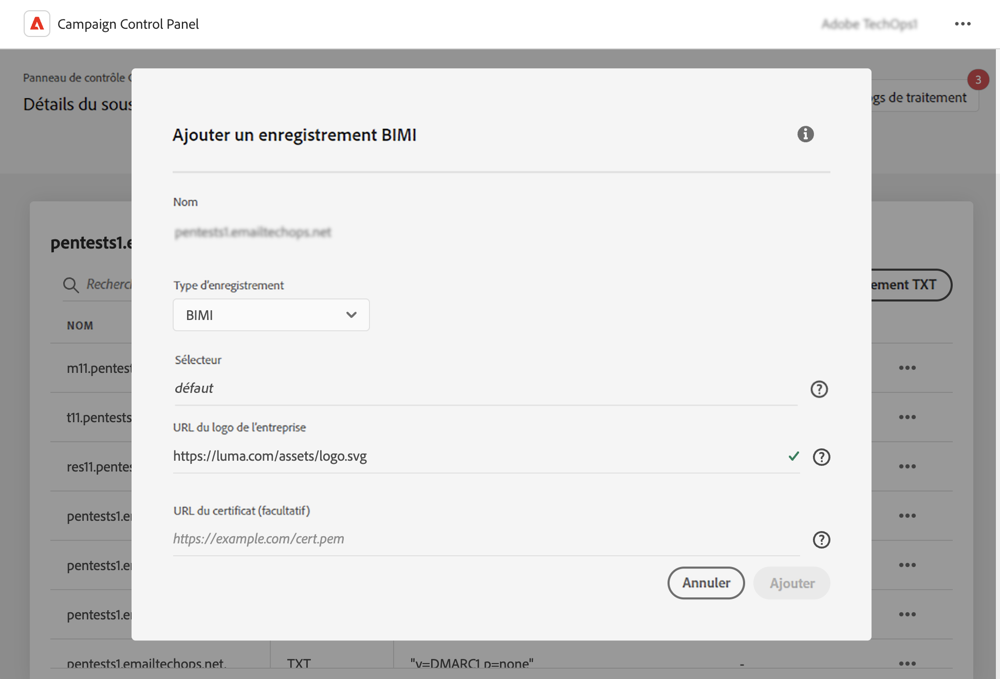

# Ajout d’enregistrements BIMI {#dmarc}

## À propos des enregistrements BIMI {#about}

Les indicateurs de marque pour l’identification des messages (BIMI) sont une norme du secteur qui permet l’affichage d’un logo approuvé en regard de l’adresse électronique de l’expéditeur dans les boîtes de réception des fournisseurs de messagerie afin d’améliorer la reconnaissance et la confiance de la marque. Il permet d&#39;empêcher l&#39;usurpation et le phishing des emails en vérifiant l&#39;identité de l&#39;expéditeur via l&#39;authentification DMARC, rendant plus difficile l&#39;usurpation d&#39;identité des marques légitimes dans les emails de la part d&#39;acteurs malveillants.

Des informations détaillées sur la mise en oeuvre de BIMI sont disponibles dans la section [Guide des bonnes pratiques de délivrabilité des Adobes](https://experienceleague.adobe.com/docs/deliverability-learn/deliverability-best-practice-guide/additional-resources/technotes/implement-bimi.html)

{width="70%" align="center"}

## Limites et conditions préalables {#limitations}

* Les enregistrements SPF, DKIM et DMARC sont des prérequis pour la création d’un enregistrement BIMI.
* Les enregistrements BIMI ne peuvent être ajoutés que pour les sous-domaines à l’aide de la délégation complète de sous-domaines. [En savoir plus sur les méthodes de configuration des sous-domaines](subdomains-branding.md#subdomain-delegation-methods)
* Conditions préalables pour les enregistrements DMARC :

   * Le type de stratégie d’enregistrement du sous-domaine doit être défini sur &quot;Quarantaine&quot; ou &quot;Rejeter&quot;. La création d’enregistrement BIMI n’est pas disponible avec un type de stratégie DMARC défini sur &quot;Aucun&quot;.
   * Le pourcentage d’emails auxquels la stratégie DMARC est appliquée doit être de 100 %. BIMI ne prend pas en charge les stratégies DMARC si ce pourcentage est défini sur moins de 100 %.

[Découvrez comment configurer des enregistrements DMARC](dmarc.md)

## Ajout d’un enregistrement BIMI pour un sous-domaine {#add}

Pour ajouter un enregistrement BIMI pour un sous-domaine, procédez comme suit :

1. Dans la liste des sous-domaines, cliquez sur le bouton représentant des points de suspension en regard du sous-domaine souhaité, puis sélectionnez **[!UICONTROL Détails du sous-domaine]**.

1. Cliquez sur le bouton **[!UICONTROL Ajout d’un enregistrement TXT]** , puis choisissez **[!UICONTROL BIMI]** de la **[!UICONTROL Type d’enregistrement]** liste déroulante.

   

1. Dans le **[!UICONTROL URL du logo de l’entreprise]**, spécifiez l’URL du fichier du SVG contenant votre logo.

1. Bien **[!UICONTROL URL du certificat]** est facultatif. Il est nécessaire pour certains fournisseurs de messagerie tels que Gmail et Apple, qui couvrent 80 % du marché des boîtes aux lettres. Par conséquent, nous vous recommandons d’obtenir un certificat de marque vérifié (VMC) pour vraiment tirer parti de BIMI.

   +++Comment obtenir un VMC ?

   Les principales étapes pour obtenir un VMC sont les suivantes :

   1. Enregistrez votre logo en tant que marque déposée auprès d’un bureau de propriété intellectuelle reconnu par les émetteurs de VMC. Si vous disposez d’une équipe juridique, nous vous recommandons de travailler avec elle pour obtenir la marque de votre logo ou de vérifier qu’il est déjà déposé.

   1. Une fois que vous avez vérifié que votre logo est une marque, contactez DigiCert ou l’autorité de certification d’Entrust pour demander un VMC.

   1. Une fois votre VMC approuvé, vous recevrez un fichier PEM (Privacy Enhanced Mail) de certificat d’entité. Ajoutez tous les autres certificats intermédiaires que vous obtenez de l’autorité de certification à ce fichier PEM. Téléchargez le fichier PEM (ainsi que les fichiers ajoutés) sur votre serveur web public et notez l’URL du fichier PEM. Vous utiliserez l’URL dans votre enregistrement TXT BIMI.

   1. Une fois que l’enregistrement BIMI est visible dans la page des détails du sous-domaine pour un sous-domaine particulier, vous pouvez utiliser l’Inspecteur BIMI disponible. [here](https://bimigroup.org/bimi-generator/) pour vérifier si l’enregistrement BIMI fonctionne correctement.

   Vous trouverez des informations détaillées sur l’implémentation de BIMI dans la section [Documentation BIMI standard](https://bimigroup.org/implementation-guide/)
+++

1. Cliquez sur **[!UICONTROL Ajouter]** pour confirmer la création de l’enregistrement BIMI.

Une fois la création d’enregistrement BIMI traitée (environ 5 minutes), elle s’affiche dans l’écran de détails des sous-domaines. [Découvrez comment surveiller les enregistrements TXT pour vos sous-domaines](gs-txt-records.md#monitor)
