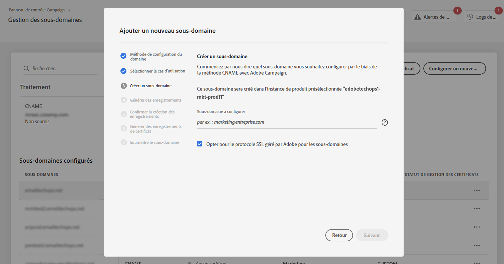
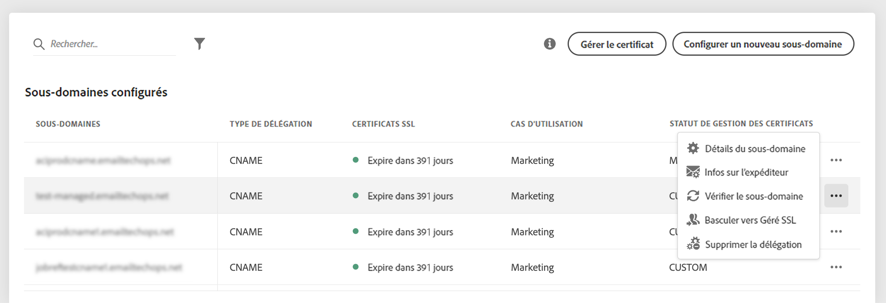
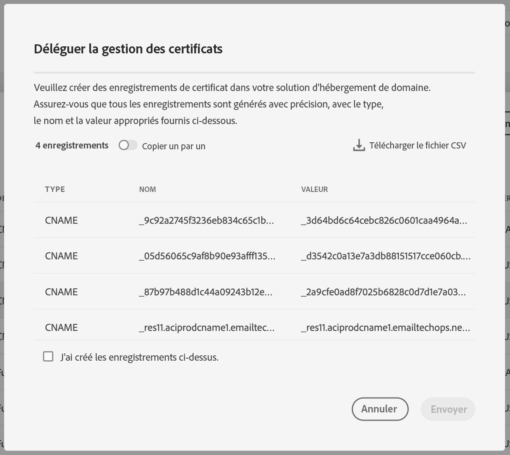

# Déléguer des certificats SSL de sous-domaines à Adobe {#delegate-ssl-certificates}

>[!CONTEXTUALHELP]
>id="cp_managed_ssl"
>title="Déléguer des certificats SSL de sous-domaines à Adobe"
>abstract="Le panneau de contrôle vous permet de laisser Adobe gérer les certificats SSL de vos sous-domaines. Si vous utilisez des CNAME pour configurer votre sous-domaine, les enregistrements de certificats seront automatiquement générés et fournis afin de générer un certificat dans votre solution d’hébergement de domaine."

Il est vivement recommandé de déléguer les certificats SSL de vos sous-domaines à Adobe, car Adobe crée automatiquement le certificat et le renouvelle tous les ans avant l’expiration de ce dernier.

Si vous utilisez des CNAME pour configurer une délégation de sous-domaine, Adobe fournira des enregistrements de certificat à utiliser dans votre solution d’hébergement de domaine pour générer votre certificat.

La délégation des certificats SSL à Adobe peut être effectuée lors de la configuration d’un nouveau sous-domaine ou pour des sous-domaines déjà délégués.

>[!NOTE]
>
>Le protocole SSL géré par Adobe est une fonctionnalité gratuite.

## Déléguer les certificats SSL des nouveaux sous-domaines {#new}

Pour déléguer des certificats SSL lors de la configuration d’un nouveau sous-domaine, activez l’option **[!UICONTROL Choisir le protocole SSL géré par Adobe pour les sous-domaines]** de l’assistant de configuration de sous-domaine. Les enregistrements de certificat à copier dans votre solution d’hébergement seront fournis ultérieurement dans l’assistant de configuration. Les étapes détaillées sont décrites dans [cette section](setting-up-new-subdomain.md).

{width="70%" align="left"}

## Déléguer des certificats SSL pour les sous-domaines déjà délégués {#delegated}

Pour déléguer des certificats SSL pour un sous-domaine déjà délégué, cliquez sur le bouton représentant des points de suspension en regard du sous-domaine souhaité, puis cliquez sur **[!UICONTROL Basculer vers le protocole SSL géré]**.

{width="70%" align="left"}

Une boîte de dialogue s’affiche avec les enregistrements de certificat qui ont été générés automatiquement par Adobe. Copiez ces enregistrements un par un ou en téléchargeant un fichier CSV, puis accédez à votre solution d’hébergement de domaine pour générer le certificat correspondant.

Assurez-vous que tous les enregistrements des certificats ont été générés dans votre solution d’hébergement de domaine. Si tout est correctement configuré, confirmez la création des enregistrements puis cliquez sur **[!UICONTROL Envoyer]**.

{width="70%" align="left"}
