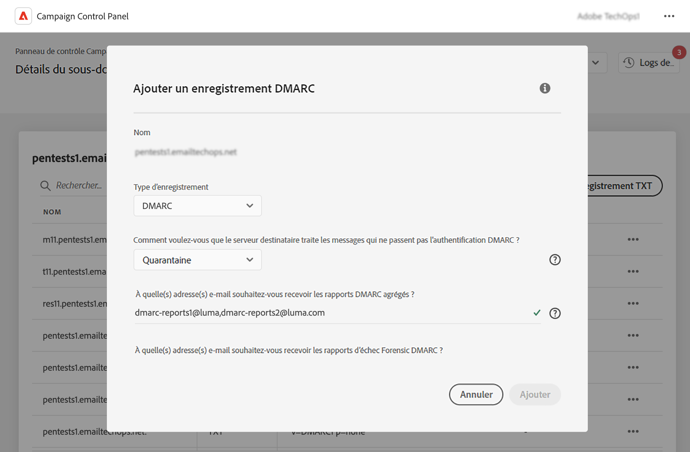
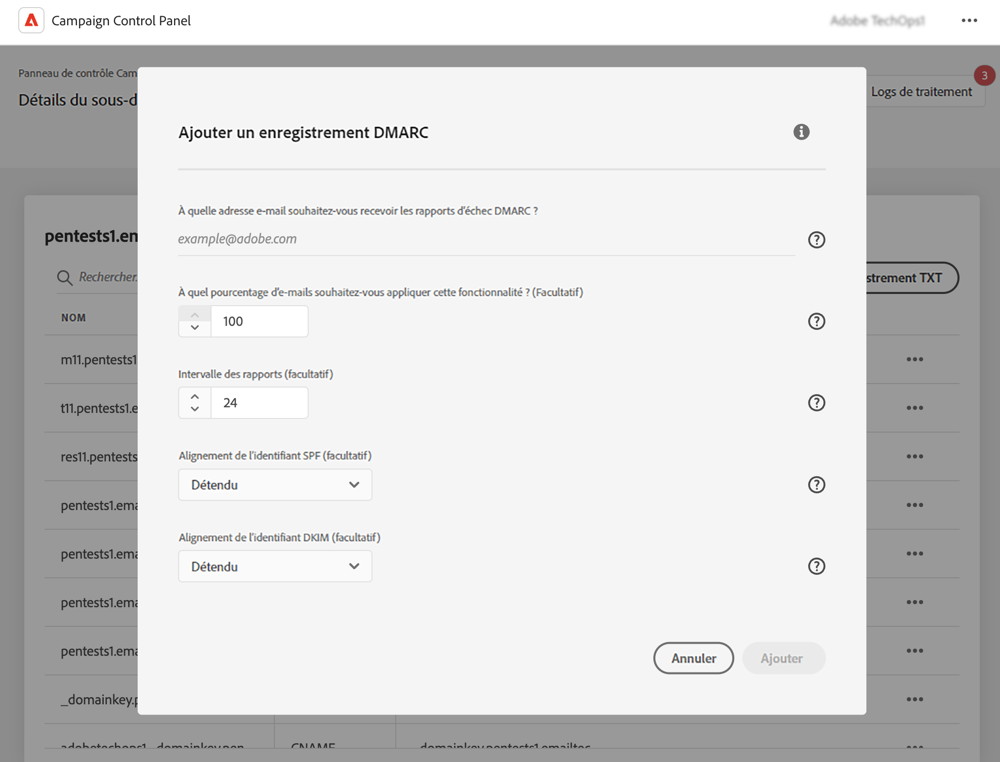

# Ajouter des enregistrements DMARC {#dmarc}

## À propos des enregistrements DMARC {#about}

DMARC (Domain-based Message Authentication, Reporting and Conformance) est une norme de protocole d’authentification des e-mails qui permet aux organisations de protéger leurs domaines de messagerie contre les attaques de phishing et d’usurpation d’identité. Elle vous permet de décider comment un fournisseur de messagerie doit traiter les e-mails qui échouent aux contrôles SPF et DKIM, offrant ainsi un moyen d’authentifier le domaine de la personne expéditrice et d’empêcher toute utilisation non autorisée du domaine à des fins malveillantes.

Des informations détaillées sur la mise en œuvre de DMARC sont disponibles dans le [Guide des bonnes pratiques en matière de délivrabilité d’Adobe](https://experienceleague.adobe.com/docs/deliverability-learn/deliverability-best-practice-guide/additional-resources/technotes/implement-dmarc.html?lang=fr).

## Limites et prérequis {#limitations}

* Les enregistrements SPF et DKIM sont indispensables pour la création d’un enregistrement DMARC.
* Les enregistrements DMARC ne peuvent être ajoutés que pour les sous-domaines à l’aide de la délégation complète de sous-domaine. [En savoir plus sur les méthodes de configuration des sous-domaines.](subdomains-branding.md#subdomain-delegation-methods)

  Pour établir un enregistrement DMARC pour un sous-domaine basé sur CNAME, vous pouvez configurer l’enregistrement DMARC pour son domaine parent. Cela garantit que tous les sous-domaines associés héritent des paramètres de l’enregistrement DMARC, même lorsqu’ils sont délégués via des CNAME.

* S’il existe des enregistrements DMARC et BIMI pour un sous-domaine :
   * Les enregistrements DMARC ne peuvent pas être supprimés. Si vous souhaitez supprimer un enregistrement DMARC, supprimez d’abord l’enregistrement BIMI.
   * Les enregistrements DMARC peuvent être modifiés, mais la rétrogradation de la politique DMARC sur « Aucun » n’est pas autorisée et la valeur de pourcentage doit être définie sur « 100 ».

## Ajouter un enregistrement DMARC pour un sous-domaine {#add}

Pour ajouter un enregistrement DMARC pour un sous-domaine, procédez comme suit :

1. Dans la liste des sous-domaines, cliquez sur le bouton représentant des points de suspension en regard du sous-domaine souhaité, puis sélectionnez **[!UICONTROL Détails du sous-domaine]**.

1. Cliquez sur le bouton **[!UICONTROL Ajouter un enregistrement TXT]**, puis choisissez **[!UICONTROL DMARC]** dans la liste déroulante **[!UICONTROL Type d’enregistrement]**.

   

1. Choisissez le **[!UICONTROL Type de politique]** que le serveur destinataire doit suivre en cas d’échec de l’un de vos e-mails. Les types de politiques disponibles sont les suivants :

   * **[!UICONTROL Aucun]** (none),
   * **[!UICONTROL Quarantaine]** (quanrantine) (placement dans le dossier de spam),
   * **[!UICONTROL Rejeter]** (reject) (bloquer l’e-mail).

   Il est recommandé de déployer lentement la mise en œuvre de DMARC en faisant passer votre politique DMARC de p=none à p=quarantine, puis à p=reject à mesure que vous comprenez l’impact potentiel de DMARC.

   * **Étape 1 :** analysez les commentaires que vous recevez et utilisez (p=none), qui indique à la personne destinataire de n’effectuer aucune action sur les messages dont l’authentification échoue, mais d’envoyer néanmoins des rapports sur les e-mails à la personne expéditrice. En outre, examinez les problèmes liés à SPF/DKIM et corrigez-les si des messages légitimes échouent à l’authentification.

   * **Étape 2 :** déterminez si SPF et DKIM sont alignés et réussissent l’authentification pour tous les e-mails légitimes, puis passez la politique à (p=quarantine), ce qui indique au serveur de messagerie de réception de mettre en quarantaine les e-mails qui échouent l’authentification (cela signifie généralement placer ces messages dans le dossier de spam). Si la politique est définie sur la quarantaine, il est recommandé de commencer avec un petit pourcentage de vos e-mails.

   * **Étape 3 :** définissez la politique sur (p=reject). Remarque : utilisez cette politique avec précaution et déterminez si elle convient à votre organisation. La politique p=reject indique à la personne destinataire de refuser complètement (rebond) tout e-mail pour le domaine qui ne réussit pas l’authentification. Lorsque cette politique est activée, seul un e-mail qui est vérifié comme étant authentifié à 100 % par votre domaine aura une chance d’être placé en boîte de réception.

   >[!NOTE]
   >
   > La création d’enregistrement BIMI n’est pas possible avec un type de politique d’enregistrement DMARC défini sur « Aucun ».

1. Renseignez les adresses e-mail qui doivent recevoir les rapports DMARC. Vous pouvez ajouter plusieurs adresses e-mail séparées par des virgules. Lorsque l’un de vos e-mails échoue, les rapports DMARC sont automatiquement envoyés à l’adresse e-mail de votre choix :

   * Les rapports Aggregate-DMARC fournissent des informations de haut niveau comme, par exemple, le nombre d’e-mails qui ont échoué sur une période donnée.
   * Les rapports d’échec Forensic DMARC fournissent des informations détaillées comme, par exemple, l’adresse IP d’où provient l’e-mail ayant échoué.

1. Si la politique DMARC est définie sur « Aucun », saisissez un pourcentage applicable à 100 % des e-mails.

   Si la politique est définie sur « Rejeter » ou « Quarantaine », il est recommandé de commencer avec un petit pourcentage de vos e-mails. À mesure que de plus en plus d’e-mails de votre domaine réussissent l’authentification auprès des serveurs de réception, mettez à jour votre enregistrement lentement avec un pourcentage plus élevé.

   >[!NOTE]
   >
   >Si votre domaine utilise BIMI, votre politique DMARC doit avoir une valeur en pourcentage de 100 %. BIMI ne prend pas en charge les politiques DMARC avec cette valeur définie sur moins de 100 %.

   

1. Les rapports DMARC sont envoyés toutes les 24 heures. Vous pouvez modifier la fréquence d’envoi des rapports dans le champ **[!UICONTROL Intervalle des rapports]**. L’intervalle minimum autorisé est de 1 heure, tandis que la valeur maximale autorisée est de 2 190 heures (soit 3 mois).

1. Dans les champs **SPF** et **[!UICONTROL Alignement de l’identifiant DKIM]**, indiquez le degré de rigueur des serveurs destinataires lors de la vérification des authentifications SPF et DKIM pour un e-mail.

   * Mode **[!UICONTROL souple]** (relaxed) : le serveur accepte l’authentification même si l’e-mail est envoyé à partir d’un sous-domaine.
   * Le mode **[!UICONTROL Strict]** accepte l’authentification uniquement lorsque le domaine expéditeur correspond exactement à un domaine SPF et DKIM.

   Imaginons que nous travaillons avec le domaine `http://www.luma.com`. En mode « Souple », les e-mails provenant du sous-domaine `marketing.luma.com` seront autorisés par le serveur, mais seront rejetés en mode « Strict ».

1. Cliquez sur **[!UICONTROL Ajouter]** pour confirmer la création de l’enregistrement DMARC.

Une fois la création de l’enregistrement DMARC traitée (environ 5 minutes), il s’affiche dans l’écran des détails des sous-domaines. [Découvrez comment surveiller les enregistrements TXT pour vos sous-domaines.](gs-txt-records.md#monitor)
