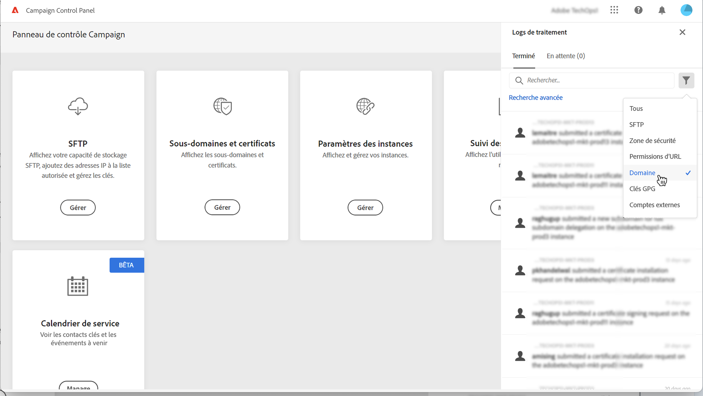
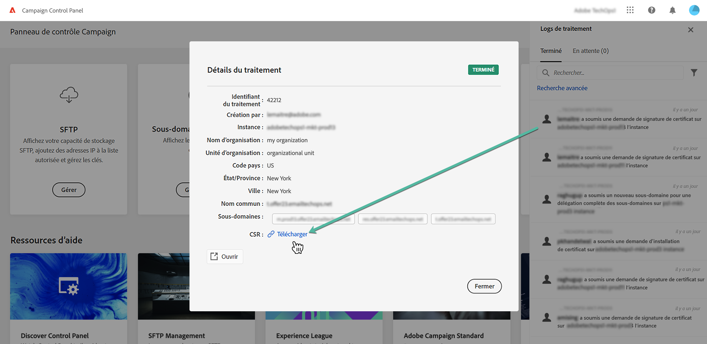

# Générer une demande de signature de certificat {#generating-csr}

>[!CONTEXTUALHELP]
>id="cp_generate_csr"
>title="Génération dʼune demande de signature de certificat"
>abstract="La demande de signature de certificat doit être générée pour l’instance et les sous-domaines que vous envisagez de sécuriser avant d’acheter un certificat."

>[!CONTEXTUALHELP]
>id="cp_select_subdomains"
>title="Sélectionner les sous-domaines pour votre CSR"
>abstract="Vous pouvez choisir d’inclure tous les sous-domaines ou uniquement des sous-domaines spécifiques dans votre demande de signature de certificat. Seuls les sous-domaines sélectionnés seront certifiés par le biais du certificat SSL acheté."
>additional-url="https://experienceleague.adobe.com/docs/control-panel/using/subdomains-and-certificates/subdomains-branding.html?lang=fr" text="À propos de la marque des sous-domaines"

## Générer la demande de signature de certificat (CSR) {#generate}

Pour générer une demande de signature de certificat (CSR), procédez comme suit :

1. Dans la carte **[!UICONTROL Sous-domaines et certificats]**, sélectionnez l’instance voulue, puis cliquez sur le bouton **[!UICONTROL Gérer le certificat]**.

   

1. Sélectionnez **[!UICONTROL 1 - Génération d’une demande de signature de certificat]**, puis cliquez sur **[!UICONTROL Suivant]** pour lancer l’assistant qui vous guidera tout au long de ce processus.

   

1. Un formulaire s’affiche contenant tous les détails nécessaires à la génération de la demande de signature de certificat.

   Veillez à renseigner précisément les informations demandées, faute de quoi il est possible que le certificat ne soit pas renouvelé (contactez votre équipe interne et les équipes de sécurité et informatique si nécessaire), puis cliquez sur **[!UICONTROL Suivant]**.

   * **[!UICONTROL Organisation]** : nom officiel de l’organisation.
   * **[!UICONTROL Unité d’organisation]** : unité associée au sous-domaine (exemple : marketing, informatique).
   * **[!UICONTROL Instance]** (prérenseigné) : URL de l’instance Campaign associée au sous-domaine.
   * **[!UICONTROL Nom commun]** : le nom commun est sélectionné par défaut, vous pouvez sélectionner un des sous-domaines si nécessaire.

   

1. Sélectionnez les sous-domaines à inclure dans le fichier CSR, puis cliquez sur **[!UICONTROL OK]**.

   

1. Les sous-domaines sélectionnés s’affichent dans la liste. Pour chacun d’eux, sélectionnez les sous-domaines à inclure, puis cliquez sur **[!UICONTROL Suivant]**.

   

1. Un résumé des sous-domaines à inclure dans le fichier CSR s’affiche. Cliquez sur **[!UICONTROL Soumettre]** pour confirmer votre requête.

   

   >[!NOTE]
   >
   >Le bouton **[!UICONTROL Copier le contenu de la CSR]** vous permet de copier toutes les informations relatives à la CSR (Identifiant de l’organisation, instance, nom de l’organisation, nom commun, sous-domaines inclus, etc.).

1. Le fichier .csr correspondant à votre sélection est généré et téléchargé automatiquement. Vous pouvez désormais l’utiliser pour acheter le certificat SSL auprès de l’autorité de certification approuvée par votre société. Si vous devez télécharger à nouveau la CSR, suivez les étapes détaillées dans [cette section](#download).

Une fois que votre CSR a été générée et téléchargée, vous pouvez l’utiliser pour acheter un certificat SSL auprès d’une autorité de certification approuvée par votre organisation.

Après l’achat du certificat SSL, vous pourrez l’installer sur votre instance pour sécuriser votre sous-domaine. [En savoir plus](install-ssl-certificate.md)

## Télécharger la CSR {#download}

Pour acheter un certificat SSL, vous devez d’abord télécharger la demande de signature de certificat. La CSR est automatiquement téléchargée après avoir été générée. Vous pouvez également la télécharger à nouveau à tout moment à partir des journaux de tâches :

1. Dans les **[!UICONTROL Journaux de tâches]**, sélectionnez l’onglet **[!UICONTROL Terminé]** puis filtrez la liste afin d’afficher les tâches liées à la gestion des sous-domaines.

   

1. Ouvrez la tâche correspondant à la génération de la CSR, puis cliquez sur le lien **[!UICONTROL Télécharger]** pour obtenir le fichier .csr.

   
