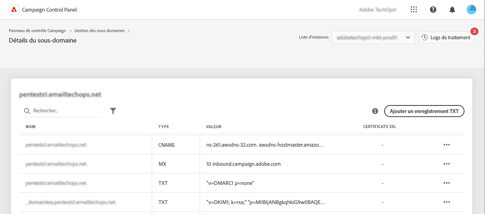

# Commencer avec les enregistrements TXT {#managing-txt-records}

>[!CONTEXTUALHELP]
>id="cp_siteverification_add"
>title="Gérer les enregistrements TXT"
>abstract="Les enregistrements TXT font partie des enregistrements DNS. Ils servent à donner des informations textuelles à propos d’un domaine, que des sources externes pourront lire par la suite. Le panneau de contrôle vous permet d’ajouter trois types d’enregistrements à vos sous-domaines : les enregistrements de vérification de site Google, DMARC et BIMI."

## À propos des enregistrements TXT {#about}

Les enregistrements TXT font partie des enregistrements DNS. Ils servent à donner des informations textuelles à propos d’un domaine, que des sources externes pourront lire par la suite. Le panneau de contrôle vous permet d’ajouter trois types d’enregistrements à vos sous-domaines :

* Les **enregistrements TXT Google** vous permettent d’attester que vous êtes la personne propriétaire de votre domaine, ce qui garantit un taux de réception élevé et un faible taux de spam pour vos e-mails. [Découvrez comment ajouter des enregistrements TXT Google.](managing-txt-records.md)
* Les **enregistrements DMARC** offrent un moyen d’authentifier le domaine de la personne expéditrice et d’empêcher l’utilisation non autorisée du domaine à des fins malveillantes. [Découvrez comment ajouter des enregistrements DMARC.](dmarc.md)
* Les **enregistrements BIMI** vous permettent d’afficher un logo approuvé en regard de vos e-mails dans les boîtes de réception des fournisseurs de messagerie afin d’améliorer la reconnaissance de la marque et la confiance en elle. [Découvrez comment ajouter des enregistrements BIMI.](bimi.md)

## Surveiller les enregistrements de vos sous-domaines {#monitor}

Vous pouvez surveiller tous les enregistrements TXT ajoutés pour chaque sous-domaine en accédant aux détails des sous-domaines.

Dans cet écran, tous les enregistrements de type TXT du sous-domaine sélectionné s’affichent avec, sur leur configuration, les informations de la colonne Valeur. Pour supprimer un enregistrement TXT Google, DMARC ou BIMI, cliquez sur le bouton représentant des points de suspension, puis sélectionnez Supprimer. Vous pouvez également modifier les enregistrements DMARC et BIMI en cas de besoin.

