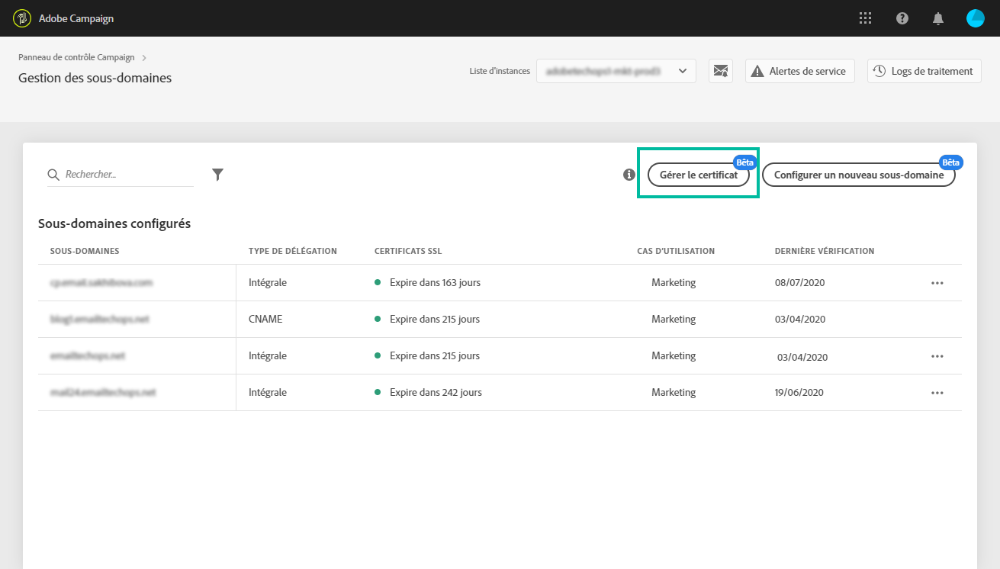
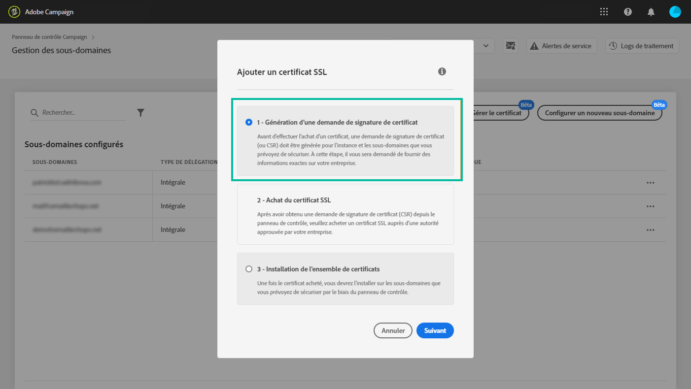

# Gestion des certificats SSL des sous-domaines {#managing-subdomains-ssl-certificates}

La vignette **[!UICONTROL Sous-domaines et certificats]permet de voir les sous-domaines et les sous-domaines associés hébergeant des landing pages et des ressources sur lesquels des certificats SSL sont installés.** Vous pouvez aussi voir facilement les sous-domaines dont les certificats arrivent à expiration afin d'anticiper leur expiration.

Si un certificat est sur le point d'arriver à expiration, vous pouvez envoyer une demande à l'Assistance client avec toutes les informations requises pour renouveler le certificat et garantir le bon fonctionnement de votre instance.

>[!NOTE]
>
>Adobe recommande de renouveler un certificat SSL des sous-domaines associés **lorsqu’il se rapproche de la date d’expiration**. Le renouvellement du certificat peut prendre quelques jours selon votre organisation. Nous vous recommandons d’allouer le temps approprié pour ce processus.

## Surveillance des certificats SSL {#monitoring-ssl-certificates}

La liste des sous-domaines de chacune de vos instances est accessible directement lorsque vous sélectionnez la vignette **[!UICONTROL Sous-domaines et certificats].**

Les sous-domaines sont classés en fonction de la date d'expiration la plus proche du certificat SSL. De plus, des informations visuelles sur l'expiration (délai en jours) sont proposées :

* **Vert** : le sous-domaine n'a pas de certificat arrivant à expiration dans les 60 prochains jours.
* **Orange** : un ou plusieurs sous-domaines ont un certificat qui arrivera à expiration dans les 60 prochains jours.
* **Rouge**: un ou plusieurs sous-domaines disposent d’un certificat qui expirera dans les 30 prochains jours.

Pour plus d’informations sur les certificats d’un sous-domaine, cliquez sur le bouton **[!UICONTROL Détails du certificat]**.

La liste de tous les sous-domaines associés s'affiche sur leurs certificats. En règle générale, elle contient les sous-domaines des landing pages, des pages de ressources, etc.

Si nécessaire, vous pouvez effectuer une demande de renouvellement de certificat à partir de cette fenêtre. Pour plus de détails, reportez-vous à la section ci-dessous.

## Lancement du renouvellement des certificats SSL {#initiating-ssl-certificate-renewal}

>[!NOTE]
>
>Le panneau de contrôle ne gère pas automatiquement le renouvellement des certificats. It only allows you to **initiate the renewal process** by preparing the request to be sent to Adobe Campaign Customer Care.

La procédure de renouvellement des certificats SSL comprend 3 étapes :

1. **Génération de la demande de signature de certificat (CSR, Certificate Signing Request)** L'Assistance client Adobe génère une demande de signature de certificat suite à la demande effectuée sur le portail de l'Assistance client. Vous devrez fournir certaines informations nécessaires à la génération de la demande de signature de certificat (telles que le nom commun, le nom et l'adresse de l'organisation, etc.). Dans le panneau de contrôle, vous pouvez voir la liste des éléments requis lors du lancement de la procédure de renouvellement. Pour plus de détails, reportez-vous à la section ci-dessous.
1. **Achat du certificat SSL** Une fois que l'Assistance client a généré la demande de signature de certificat, vous pouvez la télécharger et acheter le certificat SSL auprès de l'autorité de certification approuvée par votre société.
1. **Installation du certificat SSL** Une fois le certificat SSL acheté, vous devez le fournir à l'Assistance client Adobe. Le certificat sera installé et les dates d'expiration mises à jour des certificats seront visibles dans le panneau de contrôle.

Pour lancer le renouvellement des certificats SSL dans le Panneau de configuration, procédez comme suit :

1. Ouvrez la carte **[!UICONTROL Sous-domaines et certificats]**, puis cliquez sur l’icône **[!UICONTROL Détails du certificat]** du sous-domaine avec les certificats arrivant à expiration.

   

1. La liste des sous-domaines associés s’affiche. Elle comprend généralement des sous-domaines de landing pages, de pages de ressources, etc.
Cliquez sur le bouton **[!UICONTROL Détails du ticket]** pour lancer le processus de renouvellement des certificats.

   

1. Un formulaire s'affiche. Il contient tous les détails nécessaires au renouvellement du certificat SSL. Veillez à renseigner toutes les informations demandées de façon précise (contactez votre équipe interne et les équipes de sécurité et informatiques, si nécessaire). Sinon, une demande de signature de certificat ne peut pas être générée et vous ne pourrez pas renouveler le certificat.

   * **[!UICONTROL Organisation IMS]** : identifiant de votre organisation.
   * **[!UICONTROL Instance]** : URL de l'instance Campaign associée au sous-domaine.
   * **[!UICONTROL Nom]** commun : Il s’agit généralement d’une URL de sous-domaine de suivi, associée au sous-domaine avec le certificat expirant.
   * **[!UICONTROL Sous-domaines]**: Sous-domaines liés au sous-domaine avec un certificat expirant. Si vous souhaitez appliquer un seul certificat SSL à d'autres sous-domaines, vous pouvez les ajouter à cette liste. Dans ce cas, assurez-vous que ces sous-domaines sont associés aux mêmes organisation IMS et URL d'instance.
   >[!CAUTION]
   >
   >Les champs **[!UICONTROL Organisation IMS]** et **Instance]sont renseignés automatiquement par le panneau de contrôle et ne doivent pas être modifiés.[!UICONTROL **

   

1. Once the form is completed, click the **[!UICONTROL Copy Details]** button to save the information to your Clipboard.

   >[!NOTE]
   >
   >Si vous n’effacez pas l’historique de votre navigateur, les informations que vous avez saisies seront enregistrées, ce qui vous permettra de les utiliser pour renouveler le certificat ultérieurement.

1. Click the **[!UICONTROL Log new ticket]** button. Vous êtes automatiquement redirigé vers la page de connexion de l'Assistance client d'Adobe Campaign.

   

1. Connectez-vous, puis créez un ticket de support avec pour objet "SSL certificate CSR request" (Demande de signature de certificat SSL).
Collez toutes les informations copiées précédemment dans le corps du ticket, puis cliquez sur Envoyer.

   >[!NOTE]
   >
   >Si vous ne disposez pas des privilèges nécessaires pour faire une demande de résolution d'incident pour votre organisation, transmettez toutes les informations que vous avez copiées dans le Presse-papiers à votre contact du support et demandez-lui d'ouvrir un nouveau ticket d'Assistance client à votre place.

**Rubriques connexes :**

* [Tutoriel vidéo sur Campaign Standard](https://docs.adobe.com/content/help/en/campaign-learn/campaign-standard-tutorials/administrating/control-panel/managing-ssl-certificates.html)
* [Tutoriel vidéo sur Campaign Classic](https://docs.adobe.com/content/help/en/campaign-learn/campaign-classic-tutorials/administrating/control-panel-acc/managing-ssl-certificates.html)
