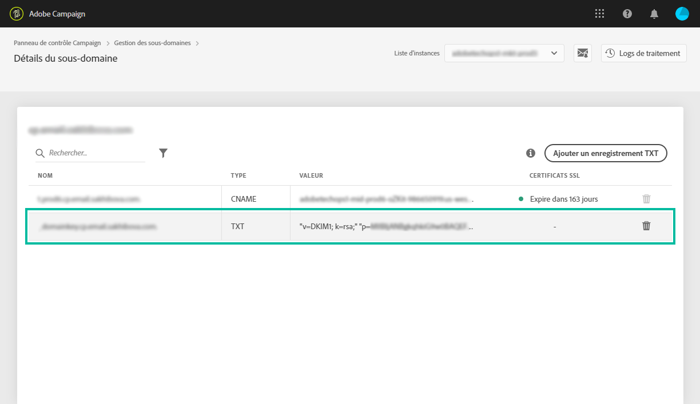

# Gestion des enregistrements TXT {#managing-txt-records}

>[!CONTEXTUALHELP]
>id="cp_siteverification_add"
>title="[!CONTEXTUALHELP]
>id=&quot;cp_siteverification_add&quot;
>title=&quot;Gestion des enregistrements TXT&quot;
>abstract=&quot;Certains services comme Google exigent que vous ajoutiez un enregistrement TXT aux paramètres de votre domaine pour vérifier que vous en êtes propriétaire.&quot;"
>abstract="À propos des enregistrements TXT {#about-txt-records}"

## Les enregistrements TXT font partie des enregistrements DNS. Ils servent à donner des informations textuelles à propos d’un domaine, que des sources externes pourront lire par la suite.{#about-txt-records}

Pour garantir des taux de réception d’emails élevés et des taux de spam bas, certains services comme Google exigent que vous ajoutiez un enregistrement TXT aux paramètres de votre domaine pour vérifier que vous en êtes propriétaire.

Actuellement, Gmail est l’un des fournisseurs d’adresses email les plus utilisés. Pour garantir une bonne délivrabilité et une diffusion réussie des emails vers les adresses Gmail, Adobe Campaign permet d’ajouter des enregistrements TXT de vérification de site Google spéciaux à vos sous-domaines afin de s’assurer qu&#39;ils soient vérifiés.

Ajout d’un enregistrement TXT Google pour un sous-domaine {#adding-a-google-txt-record}

## Pour ajouter un enregistrement TXT Google à un sous-domaine utilisé pour envoyer des emails à des adresses Gmail, procédez comme suit :{#adding-a-google-txt-record}

Accédez à la carte **[!UICONTROL Sous-domaines et certificats]**.

1. Sélectionnez votre instance, puis ouvrez les détails du sous-domaine auquel vous souhaitez ajouter un enregistrement DNS.****

1. 

   Cliquez sur le bouton **[!UICONTROL Ajouter un enregistrement TXT]**, puis saisissez la valeur générée dans les outils G Suite Admin. Pour plus d’informations, voir [l’aide de G Suite Admin[#$tu15].

1. 

   Cliquez sur le bouton **[!UICONTROL Ajouter]** pour confirmer l’opération.

1. ]**

   Une fois l’enregistrement TXT ajouté, vous devez le faire vérifier par Google. Pour cela, accédez aux outils G Suite Admin, puis lancez l’étape de vérification (voir [l’aide de G Suite Admin[#$tu20]).

[!NOTE]

>[!NOTE]Le seul enregistrement que vous pouvez supprimer de la liste des enregistrements DNS est celui qui vient d’être ajouté (dans notre cas, l’enregistrement Google TXT).
>
>The only record that you can delete from the DNS records list is the one that you have previously added (in our case the Google TXT record).
