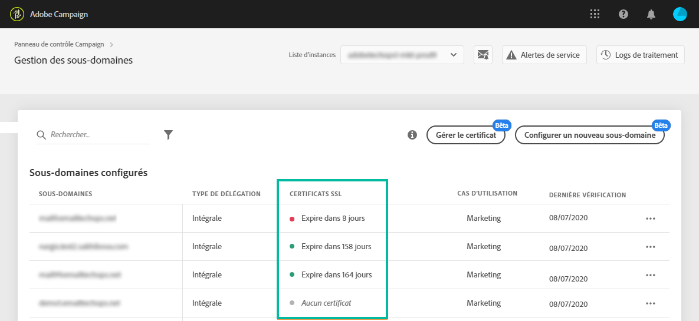
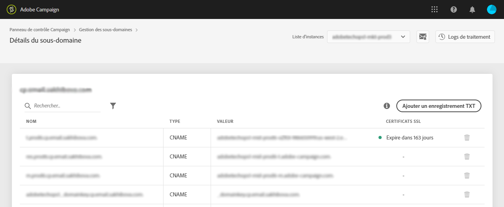

# Surveillance des certificats SSL des sous-domaines {#monitoring-ssl-certificates}

>[!AVAILABILITY]
>
>Cette fonctionnalité n’est pas disponible pour Campaign v8.

## À propos des certificats SSL {#about-ssl-certificates}

Adobe Campaign vous recommande de sécuriser les sous-domaines hébergeant vos landing pages, en particulier ceux qui recueillent des informations sensibles sur vos clients.

Le **cryptage SSL (Secure Socket Layer)** garantit la sécurité des sous-domaines que vous avez configurés en vue de leur fonctionnement avec Adobe. Lorsque votre client remplit un formulaire web ou visite une landing page hébergée par Adobe Campaign, les informations sont envoyées par défaut via un protocole non sécurisé (HTTP). Pour assurer une sécurité supplémentaire, sécurisez les informations envoyées avec un protocole HTTPS. Par exemple, l’adresse du sous-domaine « http://info.monsiteweb.com/ » deviendra « https://info.monsiteweb.com/ ».

**Les certificats SSL ne sont pas installés sur les sous-domaines configurés**. Ils sont installés sur les sous-domaines associés, principalement ceux qui hébergent des landing pages, des pages de ressources, etc.

**Les certificats SSL sont fournis pour une période spécifique** (1 an, 60 jours, etc.). Lorsqu’un certificat arrive à expiration, vous pouvez rencontrer des problèmes lors de l’accès aux landing pages ou de l’utilisation de ressources du sous-domaine. Pour éviter cela, le panneau de contrôle permet de surveiller les certificats SSL de vos sous-domaines et de lancer une procédure de renouvellement.

## Surveillance des certificats SSL {#monitoring-certificates}

>[!CONTEXTUALHELP]
>id="cp_subdomain_details"
>title="Détails du sous-domaine"
>abstract="Récupérez des informations sur les certificats SSL de vos sous-domaines."

L’état des certificats SSL de vos sous-domaines est disponible directement dans la liste des sous-domaines en sélectionnant la carte **[!UICONTROL Sous-domaines et certificats]**.

Les sous-domaines sont classés en fonction de la date d’expiration la plus proche du certificat SSL. De plus, des informations visuelles sur l’expiration (délai en jours) sont proposées :

* **Vert** : le sous-domaine n’a pas de certificat arrivant à expiration dans les 60 prochains jours.
* **Orange** : un ou plusieurs sous-domaines ont un certificat qui arrivera à expiration dans les 60 prochains jours.
* **Rouge** : un ou plusieurs sous-domaines ont un certificat qui arrivera à expiration dans les 30 prochains jours.
* **Gris** : aucun certificat n’a été installé pour le sous-domaine.

Pour obtenir plus de détails sur un sous-domaine, cliquez sur le bouton **[!UICONTROL Détails du sous-domaine]**.
La liste de tous les sous-domaines associés s&#39;affiche. En règle générale, elle contient les sous-domaines des landing pages, des pages de ressources, etc.

L’onglet **[!UICONTROL Infos sur l’expéditeur]** fournit des informations sur les boîtes de réception configurées (Expéditeur, Réponse, Email d’erreur).

Si l’un des certificats SSL de votre sous-domaine est sur le point d’arriver à expiration, vous pouvez le renouveler directement depuis le panneau de contrôle. Pour plus d’informations à ce sujet, consultez la section : [Renouvellement du certificat SSL d’un sous-domaine](../../subdomains-certificates/using/renewing-subdomain-certificate.md).

>[!IMPORTANT]
>
>Le renouvellement du certificat depuis le panneau de contrôle est disponible en version bêta et sujet à de fréquentes mises à jour et modifications sans préavis.

**Rubriques connexes :**

* [Renouvellement du certificat SSL d’un sous-domaine](../../subdomains-certificates/using/renewing-subdomain-certificate.md)
* [Marque des sous-domaines](../../subdomains-certificates/using/subdomains-branding.md)
